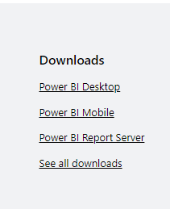
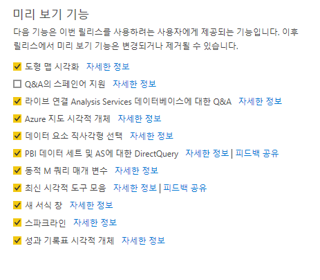

# 1. Power BI Download & Setting

## 1.1. BI

- BI는 Business Intelligence의 약자
- 기업에서 데이터를 수집, 정리, 분석하고 활용하여 효율적인 의사결정을 할 수 있는 방법에 대해 연구하는 학문

- 조직의 구성원에게 적시에 의사결정 할 수 있도록 지원하는 정보체계

## 1.2. BI & 분석 도구

- 데이터 분석 도구: Excel, Power BI, Tableau
- SQL, R, Python 등으로 고급 데이터 분석 가능

## 1.3. Power BI

- Microsoft사에 제공하는 손쉬운 데이터 분석 및 시각화 도구

## 1.4. Power BI 설치

- 주소 : https://powerbi.microsoft.com/en-us/getting-started-with-power-bi/
- 웹 사이트 가장 아래에 있는 Power BI Desktop 선택 후 다운로드

## 1.5. 데이터 분석 및 시각화 절차

- 문제정의: 어떤 데이터 분석을 하고싶은지, 데이터 수집이 가능한지 확인

- 데이터 가져오기: Excel, Text, CSV, 폴더, DB, Web 등 80개 이상의 다양한 데이터 원본 유형 지원

- 데이터 정리 및 변환

  - 쿼리 편집기 사용
  - 비정형 데이터를 분석 가능한 형태의 데이터로 편집

- 데이터 모델링

  - 관계 작성
  - 데이터 형식 지정, 열 기준 정렬
  - 분석식 작성(DAX)

- 데이터 시각화

  - 다양한 시각적 개체 사용
  - 시작화 보고서 작성

  

## 1.6. Power BI 옵션설정

- 파일 > 옵션 및 설정 > 옵션 클릭

- 미리 보기 기능에서 스페인어 지원 제외 모두 선택

