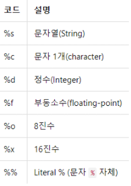

## 변수 생성  
#### 변수 : 값을 저장하기 위한 객체(object)  

- 변수 명명 규칙  

- 대소 구분, 숫자로 시작 불가(숫자 포함 가능), 특수기호(!@#) 삽입불가(\_dict : \_ 사용가능)  
- 예약어(함수명, 함수 내 인자명, 패키지 이름... if, for, while )

#### 파이썬의 숫자 종류 

1. 정수형, 실수형, 8진수와 16진수가 있다. 

```python
# 정수형
a = 1
a = -1
a = 0

# 실수형
a = 1.2
a = -3.45
a = 4.25E10
a = 4.25E-10 
# 컴퓨터식 지수 표현 방식으로 E는 10을 뒤에 오는  숫자는 제곱의 수를 얘기한다.

# 8진수와 16진수 
a = 0o177 # 8진수를 만들기 위해서는 숫자가 0o 또는 0O 으로 시작하면된다. 
a = 0x8ff # 16진수는 0x로 시작하면된다.
```

2\. 문자열은 string으로 문자, 단어 등으로 구성된 문자들의 집합을 말한다. 

```python
v1 = 'abcd'
```

---


## 모듈(module)  

#### 패키지(package)  
#### import 모듈 호출(loading)  


```python
round(1.5) = 2
```

\# trunc(1.5) 불가  

#### 1) 모듈 호출 : 하위 함수 (모듈명.함수명)

import math  
import math as ma  #as (alias : 별칭)  

ma.trunc(1.5)

```python
import math as ma  

ma.trunc(1.5) = 1 #trunc는 버림이다.
```

  

#### 2) 모듈 내 함수 직접 호출 : 함수명만 사용 가능

```python
from math import trunc
trunc(1.5) = 1
```


## 산술연산  
```python
3+2      
3/1.5  
10-2  
5*3  

9//2  # 몫  
9%2   # 나머지  

3**2  # 거듭제곱  
math.pow(3, 2)  # 3의 제곱  
```


## 파이썬 기본 구조  

#### 1) 리스트(list)  \[ \]  cf. R: c()  
 - 기본 자료 구조 (여러 상수를 동시 전달)  
- 1차원   
 - 서로 다른 데이터 타입 가입  

##### 1. **리스트 생성**

```python
l1= [1,2,3,4]
l1

type(l1)

l2 = [1,2,3,'4']
type(l2)

t1 = (1,2,3,4) # tuple : 상수 (변하지 않는 값 -> 변경이 불가능한 값)
type(t1)
t2 = 1,2,3,4
```


#### 2) **색인(indexing)**

파이썬은 0부터 숫자를 센다.

```python
l1
l1[0]
l1[1]
l1[-1] # reverse indexing
l1[-2]

l1[0:1] # n:m --> n부터 m-1 까지
l1[0:2]

# 여러 숫자 전달 불가
l2[0,2] 
l2[[0:2]]
```

슬라이싱 기법으로 a\[0:3\]을 수식으로 나타내면 

```python
0 <= a < 3
```

슬라이싱으로 문자열 나누기 

```python
>>> a = "20010331Rainy"
>>> year = a[:4]
>>> day = a[4:8]
>>> weather = a[8:]
>>> year
'2001'
>>> day
'0331'
>>> weather
'Rainy'
```


#### 3) **수정**

```python
l1[0] = 10
l1
```

```python
>>> a = "Pithon"
>>> a[1]
'i'
>>> a[1] = 'y'
error
```

문자열의 요솟값은 바꿀 수 있는 값이 아니기 때문에 오류가 발생한다.

따라서 

```python
>>> a = "Pithon"
>>> a[:1]
'P'
>>> a[2:]
'thon'
>>> a[:1] + 'y' + a[2:]
'Python'
```

이렇게 슬라이싱을 활용하여 새로운 문자열을 만들 수 있다. 


##### 1. 문자열 포매팅 따라 하기

- 숫자, 문자열 대입

```python
>>> "I eat %d apples." % 3
'I eat 3 apples.'
```

문자열 안에 숫자를 넣고 싶은 자리에 %d 문자를 넣어주고 뒤에 있는 % 뒤에 삽입 숫자를 넣어주면 된다. 



(사진출처: wikidocs.net)

문자열에 넣고싶은 성질에 따라서 코드를 변경해 주면 된다.

하지만 %s 코드는 어떤 형태의 값이든 변환해 넣을 수 있다. 

##### 2. **%s 코드 활용**

```python
>>> "%10s" % "hi"
'        hi'
#전체 길이가 10개인 문자열 공간에서 대입되는 값을 오른쪽으로 정렬 후 나머지는 공백으로 남겨두란 의미

>>> "%-10sjane." % 'hi'
'hi        jane.'


>>> "%0.4f" % 3.42134234
'3.4213'


>>> "%10.4f" % 3.42134234
'    3.4213'
```


#### 4) 연산

```python
l1 + 1  # 리스트와 정수(int) 연산 불가
l1 > 1  # 조건 전달 불가
    #TypeError: can only concatenate list (not "int") to list
    #TypeError: '>' not supported between instances of 'list' and 'int'
```


##### 1. 리스트 확장

```python
[1,2,3] + [10,20,30]
# [1, 2, 3, 10, 20, 30]
```


##### 2. 원소 추가

```python
l1 +[5]
# [10, 2, 3, 4, 5]

l1.append(6)
l1
# [10, 2, 3, 4, 6]
```


##### 3.문자열 더하고 곱하기

```python
'a' + 'b'
'ab'
'a'*3
'aaa'
```

  

##### 4. 튜플(상수) 수정

```python
t1
t1[0] = 10
# TypeError: 'tuple' object does not support item assignment
```

  

##### 5. 삭제

```python
del(l1[0]) #첫번째 원소 삭제
l1

del(l1)
l1 #리스트 l1삭제
```

  

##### 6.리스트 내 모든 원소 삭제


```python
l2 = [] #l2를 빈칸으로 재 define 하면서 리스트 원소를 삭제
l2
```

##### 7. 리스트 요소 제거 remove

remove(x)는 리스트에서 나오는 첫번 째로 나오는 x를 삭제하는 함수

```python
>>> a = [1, 2, 3, 1, 2, 3]
>>> a.remove(3)
>>> a
[1, 2, 1, 2, 3]
```

##### 8.리스트 요소 끄집어내기 pop

pop()은 리스트의 맨 마지막 요소를 돌려주고 그 요소는 삭제한다.

pop(x)는 리스트의 x번째 요소를 돌려주고 그 요소는 삭제한다. 

```python
>>> a = [1,2,3]
>>> a.pop()
3
>>> a
[1, 2]

>>> a = [1,2,3]
>>> a.pop(1)
2
>>> a
[1, 3]
```

##### 9. 리스트에 요소 삽입 insert

inser(a,b)는 리스트의 a번째 위치에 b를 삽입하는 함수.

```python
>>> a = [1, 2, 3]
>>> a.insert(0, 4)
>>> a
[4, 1, 2, 3]
```

##### 10. 리스트 확장 extend

extend(x)에서 x에는 리스트만 올 수 있고, 원래의 a 리스트에 x리스트를 더하게 된다

```python
>>> a = [1,2,3]
>>> a.extend([4,5])
>>> a
[1, 2, 3, 4, 5]
>>> b = [6, 7]
>>> a.extend(b)
>>> a
[1, 2, 3, 4, 5, 6, 7]
```

**a.extend(\[4,5\])는 a += \[4,5\]와 동일하다.** 


---
## 함수 (function)와 매서드 (method)  

#### method : 함수의 일부  
#### 인수 전달 방식이 다름  


```python
sum([1,2,3]) # 함수 : 인수 전달이 모두 관호 안에서 진행
6
```

```python
import numpy as np
a1 = np.array([1,2,3])
a1.sum()
6
```

#### 메서드  
- 객체(object)에서 호출 가능한 형태의 함수 (값을 객체가 가지고 있다)