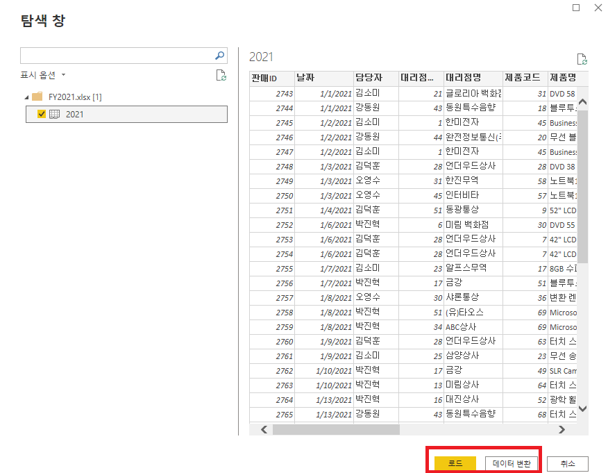
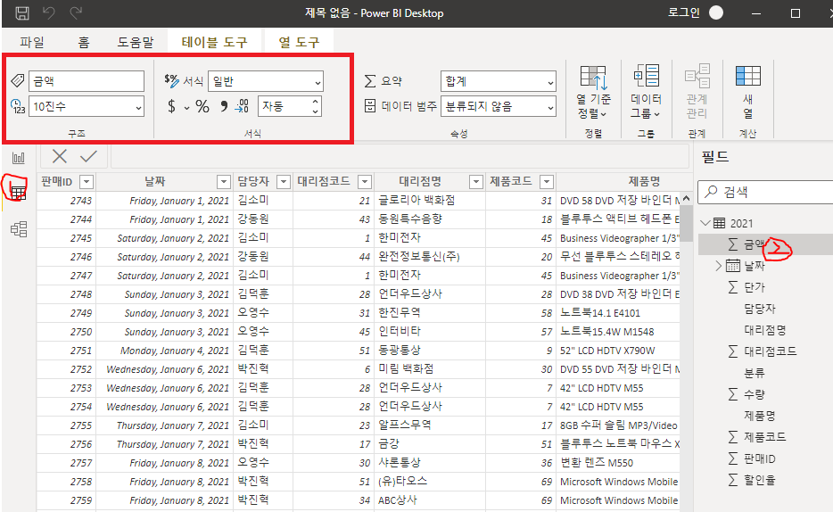
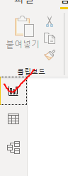
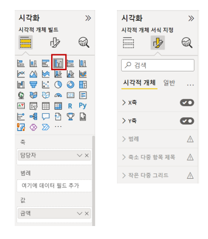
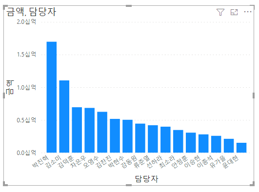
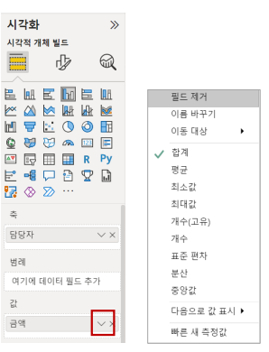
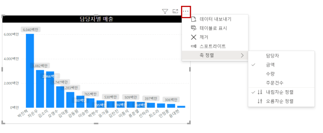
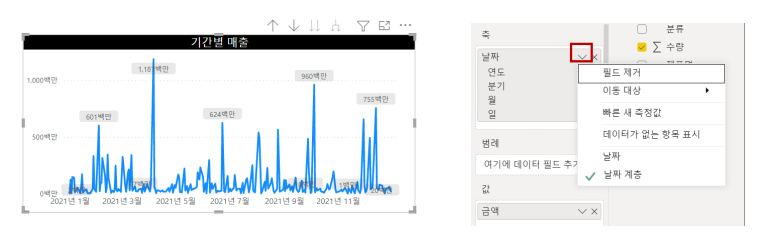
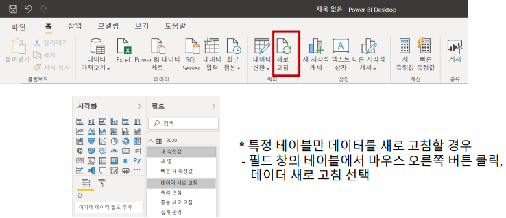
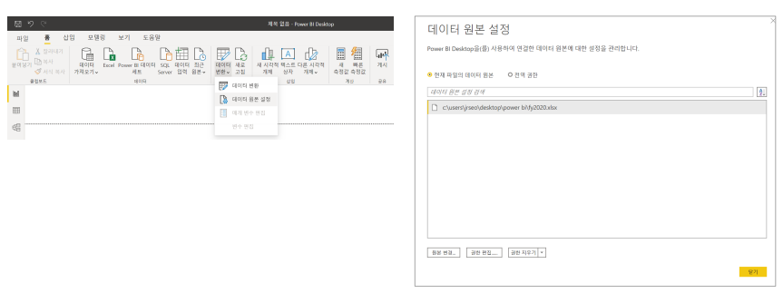

# 2. Power BI 다루기

파일 다운주소: https://github.com/microsoft/powerbi-desktop-samples/blob/main/Sample%20Reports/Sales%20%26%20Returns%20Sample%20v201912.pbix

## 2.1. 데이터 가져오기

- 로드

  - 데이터를 가져와 사용 (Excel의 FY2021을 가져와보자)

- 데이터 변환

  - 데이터 정리 및 편집이 필요한 경우 쿼리 편집기로 이동

  

## 2.2. 테이블 및 필드 다루기

- [열 도구]에서 데이터 형식, 서식 변경
- 데이블 숨기기, 필드 숨기기, 이름 바꾸기 등

## 2.3. 데이터 시각화

- 보고서 선택

- [시각적 개체에 데이터 추가] 옵션
  - 축, 범례, 값, 도구 설명 영역에 필드 추가
- [시각적 개체 서식 지정] 옵션
  - X축, Y축, 데이터 색, 데이터 레이블 등 변경

## 2.5. 요약 값 변경

- 값 영역에 추가한 데이터는 기본으로 합계로 표시, 평균, 개수 등으로 변경

- [값] 영역에서 필드의 아래 화살표 클릭
- 기본 통계(합계, 평균, 개수 등) 변경

## 2.6. 시각적 개체 요소

- 시각적 개체 머리글의 아이콘 사용 

- 필터 –적용된 필터 값 표시 
- 포커스 모드 –시각적 개체 확대 
- 추가 옵션 – 데이터 내보내기, 스포트라이트, 축 정렬 등 적용

## 2.7. 날짜 축 다루기

- 꺾은선형 시각적 개체 추가 후 
- 날짜 필드를 축에 추가하면 연도, 분기, 월, 일로 날짜 계층 구조로 표시 
  - 시각화 드릴 모드에서 계층구조 모두 확장 아이콘으로 계층 탐색 
- 날짜 필드의 아래 화살표( ) 클릭하여 날짜 사용 
  - 기본 날짜로 표시

## 2.8. 데이터 새로 고침

- 원본 파일의 데이터가 추가, 편집, 삭제된 경우 
- [홈]-[새로 고침]으로 전체 데이터 세트에 데이터 새로 고침 반영 
  - 데이터 크기나 PC환경에 따라 처리 속도가 오래 걸릴 수 있음

## 2.9. 데이터 원본 변경

- 원본 파일의 위치가 변경된 경우 
- [홈]-[데이터 변환]-[데이터 원본 설정]선택하여 원본 변경

## 2.10. 파일 저장

- [파일]탭 – [다른 이름으로 저장] 선택 
- .PBIX로 저장

