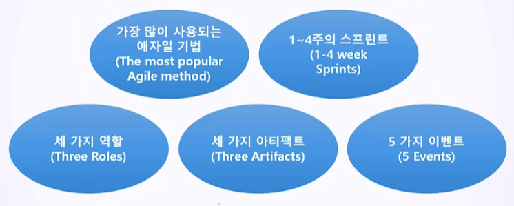
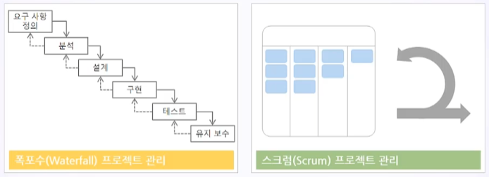
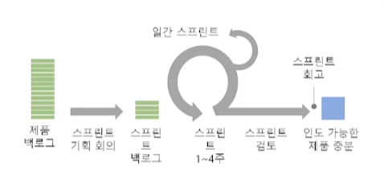
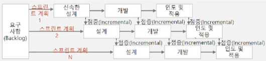
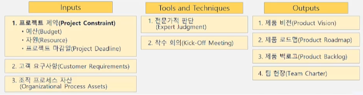
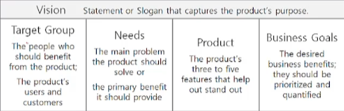
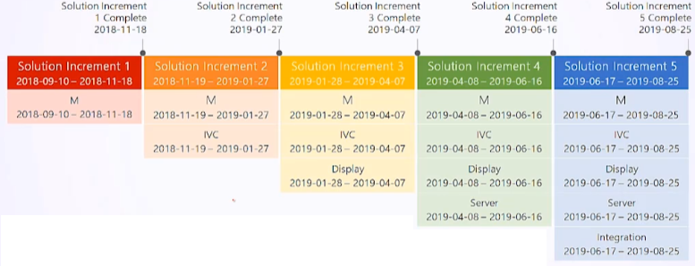
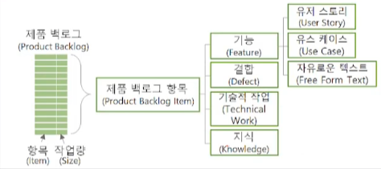
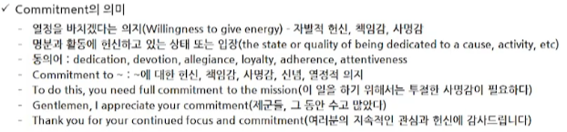

# 10. Scrum (스크럼)

- 스크럼 소개
- 스크럼 프로세스
- 스크럼 착수

## 10.1. Introduction to Scrum

#### 10.1.1.스크럼 명언

- 다른 사람이 잘 되도록 도와주면, 우리가 잘 됩니다
  - 로버트 잉거솔
- 스크럼에서 그 놈의 역할이라는 것은 딱 세 개 밖에 없습니다. 개우 세 개라구요. 그것도 제대로 해내지 못하면, 스크럼이라고 부르지 마세요. 아시겠어요?
  - 론 제프리스
- 스크럼은 여러분의 시어머니와 같습니다. 여러분의 모든 잘못을 지적합니다.
  - 켄 슈와버
- 스프린트가 끝날 때 작동 가능한 제품이 나오지 않으면 그 스크럼은 실패한 스크럼입니다.
  - 제프 서덜랜드

#### 10.1.2 Scrum

- 스크럼이란 프로젝트를 위한 상호협력적이며(Collaborative), 점진적인(Incremental) 개발 방법론
  - 스크럼은 자기 조직화 팀(Self Organizing Team)으로 진행됨
    - 서로를 존중하고 협력하고 협업하며 팀 전체의 역량을 강화해 나감
    - 항상 팀 단위로 생각하고 행동함
    - 원활한 의사소통을 위하여, 구분 없는 열린 공간을 유지함
      - 개발팀, 스크럼 마스터, 제품 책임자
  - 원래 럭비에서 양 팀 선수 전원이 하나의 팀으로 서로 밀집하여 팔을 꼭 끼고 하나의 집단을 형성해 상대 팀을 앞으로 밀치는 대형을 의미함
    - 이렇게 럭비 경기에서 쓰이던 용어가 소프트웨어 개발 프로젝트에 사용되는 것은 스포츠팀이라는 단어가 주는 의미를 개발 팀에 적용하여 효율적인 성과를 얻기 위해서임
  - 스크럼은 개발 팀(조직)을 효율적으로 관리하는 방법을 제공함

#### 10.1.3. 스크럼의 핵심

#### 10.1.4. 세 가지 역할 (Three Roles)

- 스크럼 팀 (Scrum Team) = 스크럼 프로젝트를 위하여 구성된 팀
  - 스크럼 팀은 제품 책임자, 개발팀, 스크럼 마스터로 구성됨
  - 스크럼 팀은 3~9명으로 구성된 작은 팀임
    - 규모가 작은 프로젝트는 하나의 스크럼 팀이 존재할 수 있음
    - 규모가 큰 프로젝트는 여러 개의 스크럼 팀이 존재할 수 있음

|            스크럼역할            | 설명                                                         |
| :------------------------------: | :----------------------------------------------------------- |
|    제품 책임자(Product Owner)    | - 제품 책임자 = 제품 소유자 - 무엇을 개발할 것인가 결정함 - 가장 가치있는 소프트웨어를 개발하기 위하여 제품에 필요한 기능을 정의함 - 기능을 제품 백로그에 추가하고, 삭제하며, 기능에 우선순위(Priority)를 부여함 |
|    개발팀 (Development Team)     | - 실제 개발 작업과 연관된 사람                               |
| **스크럼 마스터** (Scrum Master) | - 전체를 지원하고 관리하는 사람 - **스크럼 프로세스를 촉진함** - 자기 조직화 팀(Self Organizing Team)을 구축을 할 수 있도록 도움 - 외부의 간섭으로푸터 팀을 보호함(Shield team from extrenal interfenerces) |

#### 10.1.5. 세 가지 아티팩트 (Three Artifacts)

| Artifacts       | 설명                                                         |
| --------------- | ------------------------------------------------------------ |
| Increment       | - 한번 수행된 스프린트의 성과이자 스프린트에서 완료한 제품의 기능(해당 스프린트와 지금까지 완선한 기능 전체)을 의미함 - 스프린트가 종료될 때는 증분이 동작하는 상태가 되어야 하며, 이것을 확인하면서 실제로 제품 책임자가 제품 릴리즈 여부를 결정함 |
| Product Backlog | - 제품 개발을 위하여 팀이 유지해 나가는 사용자 중심의 요구사항에 관한 지시 목록 - 제품 백로그는 프로젝트 전 단계에 걸쳐 계속 추가 및 수정해 나감 |
| Sprint Backlog  | - 제품 백로그로부터 추출되어 해당 스프린트에 할당된 기능 목록을 말함 - 스프린트 계획을 수립할 때 제품 잭임자가 결정한 순위와 개발팀이 결정한 공수 정보를 통합하여 논의한 후에 만들어짐 - 이 목록은 한 번의 스프린트에서만 사용됨 |

#### 10.1.6. 5 가지 이벤트

| 이벤트        | 설명                                                         |
| ------------- | ------------------------------------------------------------ |
| 스프린트      | - 반복 주기, 짧은 프로젝트 관리 주기, 보고 주기 - 스프린트는 1~4주의 타임박스에서 결정함. 일반적으로 **2주**가 스프린트의 적절한 기간 - 예정된 기능이 완성되지 않아도 연장되지 않음(정해진 기간이 지나면  스프린트는 종료함) - 스프린트 기간 동안 개발팀은 **스프린트 백로그(Sprint Backlog)**에서 정한 대상의 개발에 집중함으로써 동작하는 제품 기능의 일부(Increment)를 만들어냄 - 스프린트(Sprint)내에서 스프린트 계획 (Sprint Plan), 일일 스크럼 (Daily Scrum), 개발 (Development), 스프린트 리뷰 (Sprint Review), 회고 (Retrospective) 등의 제품 개발을 수행함 |
| 스프린트 계획 | - 스프린트 시작에 앞서 수행하는 미팅임 - 제품 백로그로부터 해당 스프린트에 할당할 스프린트 백로그를 도풀한 후에, 팀은 스프린트 내에서 이를 구현할 것을 결정함 - 이것을 대상으로 개발팀은 실제 업무량을 산정하고 이전 스프린트에서 측정된 개발 실적에 비춰 우선순위가 높은 것부터 이번 스프린트에 어디까지 포함할 지를 결정함 |
| 일일 스크럼   | - 일일 스크럼 = 스탠드업 미팅 = 조회 - 개발팀 전원의 활동 현황을 공유함 - 일어선 채로 매일 정해진 시간에 정해진 장소에서 15분의 짧은 시간 동안 미팅을 진행함 |
| 스프린트 리뷰 | - 스프린트가 종료될 때 제품에 대한 관계자를 불러 모아 완성된 제품을 시연하는 이벤트임 - 스프린트 리뷰는 개발팀에게는 자신들이 만든 백로그의 항목이 제대로 작동되는지에 대해 증명할 수 있는 기회가 되고, 다른 관계자에게는 스프린트가 잘 수행되어 제품이 서서히 성장하고 있다는 것을 보게 해 주는 기회가 됨 |
| 회고          | - 스프린트 리뷰 후에 수행하는 행위로, 방금 수행한 스프린트를 되돌아보는 기회임 - 회고를 통해 스프린트에서 잘 수행한 것, 잘 수행하지 못한 것에 대해 이야기하고 궁극적으로 어떻게 하면 다음 스프린트에서 더 잘 수행할 수 있을지에 대한 의견을 같이 나눔 - 이것이 "점검과 개선"의 기회가 되고 팀 학습, 팀 개선의 활동이 됨 |

## 10.2. 스크럼 프로세스 (Scrum Process)

- Waterfall vs. Scrum

- 스크럼은 프로젝트 기간과 **스프린트**를 정한 후에 제품 **백로그**를 프로젝트 전반에 걸쳐 업데이트하고 제품을 개발하는 애자일 프로젝트 관리 방법론 중 하나

#### 10.2.1. 스크럼이란

- 증분과 반복에 기반한 프로젝트 관리 방법론
- 프로젝트 범위를 증분과 반복으로 작게 정의하여 수 많은 작은 실패를 반복함
  - 스크럼 팀에서는 실패를 두려워 하지 않고 사실대로 공유하고 함께 해결하고 함께 평가 받음
  - 계획대로 작업을 완료하는 것이 중요하지않음 -> 실제 작동하는 결과를 보여 주는 것이 중요함
- 증분기간 내에 여러 번 시행 착오 할 수 있는 스프린트를 반복함
  - 각 스프린트의 후반부에는 스프린트 리뷰를 실시하여 작동 가능한 중간 산출물을 검토하고, 다음 스프린트에서 개선함
  - 각 증분의 마지막 스프린트의 스프린트 리뷰에서는 UAT(User Acceptance Test, 사용자 인수 테스트)를 실시하고 산출물(Deliverable)을 인도함
- 증분 =Increment = Build = Version
  - 증분은 고객 또는 경영진 관점의 단꼐별 점증적 인도물의 구현을 의미
  - 증분은 점진적으로 발전해 가는 것이며, 제품의 기능을 추가하거나 보완함(세로로 프로세스 적용)
  - 프로젝트 초기에 상위 수준의 범위가 명확하지만, 상세한 범위는 증분을 반복하면서 구체화됨
  - 현재의 증분에서 다루지 않는 산출물은 상위 수준에서 다루거나 미래의 증분N에 잠정적으로 배분함
- 반복 = Iteration = 표준 프로세스 = 단계 (Step, Stage, Phase)
  - 제품 개발을 위한 프로젝트 프로세스를 개발함 (가로로 프로세스 적용)
  - 반복적 단계의 마지막 부분에는 산출물이 완성되어야 함

## 10.3. 스크럼 착수 (Initiating Scrum) 

#### 10.3.1. 제품 비전(Product Vision)

- 차별화된 제품 개발을 슬로건을 표현함
- 대상 사용자 도는 고객사 이름을 기술함
- 고객의 니즈를 식별함
- 제품 성공을 위한 제품의 가장 중요한 속성을 결정함
- ROI, 혜택, 개발 기간 등 사업적 목표를 설정함

#### 10.3.2. 제품 로드맵(Product Roadmap)

- 제품의 불확실성을 줄이고 우선 순위가 높은 증분을 먼저 개발하는 방식의 단계를 제시해야 함

#### 10.3.3. 증분

- 프로젝트 착수 시에 프로젝트의 전체 기간에 걸친 증분 계획을 마일스톤 일정 차트 형식으로 작성함
- 각 스프린트가 종료될 때는 증분이 동작하는 상태가 되어야 함
  - 증분은 팀의 완료 조건을 만족해야 함
  - 제품 책임자가 하며, 증분의 동작 여부를 확인한 후에 실제로 제품 릴리즈 여부를 결정함

#### 10.3.4. 제품 백로그

- 제품 개발을 위하여 팀이 유지해 나가는 사용자 중심의 요구사항에 관한 지시 목록
- 프로젝트의 전체 범위

#### 10.3.5. 착수 회의 (Kick-off Meeting)

- 목적
  - 이해관계자에 정보를 제공하고 참여를 유도함
  - 자발적 헌신을 확보함
- 참가자
  - 제품 책임자, 스크럼 마스터, 개발팀, 이해관계자

- 진행 방법
  - 프로젝트의 목적과 개요 설명
  - 프로젝트 팀원의 소개와 인사 : 인간 관계와 커뮤니케이션의 형성
  - 프로젝트 현황 검토: 제품 비전, 제품 로드맵, 제품 백로그, 리스크 관리 대장, 이슈 로그
  - 문제 영역 실별 -> 참여 유도 -> 팀원에게 신뢰 표명 -> 해결책 질문 -> 팀원의 답변 -> 토론 -> 공감대 형성
  - 개인과 그룹의 역할과 책임 정의
  - 개인과 그룹의 자발적 헌신 의지 도출. 동기 부여

#### 10.3.6. 팀 헌장 (Team Charter)

- 팀 헌장은 프로젝트 팀원에게 허용되는 행동에 대한 명확한 기대사항을 규정함
- 행동강령, 의사소통, 의사결정 또는 회의 예절 등의 주제를 논의함으로써 팀원들이 서로에게 중요한 가치를 발견할 수 있음
- 팀원들이 직접 개발할 때 효과적임
- 예
  - 항상 더 즐겁게 일해요
  - 지식을 공유하는 것에 자부심을 가집시다
  - 상대방의 입장에서 이슈를 이야기합시다
  - 우리 팀은 서로 돕고 비난하는 일이 없으면 좋겠어요

## Key Point

- 스크럼의 특징
  - 스크럼은 프로젝트를 위한 상호협력적이며, 점진적인 개발 방법론
  - 스크럼은 자기 조직화 팀으로 진행
- 스크럼의 세 가지 역할
  - 제품 책임자
  - 개발팀
  - 스크럼 마스터
- 스크럼은 프로젝트 범위를 증분과 반복으로 작게 정의하여 수 많은 작은 실패를 반복
- 스크럼 착수 프로세스
  - 1. 제품 비전을 작성하고
    2. 초기 제품 백로그를 준비하고
    3. 프로젝트 전반에 걸친 제품 로드맵에 증분과 반복 계획을 반영하며
    4. 스크럼 팀 구성을 구성하고 착수 회의와 제품 백로기 미팅을 수행하며
    5. 팀 헌장을 개발합니다.

