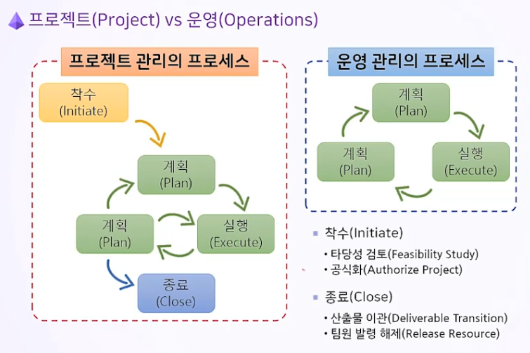

# 1. 프로젝트의 이해 

- 프로젝트 업무의 가치
- 프로젝트의 개념
- 프로젝트(Project) vs. 운영(Operation)

---

## 1.1. 프로젝트 업무의 가치

- 인류의 역사는 프로젝트의 역사
- 조직의 역사도 프로젝트의 역사
  - 비전
  - 전략적 목표
  - 프로젝트
  - 프로젝트 관리 방법론, 도구, 인적 자원
- 프로젝트 관리자(PM)는 조직의 핵심 인력
  - 프로젝트화하고
  - 프로젝트 관리 방법론을 제안과 실행
  - 프로젝트 관리 정보 시스템 PMIS
  - 많은 조직들이 PMO를 운영중

---

## 1.2. 프로젝트란?

- 고유한 목표를 산출하기 위해 수행하는 **한시적**인 노력

#### 1.2.1. 프로젝트 업무

- 목표의 달성(Achieving the goal)
- 고유성(Unique)
  - 고유한 목표  -> 산출물(Deliverable)
- 한시성(Temporary)
  - 시작과 끝 -> 분명한 마감일 (Deadline)
- 불확실성(Uncertain)
  - 단계(process) 제시
  - 점진적 상세화 (Progressive Elaboration)
- 사업 운영의 중대한 변경은 집중적인 프로젝트 관리를 필요로 함

#### 1.2.2. 일반 업무(Operation) = 운영

- 사업의 유지(sustaining the business)
- 프로젝트 결과의 활용
- 일반 업무의 특징

  - 상시성(On-going)
  - 반복성(Repetitive)
  - 안정성
  - 사업의 유지
  
- 프로젝트 결과를 활용함

#### 1.2.3. 공통점

- 사람이 수행, 자원의 제약을 받음, 계획-실행-통제를 거침

---

## 1.3. 프로젝트의 특징

- Projects Drive Change : 변화가 없다면 운영
- Business Value Creation: 가치 창출, 가치가 창출이 없다면 프로젝트가 아님
  - Tangible 유형
  - Intangible 무형

#### 1.3.1. Unique

- **산출물**(목표) 

  - 인도물= 결과물= 성과물 = 성과품

  

- 주 산출물
  - 제품
  - 서비스
  - **개선** - 애자일에서 매우 중요
  - 문서

#### 1.3.2. Temporary

- 한시성
  - 시작과 끝이 존재
- 프로젝트는 일의 시간적인 맺고 끊음을 분명히 하는 업무이다.

- 프로젝트(Project)로 목표를 달성하면 -> 목표의 유지를 운영(Operation)으로 한다.

#### 1.3.3. Uncertain

- progressive Elaboration

  - 점진적 상세화 = 점진적 구체화

- 불확실성 완화를 위한 Dedicated Planning은 Progressive Elaboration을 통해서 가능해진다

- 표준 프로세스 = 반복(Iteration)

  - 분석 >> 설계 >> 개발 >> 테스트 >> **인도**(Delivery, Release, Cut Over, Launch) 

- 프로젝트는 점차 정보의 양이 증가하고 정확한 산정치가 제시됨에 따라 계획의 정확도를 높여 나가는 반복적인 프로세스로 진행된다

- **프로젝트의 범위는 프로젝트 전 단계에 걸쳐 점진적으로 상세화**

  #### 1.3.3.1 Water fall : 예측형 프로젝트의 점진적 상세화 ( IT와 알맞지 않음)

  - 반복에 대한 개념 없음
  - **상위 단계 (Phase) >> 하위 단계 (Stage) >> 프로세스(Process)**

  #### 1.3.3.2. **애자일** 프로젝트의 점진적 상세화 (IT와 알맞음)

  - Agile 은 Adapt to Change 하는것이다

  - 짧은 주기를 여러번 설정 (Increment)
  - 고객에게 여러번 반복적으로 제공하며 feedback을 받으며 진행
  - **증분(Increment)** >> **반복(Iteration)** >> 에픽(Epic) >> **기능(Feature)** >> 사용자 스토리(User Story) >> 작업 (Task) = Issue
  - 증분의 개념을 잘 설정해야함. 
  - 증분 내에서 리스트를 고려한 반복이라는 프로세스를 잘 제시해야함

  

#### 1.3.4. 프로젝트를 통해 산출할 수 있는 고유한 산출물

- 분석, 설계, 개발, 테스트

- 제안은 제안이고 실전은 실전
- 프로젝트의 복잡성이 있다고 생각되면 애자일 방식으로 적극적으로 전환해야한다

---

## 1.4. 프로젝트 vs. 운영

- 프로젝트와 운영의 상호 선순환을 통해서 조직의 전략적 목표를 달성한다

  

## 1.5. Key Point

- 조직은 경영 전략을 프로젝트화 (Make it project)하고, 프로젝트 중심으로 성장하고 발전한다

- 조직이 성장하고 발전하기 위해서는 프로젝트 관리자, PM, 의 전문적인 역량이 매우 중요하다

- 프로젝트의 특징

  - Unique
  - Temporary
  - **Uncertain >> Progressive Elaboration**
    - Waterfall
    - Agile

  - Projects Drive Change
  - Projects Enable Business Value Creation

- 프로젝트는 한시적이고 고유합니다. 반면에 운영은 상시적이고 반복적입니다

- 프로젝트와 운영의 상호 선순환을 통해 조직의 전략적 목표를 달성합니다
