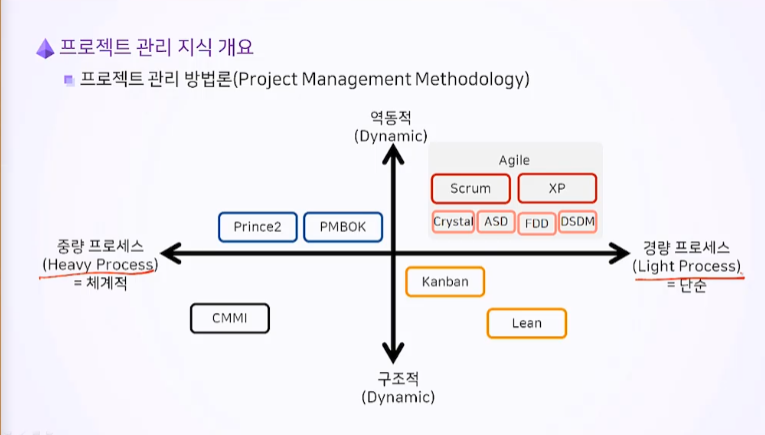
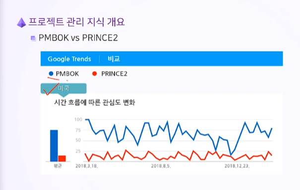
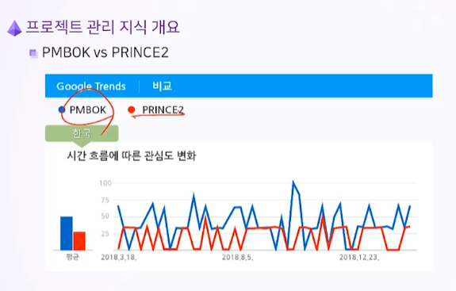
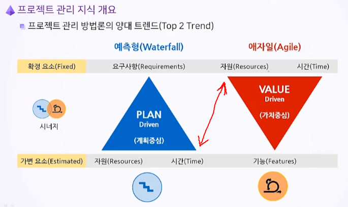
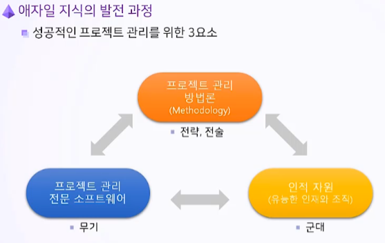

# 2. Project Management

- 프로젝트 관리 지식 개요
- 애자일 지식의 발전과정

## Goal

- 전통적 프로젝트 관리 지식의 발전 과정과 애자일 프로젝트 관리 지식의 등장 배경 이해
- 초기 애자일 프로젝트 관리 지식과 전통적 프로젝트 관리 지식
- 대표적인 애자일, 스크럼
- PMBOK 와 Prince2

## 2.1. 프로젝트 관리 지식 개요

#### 2.1.1. 역사

- 1910년 미국의 Henry L. Gantt가 **Gantt 차트** 개발
- Hoover Dam 프로젝트 (1931~ 1936)와 interstate Highway 프로젝트(1956~1991)에 **Gantt 차트** 적용

- 1957년 **PERT**가 개발되어 Polaris Missile 프로그램에 적용
- 1957년 주공정 기법(**CPM**, Critical Path Method)이 개발되어 화학공장 건설 프로젝트에 적용

- 1969년 Project Management Institute(**PMI**) 설립
- 1984년 Microsoft Project 출시
- **1996년 PMI가 Project Management Body of Knowledge(PMBOK) 1st Edition 출간**
- 2017년 **PMBOK 6th Edition** 출간

#### 2.1.2. 방법론이란

- 프로젝트를 성공적으로 관리하기 위한 검증된 지식 체계
  - 가치를 충출하기 위한 일련의 **프로세스(Process)와 도구(Tools) 및 기법(Techniques)**
  - 프로젝트의 **산출물(Deliverable)** 목록과 관리 체계
  - 업무 수행과 통제를 위한 **지침(Guideline)**

#### 2.1.3. 프로젝트 관리 방법론(Project Management Methodology)

 

#### 2.1.4. Project Management Body of Knowledge: 프로젝트 관리 지식 체계

PMBOK GUIDE

- 전세계적으로 가장 많이 알려진 방법론의 Global Standard임
- PMBOK은 국재표준화기구에 **ISO 21500** 인증을 받음
- 모든 프로젝트에 적용할 수 있는 가장 일반화된 지식이며, PM에게 필요한 **최소한의 기본 지식**을 소개함

- 애자일, 예측형, 하이브리드 등 포괄적인 지식 체계를 제공

#### 2.1.5. PMBOK 프로젝트 관리 지식 영역

대표적 세가지

- 애자일의 첫번쨰 목표는 **리스트(Risk)**관리 - What if?
- 범위(Scope) - What?
- 일정(Schedule) - When?

#### 2.1.6. PRINCE2(PRojects IN Controlled Environments): 통제된 환경에서의 프로젝트

PMBOK의 라이벌

- 1996년 영국 정부기관인 OGC(Office of Government Commerce, 영국 조달청)에서 개발한 프로젝트 관리 매뉴얼
- 현재는 공공법인인 AXCELOS이 소유권을 가짐

#### 2.1.7.PMBOK vs PRINCE2

- PMBOK
  - **테일러링**하고 선택적으로 사용할 것을 추천
  - 49개 프로세스
- PRINCE2
  - 모든 내용을 반드시 적용할 것을 주장
  - 7개 프로세스

#### 2.1.8. 예측형(waterfall) 프로젝트 관리 vs. 애자일(Agile) 프로젝트 관리

- 예측형 프로젝트 관리  = 폭포수 모델 (Waterfall)

  - 프로젝트의 범위가 명확할 때 적용

  - 프로젝트의 요구사항을 초기에 정의하고, 프로세스와 산출물 관계를 명확히 하며, **고객과 경영진**에게 산출물을 **체계적으로 문서화**하여 보고함

  - 프로젝트의 범위, 일정, 자원, 비용을 통합 관리

  - 프로세스에 따라 예측 가능하게 작업을 관리함

- 적응형 프로젝트 관리 = 애자일(Agile)

  - 애자일은 **기능(Features) 우선순위** 기반

  - 프로젝트 범위의 **변경 가능성과 불확실성**이 크고 창의적인 구현을 필요로 할 때 적용

  - 전 단계에 걸쳐 요구사항을 계속 추가하며, **문서 격식주의를 최소화**하고 개발 단계에서 **개발자 중심**으로 프로젝트 작업을 진행

  - **창의적**으로 범위를 구현하는데 초점을 맞춤

    

## 2.2. 애자일 지식의 발전 과정

#### 2.2.1. 애자일 프로젝트 관리 지식의 역사

- 1986년 히로타카와 노나카 이쿠지로가 속도와 유연성을 향상시키는 제품 개발의 접근법을 발표
- 전통적, 순차적 접근법에 반대되는 관점을 제시
- 개발팀에 함께 책임지고 단기적인 공통된 목표를 가짐
- 1993년 제프 서덜랜드가 스크럼 팀을 구성하여 프로젝트를 진행
- 2001년 **Agile 선언문**이 발표되고, 2002년 **Agile Alliance**가 탄생

- 초기에는 단순히 경량방법론(Lightweight methods)으로 통칭되었지만 Agile 선언문 이후, "Agile"이라고 불리게 됨

- **Scrum 방법론과 XP가 대표적**

#### 2.2.2. PMI Agile Practice Guide

- 전반적인 개념 위주

- PMI와 Agile Alliance의 협업으로 개발됨
- 다양한 Agile 방법론 소개

#### 2.2.3. PRINCE2 Agile

- Scrum에 초점
- PRINCE2 Frameworks 기반으로 Agile Mindset과 Delivery 프로세스를 추가함

#### 2.2.4. Scrum Guide

- 스크럼은 복잡한 제품 개발을 목표로 하는 프로젝트에 필요한 프로임워크임
- 2010년 초판이 출간되었으며 5번의 개정판이 출간
- 무료임

#### 2.2.5. 예측형과 애자일의 공통점

- 프로젝트를 성공적으로 관리하는 것을 목표로 함
  - 요구 사항을 식별(파악)함
  - 적극적이며, 효과적이고, 실질적으로 상호 협력적으로 이해관계자들 간에 소통함
  - 범위, 일정, 비용, 자원, 품질, 리스크 등의 상호 충돌하는 프로젝트 제약 조건을 균형 있게 조정

#### 2.2.6. 성공적인 프로젝트 관리를 위한 3요소

- Scrum Master이 Agile의 성공을 좌우함

- Agile은 팀웍이며 가벼우며 불확실성을 빠르게 적응하고 변화에 대응하는 것

## 2.3. Key Point

- 프로젝트의 범위가 명확할 때 **예측형(Predictive: Waterfall)** 프로젝트 관리 방법론을 적용
- 프로젝트 범위의 변경 가능성과 불확실성이 크고 창의적인 구현을 필요로 할 때 **적응형(Adaptive: Agile)** 프로젝트 관리 방법론을 적용
  - 변화에 적극적으로 대응하는 것
- PMBOK은 전세계적으로 가장 많이 알려진 프로젝트 관리 방법론의 Global Standard
- PMBOK은 Agile, Waterfall, Hybrid 등 다양한 방법론을 유연하게 적용하여 프로젝트를 성공적으로 완수할 수 있는 가장 포괄적인 지식 체계를 제공
- **Agile Practice Guide**는 Project Management Institute(PMI)와 Agile Alliance의 협업으로 개발되었음
- PRINCE2 Agile은 Scrum에 초점을 맞추고 있음
- **Scrum Guide**는 스크럼 실천을 위한 방법론
