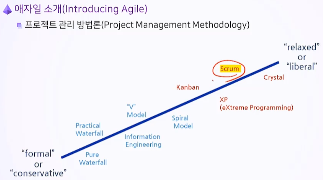
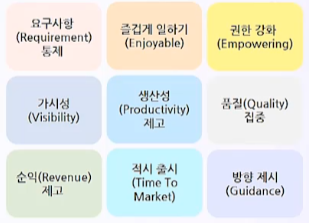
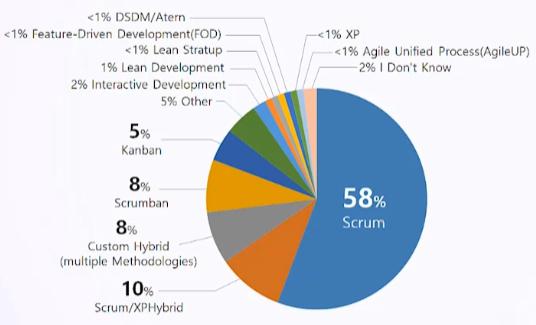
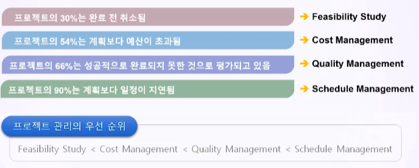

# 3. 애자일 프로젝트 개요

- 애자일 소개
- 애자일 프로젝트의 특징

## 학습목표

- 애자일 프로젝트의 의미를 이해
- 애자이리 프로젝트의 올바른 목표 설정

---

## 3.1. 애자일 소개

#### 3.1.1. 프로젝트 관리 방법론(Project Management Methodoloy)

- Scrum이 많다

#### 3.1.2. 애자일(Agile)의 정의

- 신속하고(Fast) 변화에 유연하며(Flexible to Change) 적응적인(Adaptive) 개발을 목표로 하는 다양한 Light 개발 방법론 전체를 일컫는 총칭
  - 증분(Increment)
    - 여러 하위 프로젝트를 통해서 점진적으로 프로젝트 범위와 일정을 개발하고, 프로젝트 산출물을 빠르게 인도(Fast Delivery)함
  - 반복(Iteration)
    - 단기 단위를 채용함으로써 리스크(Negative Rish)을 최소화함

#### 3.1.3. 애자일 방법론(Agile Methodology)

- Agile은 하나의 방법론이 아님
- Agile은 신속하고 예측 가능하게 개발하기 위한 여러 접근법을 통틀어 일컫는 **경량 개발 방법론(Light Development Methodologies)**임

#### 3.1.4. 애자일의 오해

-  Silver Bullet이 아니다

- 프로젝트의 일부 시기 또는 특정 프로젝트의 전체시기에 적용될 수 있는 선택적 방법론임

- 문서 격식주의가 적을 뿐이다(Less Ceremony)

- 수 많은 애자일 방법론이 존재하며, 애자일에는 표준이 없다

- 각 조직에 맞게 테일러링(Tailoring)해야 한다

- 애자일은 명쾌한 프로세스를 제시하지 않는다

- 애자일 선언문을 통해서 공표된 4대 가치와 12대 원칙을 중심으로 마음 가짐을 갖추는 것이 중요하다

#### 3.1.5. 모든 애자일 방법론의 공통점

- Customer is an active participant
- Manage Project Risk
- Focus on Dynamic Schedule Management
- Follows Processes based on Iteration

- Generally using a dialog, not a document
- Recoding simple, shorthand feature descriptions
- Collects requirements continuously
- Foucus on development team's collaboration

#### 3.1.6. 애자일의 기대효과

- Adaptive to changing business needs, giving the organization more influence over **adding, changing, or removing requrirements**
- **Early and continuous customer feedback** improves communication nad **empowers business owners** who can receive and review critical information necessary to make decisions to steer the project throughout the development process.

- **High visibility and influence over the project progress** leading to early indications of problems
- **Incremental delivery** rather than a single complete delivery at the end of the project; **reduces product and process waste**

  

#### 3.1.7. Agile Method & Practices 사용 현황

---

## 3.2. 애자일 프로젝트의 특징

#### 3.2.1. IT 프로젝트 실패의 교훈

- **고객**은 자기가 진짜 원하는 것을 올바르게 제시하지 못함
  - 요구사항과 기대사항을 구분
  - 고객과 개발자 간의 협력을 통해서 요구사항의 불확실성을 줄이고 고객이 수용할 수 있는 대안을 지속적으로 제시
- IT 프로젝트 = **팀 플레이**
  - T자형 인재(1인 다역)들이 공통된 역량을 보유
  - 자기 조직화 팀(Self Organizing Team)
- **산출물**을 관리
  - 애자일에서도 산출물 문서는 매우 중요
  - 상황을 정확하게 공유하고 시각화
- 요구사항 정의는 **프로젝트 팀이 주도**
  - 고객의 요구사항이 재미라고 주장했을 때 안전이라는 Cross Functional Requirements를 정의할 수 있어야 함
  - 핵심 요구사항을 프로젝트 전 단계에 걸쳐 발전
- IT 프로젝트에서 가장 중요한 것은 리스크 관리 역량
  - 프로젝트 목표에 영향을 주는 변수를 파악하고 관리
  - 리스크 관리의 명확한 원칙이 포함된 프로젝트 리스크 관리 계확을 수립
  - 리스크 식별 정보, 정성적 분석, 정량적 분석, 예방 계획, 비상 계획이 포함된 리스크 대응 계획을 수립
  - 리스크 보고서와 대시보드를 관리하고 예방 조치와 비상 조치를 실시

#### 3.2.2. 소프트웨어 개발 방식의 재검토 필요

- 성공을 기대하기보다 실패를 관리하자

  -  Successful: 납기준수, 예산준수, 만족할 만한 기능 제공

  - Failed: 완성되기 전에 취소되거나 사용하지 않음
  - Challenged: 지연, 예산초과, 필수 기능 제공 미흡

#### 3.2.3. 실패에 대한 인식 수정

- 오늘날 디지털 시대에서 Fail이란 무엇일까?
  - 작은 실패를 여러번 반복해서 성공으로

#### 3.2.4. 익스트림 스포츠와 스크럼

- 익스트림 스포츠: 방법과 실패를 반복하고 나아가면서 성공에 다가감
- 럭비: 스크럼과 공통점, 선수가 경고를 받는게 아니라 팀 전체가 경고를 받음
  -  개인에게 책임을 묻고 질책한다면, 교훈 나눌 수 없고 개선되기 어려움
- Seth Godin : "People are not afraid of failure, they're afraid of blame."
  - 비난의 문화가 없어져야함

#### 3.2.5. CHAOS Report

통계에 따르면

- 규모가 클 수록 실패함
- 규모가 작을 수록 성공함

#### 3.2.6. 애자일의 우선 관리 대상

- **RISK**
- 애자일의 1차적인 목표 = **프로젝트 리스크 관리(Project Risk Management)**
  - 프로젝트 리스크 관리를 위한 애자일의 기법은 **반복(Iteration)**
  - 리스크 대응과 품질 통제에 유효한 반복(Iteration) 프로세스를 개발해야 함

- 애자일의 2차적인 목표 = **프로젝트 일정 관리(Project Schedule Management)**
  - 프로젝트 일정 관리를 위한 애자일의 기법은 증분(Increment)
  - 보고 주기(스프린트) 이내에 작동 간으한 제품을 릴리스 할 수 있도록 일정을 역동적으로 관리해야 함

## Key Point

- 애자일은 신속하고 변화에 유연하며 적응적인 개발을 목표로 하는 다양한 경량 개발 방법론 전체를 일컫는 총칭
- 애자일은 증분이라는 여러 하위 프로젝트를 통해서 점진적으로 프로젝트 범위와 일정을 개발하고 프로젝트 산출물을 빠르게 인도
- 애자일은 반복이라 불리는 단기 단위를 채용함으로써, 리스크를 최소화
- 애자일의 목표
  - 1. 프로젝트 리스크 관리
  - 2. 프로젝트 일정 관리