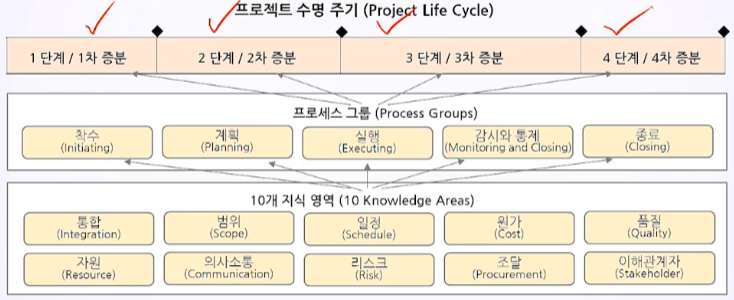
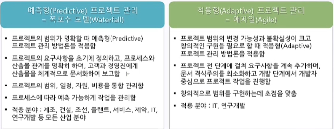
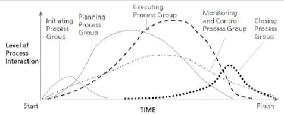
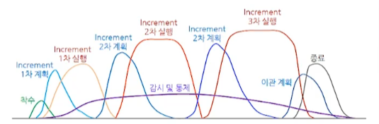

# 5. 프로젝트 라이프사이클의 이해

- 프로젝트 라이프 사이클(Project Life Cycle)의 기초
- 예측형 프로젝트 관리 vs. 적응형 프로젝트 관리
- 예측형 라이프 사이클(Predictive Life Cycle)

## 5.1. Project Life Cycle 의 기초

#### 5.1.1. PMBOK(Project Management Body of Knowledge)

- 각 증분과 단계에서 타당성을 검토한 후 프로세스 그룹에 해당되는 사항들은 착수한다.
- 모든 프로젝트에는 불확실성이 있다.

#### 5.1.2. 프로세스 모델(Process Model)

- 착수(Initicating) -->  [ 계획(Planning), 실행(Executing)  , 감시 및 통제(Monitoring & Controlling) ] --> 종료(Closing)
  - 사실살 계획, 실행, 감시 및 통제는 현실 세계에서는 동시에 일어남

#### 5.1.3. Project Life Cycle

**Life Cycle = 라이프 사이클 = 수명 주기 = 생명 주기 = 생애 주기**

- 프로젝트 라이프 사이클은 시작부터 완료에 이르기까지 프로젝트가 거치는 **일련의 단계**

  - It provides the basic framework for managing the project

    (프로젝트 관리를 위한 기본적인 프레임워크를 제공함 )

  - This basic framework applies regardless of the specific project work involved

    (프레임 뭐크는 특정 프로젝트 상관없이 적용됨)

- 프로젝트는 규모와 복잡성에서 매우 다양함

  - The phases may be sequential, iterative, or overlapping

    (페이스가 연속적, 반복적, 중첩될 수 있음)

  - 프로젝트 수명 주기의 각 단계를 어떻게 구성할 것인가는 다음과 같은 요인에 따라 결정됨

    - Control Needs of the Organization Involved in the Project

      (프로젝트에 참여한 조직이 통제할 필요성(의지))

    - The Nature of the Project Itself

      (프로젝트 자체의 본질)

    - Its Area of Application

      (적용 분야)

- 프로젝트 단계는 의사 소통의 기준 제공

  - A project may be divided into any number of phases

    (프로젝트는 여러 단계로 분할될 수 있음)

  - A project phase is a collection of logically related project activities that culminates in the completion of one or more delieverables

    (프로젝트 단계는 논리적으로 연관된 프로젝트 활동으로 구성되며, 한개 이상 인도물의 완성도가 절정에 달하면 끝남)

  - 프로젝트 단계는 필요한 자원의 종류와 역량을 구분하는데 도움이 됨

#### 5.1.4. 프로젝트 단계

- Project Phases

  - Sequential Relationship(순차적 관계)
    - 이전 단계가 완료되어야 다음 단계 시작
    - 불확실성이 감소하지만, 전체 일정이 늘어날 수 있음
  - Overlapping Relationship(중첩 관계) = Fast Tracking(패스트 트래킹)
    - Fast Tracking
    - 추가적인 노력과 비용(시간,물량)이 필요할 수 있음
    - 재작업의 리스크가 증가할 수 있음

  

#### 5.1.5. 단계 게이트(Phase Gate)

- Phase Gate = Project Gate = 프로젝트 단계의 끝에 위치한 마일스톤
  - 프로젝트 게이트
    1. 다음 단꼐로 계획대로 진행할 수도 있음
    2. 계획의 수정 후 계속 진핼할 수도 있음
    3. 프로그램 또는 프로젝트를 종료할 수도 있음 
- 프로젝트 단계는 프로젝트의 마일스톤을 결정하는 기준이 된다
- Milestone = Phase Closure = Stage Gate = Phase Review = Phase Gate = Kill Point = Decision Gate = Event = Checkpoint = Phase Exit = Go/No go Point = Tollgate = Passport = Key Date
- 진행 중인 활동을 재평가하는 시점. 필요하면 프로젝트를 변경하거나 종료하는 시점

#### 5.1.6 프로젝트 게이트(Project Gate)

- 각 단계의 끝에 마일스톤을 배치하여 선행 작업들의 완료(Complete, Done) 여부를 검증함
- 중간 산출물의 확정 여부에 대해서 고객 또는 경영진의 승인이 필요 시점에서 마일스톤을 배치함
- 마일스톤만 보면 프로젝트의 주요 체크 포인트를 한 눈에 볼 수 있어야 함
  - 특정 카테고리에 마일스톤을 모아두고 마일스톤의 타임라인을 따로 제공하는 것이 좋음

#### 5.1.7 일반 라이프 사이클 (Generic Life Cycle)

- All projects can be mapped to the generic life cycle

  (모든 프로젝트는 일반적 라이프 사이클에 해당될 수 있다)

- 모든 프로젝트 라이프 사이클의 공통점을 정리한 것이 일반 라이프 사이클임

- Generic Life Cycle Structure (일반적 라이프 사이클 구조의 단계)
  - Starting the project (프로젝트 시작)
  - Organizing and prepareing (구성 및 준비)
  - Carrying out the project work (프로젝트 작업 수행)
  - Closing the project (프로젝트 종료)

- 일반 라이프 사이클의 특징 

  - 진도율, 작업량, 비용은 누적으로 검토하여 관리해야 하며, 이를 S Curve라고 부름
  - 리스크, 이해관계자의 영향력, 변경 가능성은 프로젝트 후반부로 갈수록 줄어듦
  - 변경 비용, 프로젝트 성공 가능성은 프로젝트 후반부로 갈수록 높아짐

  

## 5.2. 예측형 프로젝트 관리 vs. 적응형 프로젝트 관리

- 불확실성이 적다면 예측형 크다면 적응형

  

#### 5.2.1. 예측형 (Predictive) 프로젝트의 라이프 사이클

- **프로세스 그룹은 상호 중첩됨**
- 감시와 통제는 전 시기에 걸쳐 실시함
- 프로젝트 단계 별로 계획-실행-통제가 반복됨
- **시간, 비용, 자원이 가장 많이 투입되는 프로세스 그룹은 실행(실행 지시 및 관리) 프로세스 그룹**

#### 5.2.2. 애자일(Agile)프로젝트의 라이프 사이클

- 애자일에서는 프로젝트의 시기별 여러 증분(Increment) 범위를 제시함
- 각 증분(Increment) 마다 계획과 실행을 반복함
- 각 증분의 하위에 스프린트(Sprint)라는 더 짧은 관리 주기를 설정하여 스프린트의 계획과 실행도 반복함
- 감시와 통제는 전 시기에 걸쳐 실시함

#### 5.2.3. 예측형(Predictive)프로젝트 관리 도구

- Microsoft Project
- ORACLE PRIMAVERA P6

#### 5.2.4. 적응형(Adaptive)프로젝트 관리 도구

- JIRA
- Microsoft Project

---

## 5.3. 예측형 라이프 사이클(Predictive Life Cycle)

Predictive Life Cycle = Fully Plan-driven Life Cycle = Waterfall Model

#### 5.3.1. 예측형 라이프 사이클의 특징

- 매우 체계적인 계획 수립
  - 프로젝트가 시작될 때, 프로젝트 팀은 제품 및 프로젝트 전체 범위를 정의하고, 제품을 인도할 계획을 세우며, 단계를 진행하면서 계획을 실행하는 일에 주력함
  - 프로젝트 범위를 완수하기 위해 필요한 시간과 원가를 결정하는 형태임
  - 프로젝트 팀에 요구되는 구성과 기량은 단계(Phase)마다 달라질 수 있음
  - 점진적 계획 보강(Rolling Wave Planning)을 적용하기도 함
- 변경의 최소화
  - 프로젝트 범위 변경을 신중하게 관리해야 함
  - 변경이 발생하면 변경에 대한 계획을 수립하고 공식적 승인을 받아야 함

- 예측형 라이프 사이클이 유리한 경우
  - 인도할 제품을 충분히 파악하고 있는 경우 (명확한 요구 사항)
  - 상당한 기바의 해당 분야 실무 사례(경험)가 있을 때
  - 이해 관계자 집단에 제품 전체를 인도해야 하는 경우

## Key Point

- 일반적 라이프 사이클(Generic Life Cycle)

  - can be mapped to the generic life cycle
  - Generic Life Cycle에서 진도율, 작업량, 비용은 누적으로 검토하여 관리해야 하며, 이를 S Curve라고 부른다

- 프로젝트 관리 방법론은 예측형 라이프 사이클(Predictive Life Cycle) 또는 적응형 라이프 사이클 (Adaptive Life Cycle)에 기반합니다.

- Predictive Life Cycle = Fully Plan-driven Life Cycle = Waterfall Model

- Predictive Life Cycle의 특징

  - 매우 체계적인 계획 수립
  - 변경의 최소화

  
