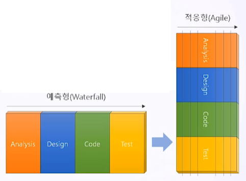
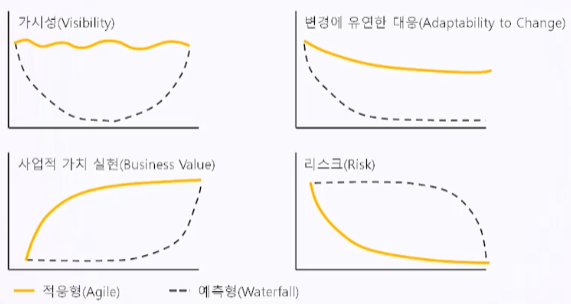
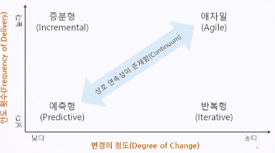
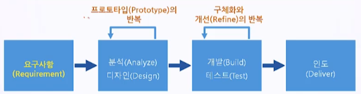

# 6. 적응형 라이프 사이클 (Adaptive Life Cycle) 1편

- 적응형 라이프 사이클 개요
- 반복형(Iterative) 라이프 사이클
- 증분형(Incremental) 라이프 사이클

## 6.1. 적응형 라이프 사이클 개요

 #### 6.1.1. 예측형 라이프 사이클 vs. 적응형 라이프 사이클

- 예측형, 적응형 모든 프로젝트는 프로세스가 존재함
- 표준 프로세스
  - Analysis
  - Design
  - Code
  - Test
- 적응형은 예측형보다 **주기가 짧음**

- 예측형은 ROI 늦음
- 적응형은 ROI 빠름

|   Predictive Life Cycle = Waterfall Model = Heavy Process    |         Adaptive Life Cycle = Agile = Light Process          |
| :----------------------------------------------------------: | :----------------------------------------------------------: |
| - 예측형은 체계적인 계획에 기반하여 프로세스를 제시 - 검증과 검수와 같은 통제 프로세스가 포함 | - 적응형은 체계적인 프로세스보다는 **개인의 역량(Skills)**에 의존 - 문서보다는 대화를 중시하며 완벽한 산출물의 구현보다 보여줄 수 있는 작동 가능한 중간 결과물을 보여줌 - 단기적인 목표를 달성하기 위한 **간단한 프로세스**를 제시함 |

|         구분         |               Predictive Life Cycle                |                  Adaptive Life Cycle                   |
| :------------------: | :------------------------------------------------: | :----------------------------------------------------: |
|    **적용 환경**     |     **기술 및 요구사항의 불확실성이 낮을 때**      |       **기술 및 요구사항의 불확실성이 높을 때**        |
|     **요구사항**     |             프로젝트 초기(착수, 계획)              |                   실행 단계에 구체화                   |
|       **초점**       |                 **Process Driven**                 |                    **Human Driven**                    |
|      **인도물**      | **프로젝트 종료 시점에 하나의 제품과 서비스 제공** | **프로젝트 실행 중 중간 산출물을 여러 번 나누어 인도** |
| **변경에 대한 인식** |              **변경을 최대한 제한함**              |              **변경을 실시간으로 반영함**              |
| **이해관계자 참여**  |         사전에 정해진 마일스톤 시점에 참여         |            프로젝트 실행 중 지속적으로 참여            |
|    **업무 수행**     |   관리자 주도 명령과 통제(개인 단위로 업무 수행)   |        Self Organization 팀 (팀 중심 업무 수행)        |
|       **조직**       |      Functional Team(분업화되고 역할이 한정)       |      Cross Functional Team(T 자형 인재, 1인 다역)      |
|   **성공의 척도**    |                     계획 준수                      |                     고객 가치 전달                     |

#### 6.1.2. 인도 주기와 변경의 정도에 따른 Approach 구분

#### 6.1.3. Project Life Cycle 접근 방식의 선택

- Characteristics

| Approach                   | Requirements | Activities                            | Delivery                    | Goal                                                    |
| -------------------------- | ------------ | ------------------------------------- | --------------------------- | ------------------------------------------------------- |
| **Predictive Life Cycle**  | Fixed        | Performed once for the entire project | Single delivery             | **Manage cost**                                         |
| **Iterative Life Cycle**   | Dynamic      | Repeated untill correct               | Single delivery             | **Crrectness of Solution**                              |
| **Incremental Life Cycle** | Dynamic      | Performed once for the entire project | Frequent samller Deliveries | **Speed**                                               |
| **Agile Life Cycle**       | Dynamic      | Repeated until correct                | Frequent samller Deliveries | **Customer value via frequent deliveries and feedback** |

---

## 6.2. Iteractive Life Cycle

- 반복이란 일련의 반복적인 주기를 통해 제품을 개발하는 것을 의미
- 리스크 완화
- 특징
  - 프로젝트 초기에 프로젝트 요구사항을 수집하고 범위를 결정
  - 프로토타입을 통해 분석과 설계를 반복
  - 개발과 테스트를 여러 번 반복 수행하여 제품이나 서비스를 구체화하고 개선함
  - 반복을 통해서 요구사항이 충족되면, 마지막에 한 번 인도함
  - 프로젝트 팀의 제품 이해도가 높아지면, 일상적으로  프로젝트의 시간과 원가 산정치를 수정

#### 6.2.1. Iteractive Life Cycle이 필요한 경우

- 프로젝트가 상대적으로 복잡한 경우
- 잦은 변경이 발생하는 경우
- 프로젝트 팀과 이해관계자가 프로젝트 범위에 대해서 기대하는 것이 다를 경우

#### 6.2.2. Storyboard

- Storyboarding is a prototyping technique showing sequence or navigation through a series of images of illustrations

- 스토리보드 사용 분야
  - Film
  - Advertising
  - Instructional Design
  - Agile Software Development
  - Other Software Development
- 소프트웨어 개발에서 스토리보드 활용
  - In software development, stroyboards use mock-ups to show navigation paths through webpares, screens or other user interfaces

#### 6.2.3. Prototypes

- 포로토타입 = 시제품 = 작동 모형 = 예상 제품의 핵심 요구사항을 갖춘 시범적 모델
- 충분한 프로토타입 주기를 거쳐야 함
  - 프로토타입을 1회성으로 또는 형식저긍로 하면 설계 또는 제작 단계로 들어가면 안됨
  - 충분한 피드백 주기를 거쳤을 때 비로소 프로토타입에서 호가인된 요구사항들이 설계 또는 제작 단계로 투입되기에 충분히 완벽한 수준에 도달함
- 고객의 요구사항을 **가장 정확하게** 확인할 수 있음
  - Prototyping is a method of obtaining by providing a working model of the expected product before actually building it
  - offering experiment with a model of the final product
    - Aggressive Details

- PMBOK Guide TIP
  - Collect Requirements process
    - 가장 정확한 요구사항 수집 방법
  - Plan Risk Responses process
    - 부정적 리스크에 대응하는 완화(Mitigation) 전략의 일환

- 요구사항 수집을 위하여 프로토타입 적용 시 주의해야 할 점
  - 고객이 비현실적인 일정과 성능을 기대할 수 있음
  - 내용보다는 외형만을 중심으로 검토할 수 있음
  - 프로토타입에 많은 시간을 낭비할 수 있음
  - 무리한 기대 사항을 갖지 않도록 적절한 수준에서 프로토타입을 작성해야 함

## 6.3. Incremental Life Cycle

- = 점증적 라이프 사이클
- 특징
  - **In an incremental life cycle, the deliverable is produced through a series of iterations that successively add functionality within a predetermined time frame**
  - The deliverable contains the necessary and sufficient capability to be considered complete only after the final iteration

- Goal

  - 여러 번 고객에게 인도함
  - 제품의 빠른 인도, 즉 속도가 가장 중요한 개발 모델

  

#### 6.3.1. Iteractive vs. Incremental

|              Iterative Life Cycles' Perspective              |             Incremental Life Cycles' Perspective             |
| :----------------------------------------------------------: | :----------------------------------------------------------: |
|            **프로젝트 리스크 관리**에 초점을 맞춤            |             **프로젝트 일정 관리**에 초점을 맞춤             |
| 다른 라이프 사이클에 비하여 상대적으로 일정이 늦어지는 문제가 있음 | **우선순위**가 높은 범위를 점진적으로 개발하여 **더 빨리 인도**하는 것으 목표함 |
|                 프로토타입 프로세스가 포함됨                 | 프로젝트를 스프린트(Sprint)라고 부르는 여러 개의 타임 프레임(Time Frame)으로 나눔 |
|    개발 목표를 단순화하여 반복하면, 정확도를 높일 수 있음    |  스프린트 내에서 우선 순위가 높은 범위를 먼저 개발하여 인도  |

## Key Point

- 적응형 라이프 사이클의 종류
  - Iterative
  - Incremental
  - Agile : Iteration + Increment
  - Hybrid : Waterfall + Agile
- Iterative Life Cycle
  - 불확실성을 관리하려면, 프로젝트 리스크 대응 계획이 필요
  - 반복형 라이프 사이클은 리스크 대응 계획의 일환으로 리스크 완화를 목표로 함
- Incremental Life Cycle
  - 증분형 라이프 사이클은 여러 번 고객에게 인도함
  - 우선 순위가 높은 범위를 점진적으로 개발하여 더 빨리 인도하는 것을 목표함
