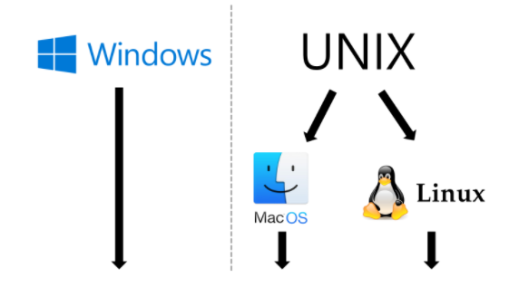

# CLI

#### 1. CLI 란?

Command Line Interface의 약자로, 터미널을 통해 사용자와 컴퓨터가 상호작용하는 방식

#### 2. GUI 란?

Graphic User Interface의 약자로, 그래픽을 통해 사용자와 컴퓨터가 상호작용하는 방식

##### CLI를 사용하는 이유

new 라는 이름으로 새 폴더를 생성해 봅시다.

	1. GUI를 사용하는 경우 (4단계) : 마우스 우클릭 -> 새로 만들기 -> 폴더 -> new작성
	1. CLI를 사용하는 경우 (1단계) : `mkdir new`


GUI는 CLI에 비해 사용이 편리하지만 단계가 많고 컴퓨터 성능을 더 많이 소모합니다.

그리고 CLI는 GUI로는 불가능한 많은 세부적인 기능을 사용할 수 있습니다.

##### Git Bash를 사용하는 이유



Windows에는 CLI 환경인 Powershell과 명령 프롬프트가 이미 존재합니다. 하지만 Git Bash를 사용하는 이유는 다음과 같습니다.

1. **명령어의 통일을 위해서 입니다.**
   - UNIX 계열 운영체제의 명령어와 Windows의 명령어의 차이가 존재합니다.
   - 따라서 **Git Bash**라고 하는 일종의 <u>번역기</u>를 통해 Windows에서도 UNIX 계열 운영체제의 터미널 명령어를 사용하기 위함입니다.
2.  **UNIX 계열 운영체제의 명령어를 더 많이 쓰기 때문입니다.**
   - 개발자 입장에서는 Windows보다는 UNIX 계열 운영체제 기반의 프로그램이 훨씬 많습니다.
   - 그만큼 개발 시장에서는 UNIX 계열 운영체제가 더 많이 사용되기 때문에, **Git Bash**를 통해서 UNIX 계열 운영체제의 터미널 명령어를 연습합니다.

#### 3. 경로

##### (1) 루트, 홈 디렉토리

1. **루트 디렉토리 (Root Directory, /)**
   - 모든 파일과 폴더를 담고 있는 최상위 폴더입니다.
   - Windows의 경우 보통은 **C 드라이브**를 의미합니다.
2.  홈 디렉토리 (Home Directory, ~)
   - **Tilde(틸드)**라고도 부르며, 현재 로그인 된 사용자의 홈 폴더를 의미합니다.
   - Windows의 경우 **C:/사용자(Users)/현재 사용자 계정**을 의미합니다.
   - Mac의 경우 **/Users/현재 사용자 계정**을 의미합니다.

##### (2) 절대 경로와 상대 경로

1. **절대 경로** : 루트 디렉토리부터 목적 지점까지 거치는 모든 경로를 전부 작성한 것
   - 윈도우 바탕 화면의 절대 경로 **C:/Users/kyle/Desktop**
2.  **상대 경로**: 현재 작업하고 있는 디렉토리를 기준으로 계산된 상대적 위치를 작성한 것
   - 현재 작업하고 있는 디렉토리가 C:/Users 라고 한다면
   - 윈도우 바탕 화면으로의 상대 경로는 kyle/Desktop 이 됩니다.
   - 간결해서 좋지만, 현재 작업하고 있는 디렉토리가 변경 되면 상대 경로도 변경됩니다.
   - ./ : 현재 작업하고 있는 폴더를 의미합니다.
   - ../ : 현재 작업하고 있는 폴더의 부모 폴더를 의미합니다.

#### 4. 터미널 명령어

1. **touch**

   - <u>파일을 생성하는 명령어</u>

   - 띄어쓰기로 구분하여 여러 파일을 한꺼번에 생성 가능

   - 숨김 파일을 만들기 위해서는 .을 파일 명 앞에 붙입니다.

   ```bash
   $ touch text.txt
   ```

     

1. **mkdir**

   - make directory

   - <u>새 폴더를 생성하는 명령어</u>

   - 띄어쓰기로 구분하여 여러 폴더를 한번에 생성 가능

   - 폴더 이름 사이에 공백을 넣고 싶다면 따옴표로 묶어서 입력 가능

   ```bash
   $ mkdir folder
   $ mkdir 'happy hacking'

3. **ls**

   - list segments
   - <u>현재 작업 중인 디렉토리의 폴더/파일 목록을 보여주는 명령어</u>
   - `-a` : all 옵션. 숨김 파일까지 모두 보여줌
   - `-l` : long 옵션. 용량, 수정 날짜 등 파일의 세부 정보를 보여줌

   ```bash
   # 기본 사용
   $ ls 
   
   # all 옵션
   $ ls -a
   
   # all, long 옵션 함께 적용
   $ ls -a -l
   
   # 여러 옵션 축약 가능
   $ ls -al
   ```

4. **mv**

   - move

   - 폴더/파일을 다른 폴더 내로 이동 하거나 이름을 변경하는 명령어

   - 단, 다른 폴더로 이동할 때는 작성한 폴더가 반드시 있어야 함. 없으면 이름이 바뀜

   ```bash
   # text.txt를 folder 폴더 안에 넣을 때
   $ mv text.txt folder
     
   # text1.txt의 이름을 text2.txt로 바꿀 때
   $ mv text1.txt text2.txt
   ```

5. **cd**

   - change directory
   - 현재 작업 중인 디렉토리를 변경하는 명령어
   - `cd ~`를 입력하면 홈 디렉토리로 이동. (단순히, `cd`라고만 해도 동일)
   - `cd ..`를 입력하면 부모 디렉토리로 이동. (위로 가기)
   - `cd -`를 입력하면 바로 전 디렉토리로 이동. (뒤로 가기)

   ```bash  
   # 현재 작업 중인 디렉토리에 있는 folder 폴더로 이동
   $ cd folder
   
   # 절대 경로를 통한 디렉토리 변경
   $ cd C:/Users/kyle/Desktop
   
   # 상대 경로를 통한 디렉토리 변경
   $ cd ../parent/child

6. **rm**

   - remove
   - 폴더/파일 지우는 명령어
   - 바로 **완전 삭제**

   - `*(asterisk, wildcard)`를 사용해서 `rm *.txt`라고 입력하면 txt 파일 전체를 모두 지움
   - `-r` : recursive 옵션. 폴더를 지울 때 사용

7. `start, open`

   - 폴더/파일을 여는 명령어
   - `windows`에서는 start를, `Mac`에서는 open을 사용

   ```bash
   # Windows
   $ start test.txt
   
   # Mac
   $ open test.txt
   ```

8. **유용한 단축키**

   - `위, 아래 방향키`: 과거에 작성했던 명령어 조회
   - `tab` : 폴더/파일 이름 자동 완성
   - `ctrl + a` : 커서가 맨 앞으로 이동
   - `ctrl + e` : 커서가 맨 뒤로 이동
   - `ctrl + w` : 커서가 앞 단어를 삭제
   - `ctrl + l` : 터미널 화면을 깨끗하게 청소 (스크롤 올리면 과거 내역 조회 가능)
   - `ctrl + insert` : 복사
   - `shift + insert` : 붙여넣기

   
