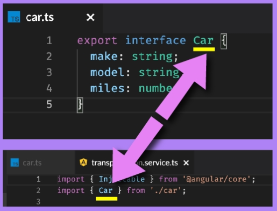
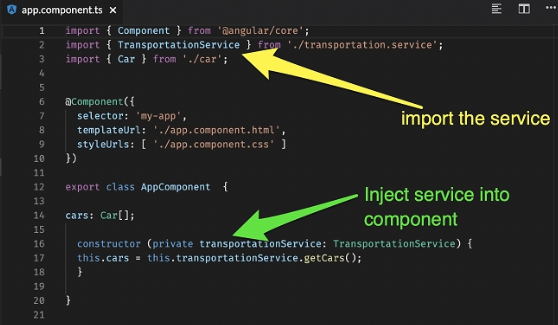

# Reading Data

## Data's Long Journey


### A simplified typical data flow from back to front would be

1. Data retrieved from database query
2. Data routed through server
3. Data reaches **service**
4. Data reaches component
5. Data reaches view

---

- Databases are most often the place where data is stored for web applications. We will eventually get there.

---


## Introduction to Angular Services

- **Services** are special files in Angular that are used to manage data.
  - They usually pull data from XHR (remember XML/HTTP Requests), but they can also store data on their own.
- No need to go all the way to the database to get the data.
  - What we need to is that simply push the data back into a service and let it live there for now.

- let's see a diagram shows a simple flow between a component, a service with data, and an HTML view.


1. The cars component makes a call to the transportation service, which holds a list of cars
2. The transportation service returns a list of cars to the cars component
3. The cars view receives the list of cars and loops over them using *ngFor

---

- A service is like a `brain` in an Angular app that either returns data from the service itself or data retrieved from an external source. It can be viewed as a 'data manager'.

---


## Generating an Angular Service

- Angular can **generate** a service for you with a simple command so you don't have to build the basic structure

```typescript
ng generate service transportation
```

- It will generate an empty service within the Angular application

```typescript
import { Injectable } from '@angular/core';
@Injectable({
  providedIn: 'root'
})
export class TransportationService {
  constructor() { }
}
```

Need to concern with two parts of this service:

1. The top of the file where the imports live. 
   - This is where we will import files that the service will use.

2. The class body where it says export class **TransportationService**. 
   - The class body is contained within the curly brackets after the word TransportationService.

---

- Methods within the class body of the service are used to export data out of the service.

---


## Import Interface into a Service

- Our Transportation Service will contain an array of Car types. 
- To do that, we need to import our Car interface that we created earlier. 
- We learned that the top of the file is where we import things.


- We can add this line to the top section of the transportation service:

```typescript
import { Car } from './car';
```

This allows us to use the Car type to make an array of Cars. Our transportation service has now IMPORTED the interface from the `car.ts` file. Here's the relationship between those two files:



- The car.ts file EXPORTS the interface and the transportation service IMPORTS that same interface for use. 
  - That will now allow us to create an array of Car types in our service.

---

- The import / export functionality we see in Angular is derived from NodeJS. This same import / export system is seen in almost every front-end JavaScript framework, as most of these frameworks are built using Node.

---


## Recreating Car Array in a Service

- Since we imported the car resource, we can create an array of Car types in our transportation service.
- The last thing we need to do after we do this is to create a getCars( ) method to export the car data out of the service. Here is the completed service:

```typescript
import { Injectable } from '@angular/core';
 import { Car } from './car';
 
 @Injectable({
  providedIn: 'root'
 })
 export class TransportationService {
  // NEW CODE
  subaru: Car = {make: 'Subaru', model: 'Outback', miles: 58232};
  honda: Car = {make: 'Honda', model: 'Accord', miles: 39393};
  bmw: Car = {make: 'BMW', model: 'X3', miles: 4400};
 
  cars:Car[] = [this.subaru, this.honda, this.bmw];
 
  constructor() { }
 
  // NEW CODE
  getCars() {
    return this.cars;
  }
 }
```

- This service is now ready to use by our component

---

- Services export methods that will later be invoked by Angular components that use the service. 
- One service can conceivably be used by multiple components.

---


## Dependency Injection

- Now service is actually exporting data, and component needs to pull it in.
  - **Dependency injection** is to pull a service into a component



- **Dependency injection** is a common design pattern in object oriented programming.

---

- Note how we create a private variable called **transportationService** that is of the type TransportationService. **transportationService** (with the lowercase **t**) is the variable and TransportationService (with an upperCase **T**) is the type. Those two naming conventions are called **camelCase** and **PascalCase**, respectively. Using camelCase for class variables and PascalCase for class and interface names is a convention seen throughout Angular.

---

