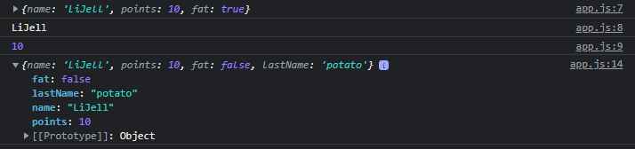

# Data Type
## Array

```javascript
const daysOfWeek = ['mon','tue','wed','thu','fri','sat'];

// Get Item from Array
console.log(daysOfWeek[4]);

// Add one more day to the array
daysOfWeek.push('sun');

console.log(daysOfWeek);
```


## Object

```javascript
const player = {
  name: "LiJell",
  points: 10,
  fat: true,
};

console.log(player);
console.log(player.name);
console.log(player["points"]);
```


```javascript
const player = {
  name: "LiJell",
  points: 10,
  fat: true,
};

console.log(player);
console.log(player.name);
console.log(player["points"]);


player.fat = false;
console.log(player);
```



- const를 바꿀 수 없지만, const 안의 Object를 변경하는 것이기 때문에 부분 수정이 가능하다

  - 하지만, const 전체를 바꾸려하면 에러가 생김
  - Object 추가도 가능

  
