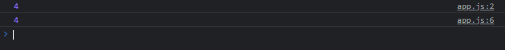
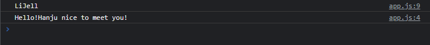

# Function

```javascript
function sayHello(nameOfPerson, age) {
    console.log("Hello my name is " + nameOfPerson + " and I am " + age)
}

sayHello("LiJell", 10);
sayHello("Hanju", 18);
sayHello("Toonsquare", 99);
```


```javascript
function plus(a, b) {
    console.log(a + b);
}

function divide(a,b) {
    console.log(a / b);
}
plus(1, 3);
divide(20, 5);
```



```javascript
const player = {
  name: "LiJell",
  sayHello: function (otherPersonsName) {
    console.log("Hello! " + otherPersonsName + " nice to meet you!");
  },
};


console.log(player.name);
player.sayHello("Hanju");

```

