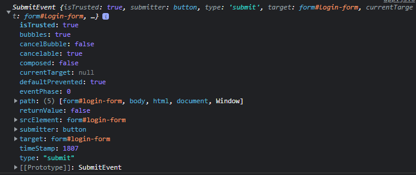

# Events Control

```html
<!DOCTYPE html>
<html lang="en">
  <head>
    <meta charset="UTF-8" />
    <meta http-equiv="X-UA-Compatible" content="IE=edge" />
    <meta name="viewport" content="width=device-width, initial-scale=1.0" />
    <link rel="stylesheet" href="style.css" />
    <title>Momentum</title>
  </head>
  <body>
    <form id="login-form">
      <input
        required
        maxlength="15"
        type="text"
        placeholder=" What is your name?"
      />
      <button>Log In</button>
      <!-- <input type="submit" value="Log In" /> -->
    </form>
    <script src="app.js"></script>
  </body>
</html>

```


```javascript
const loginForm = document.querySelector("#login-form");
const loginInput = loginForm.querySelector("input");

function onLoginSubmit() {
  const username = loginInput.value;
  console.log(username);
}

loginForm.addEventListener("submit", onLoginSubmit);
```

-  html을 동작시키면 이름을 입력해도 form 때문에 submit될 때 자동으로 새로고침 되는 현상이 발생


- 중요한 건, event가 발생할 때 브라우저가 function을 호출하게 되는데, 첫 번째 argument로써 추가적인 정보를 가진 채로 호출하게 됨
- argument가 event라 생각해보자

```javascript
const loginForm = document.querySelector("#login-form");
const loginInput = loginForm.querySelector("input");

function onLoginSubmit(event) {
    // 기본적으로 적용되고 있는 것을 막아주는 function 추가
  event.preventDefault();
  console.log(event);
}

loginForm.addEventListener("submit", onLoginSubmit);
```

- 브라우저가 우리한테 어떤 정보를 넘겨주는지 확인하고 console.log를 해보자

  

- 짠 정보가 넘겨지고 있었다

- **모든 EventListener function의 첫번째 argument는 항상, 방금 벌어진 일들에 대한 정보가 될 것이다.**
- JS가 그 정보를 무료로 제공해줌

---

```javascript
const loginForm = document.querySelector("#login-form");
const loginInput = loginForm.querySelector("input");

function onLoginSubmit(event) {
  event.preventDefault();
  console.log(loginInput.value);
}

loginForm.addEventListener("submit", onLoginSubmit);
```

- 결과적으로 위와 같이 실행 시켰을 때 submit event를 control 할 수 있다.

---

## Anchor control

```html
<!DOCTYPE html>
<html lang="en">
  <head>
    <meta charset="UTF-8" />
    <meta http-equiv="X-UA-Compatible" content="IE=edge" />
    <meta name="viewport" content="width=device-width, initial-scale=1.0" />
    <link rel="stylesheet" href="style.css" />
    <title>Momentum</title>
  </head>
  <body>
    <form id="login-form">
      <input
        required
        maxlength="15"
        type="text"
        placeholder=" What is your name?"
      />
      <button>Log In</button>
      <!-- <input type="submit" value="Log In" /> -->
    </form>
    <a href="https://lime-jelly.tistory.com/">Go to Blog</a>
    <script src="app.js"></script>
  </body>
</html>
```


```javascript
const loginForm = document.querySelector("#login-form");
const loginInput = loginForm.querySelector("input");

const link = document.querySelector("a");

function onLoginSubmit(event) {
  event.preventDefault();
  console.log(loginInput.value);
}

function handleLinkClick(event) {
  console.log(event);
  alert("clicked!");
}

loginForm.addEventListener("submit", onLoginSubmit);
link.addEventListener("click", handleLinkClick);
// link의 기본 동작은 페이지 이동이다
```


```javascript
const loginForm = document.querySelector("#login-form");
const loginInput = loginForm.querySelector("input");

const link = document.querySelector("a");

function onLoginSubmit(event) {
  event.preventDefault();
  console.log(loginInput.value);
}

function handleLinkClick(event) {
  event.preventDefault();
  console.dir(event);
}

loginForm.addEventListener("submit", onLoginSubmit);
link.addEventListener("click", handleLinkClick);
// link의 기본 동작은 페이지 이동이다
```

- link의 기본 동작을 막은 후 Event의 정보를 보면 아래와 같이 볼 수 있다.


