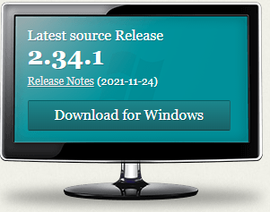
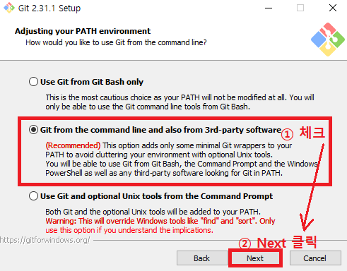
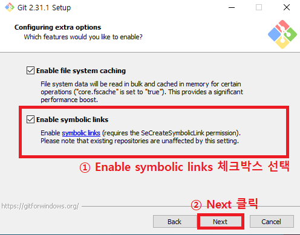
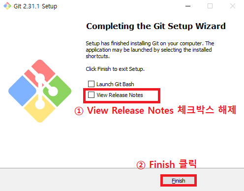

# Git 설치

### 1. 다운로드 링크 클릭 후, 이미지 클릭

https://git-scm.com/

### 2. 다운로드 진행

- 아래 세 이미지 외 다른 과정은 디폴트 설정으로 진행

### 3 다운로드 이후 확인 방법

#### (1) Windows

- Git 설치 후 윈도우 탐색기를 엽니다. (윈도우키 + e)
- 'C:/사용자(Users)/현재 사용자 계정' 로 이동합니다.

- 폴더 내 빈 공간에 마우스 우클릭 후 Git Bash Here을 클릭합니다.

- Git Bash 창에 아래 화면처럼 HOME 폴더를 의미하는 '~' 표시가 있다면 정상입니다.

  

#### (2) Mac

- Git이 기본적으로 내장 되어 있기 때문에, 별도의 설치가 필요 없습니다.
- Spotlight (검색)를 엽니다. (화면 우측 상단의 돋보기 혹은 command + spacebar)

- terminal을 검색하여 터미널을 엽니다.

- 터미널을 열면 기본적으로 HOME 폴더 경로가 설정 되어 있습니다.

  (/Users/현재 사용자 계정)

- open . 라고 입력하여 HOME 폴더를 엽니다
