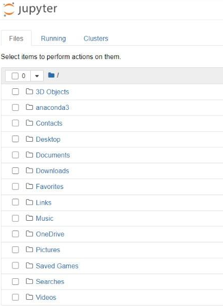
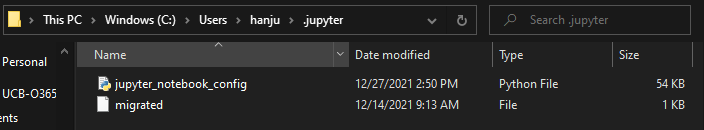
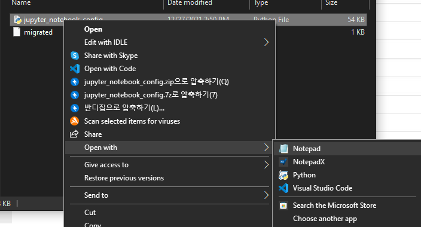
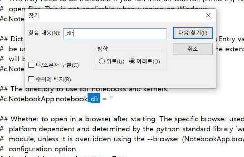
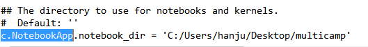
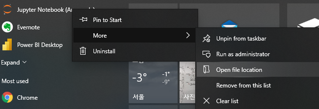
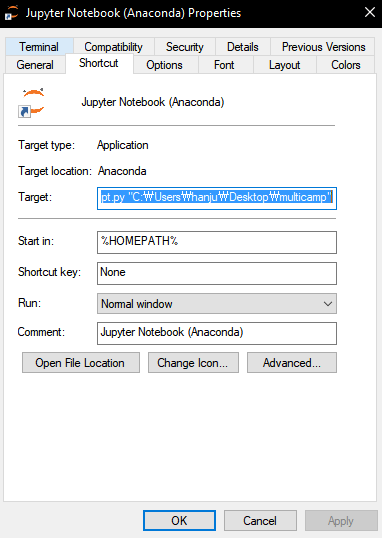

# Jupyter Notebook (주피터 노트북) 환경설정 : 시작폴더 변경방법

-순서-

1. 주피터 노트북 환경설정 두가지
2. #c. NotebookApp.notebook_dir='' 문장을 수정
3. 시작 메뉴의 주피터 노트북 속성을 수정
4. 정리

---

#### 1. 주피터 노트북 환경설정

- 주피터 노트북 초기 홈 화면

  - 처음 주피터 노트북을 실행하면 기본 폴더 경로가 [C드라이브 > 사용자 > 사용자 이름]으로 설정되어있다. 만약 내가 원하는 폴더에서 파일을 관리하고싶다면 새로운 파일을 만들어 경로설정을 다시 해야한다. 이 방법을 통해서 Data관리등 편의성을 얻을 수 있다. 아래는 주피터노트북 실행화면이다.

  

- 경로를 지정할 폴더를 생성한다

- Powershell Prompt를 열고, `jupyter notebook --generate-config` 를 입력한다.

일단 y를 누르고 입력한다.

- 위 실행 결과를 보면 C:\Users\hanju\.jupyter\jupyter_notebook_config.py 라고 설정되어있다.

  - 해당 경로를 따라 폴더를 열어보면 아래와 같이 나온다. 

    
    

---

#### 2. **#c.NotebookApp.notebook_dir= '' 문장을 수정**

- 파일 우 클릭 -> 연결 프로그램 -> 메모장

- 메모장에서 #c.NotebookApp.notebook_dir= '' 문장을 찾는다. **Ctrl + F**를 이용해보자.

  - 문장 맨 앞에 주석 처리된 #을 지우고 작은 따옴표 '' 사이에 원하는 경로를 입력한다. 경로는 `\`가 아닌` /`로 고쳐주자.

  

- 저장하고 닫은 후 주피터를 실행시켜보자. 

---

#### 3. 시작 메뉴의 주피터노트북 속성을 변경

- 위 그림과 같이 들어가서 파일이 위치한 폴더를 열어 주피터 노트북의 속성으로 들어가보자

- 위 그림에 나온 `"%USERPROFILE%/"`라고 입력된 곳을 원하는 경로로 변경해주자.
- 완료. 

---

## 4. 정리

- 프롬트에서 실행시켜 환경설정을 변경
  - 원하는 경로에 폴더를 생성한다.
  - 프롬트를 열고 명령어를 입력한다. 명령어: jupyter notebook --generate-config
  - 명령어가 실행된 경로를 따라가 생성된 파일을 우클릭하여 메모장으로 연다
  - \#c.NotebookApp.notebook_dir= ''을 찾아서 작은따옴표 ''사이에 원하는 경로를 입력 후 저장한다.
    - `\`는 `/`로 바꿔주자, 이후 # 주석 표시를 삭제한다. 
- 시작 메뉴 주피터 노트북 속성 변경
  - 시작 메뉴 -> 주피터 노트북 마우스 우클릭 -> 자세히 -> 파일 위치 열기
  - 주피터 노트북 우 클릭 -> 속성 ->  `"%USERPROFILE%/"`라고 입력된 곳을 원하는 경로로 변경
- 주피터 노트북 켜보기
