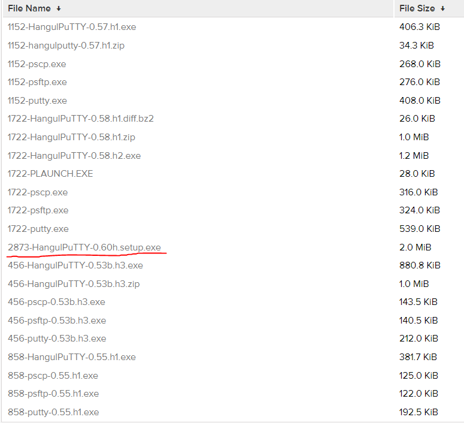
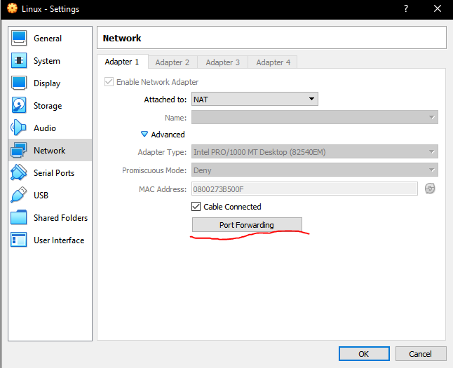
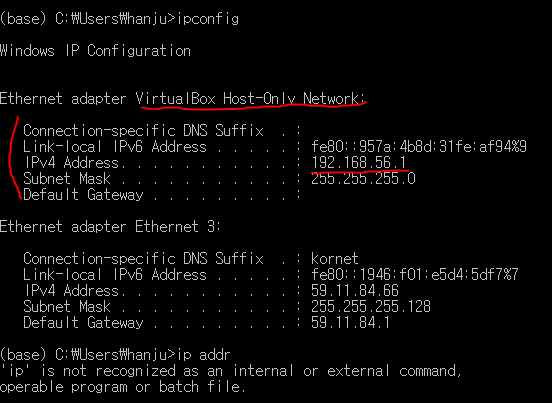
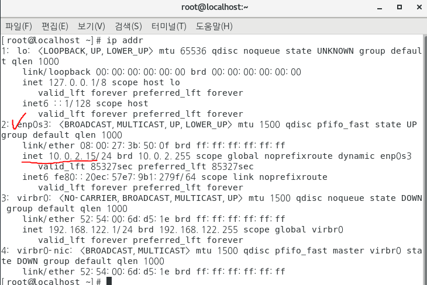
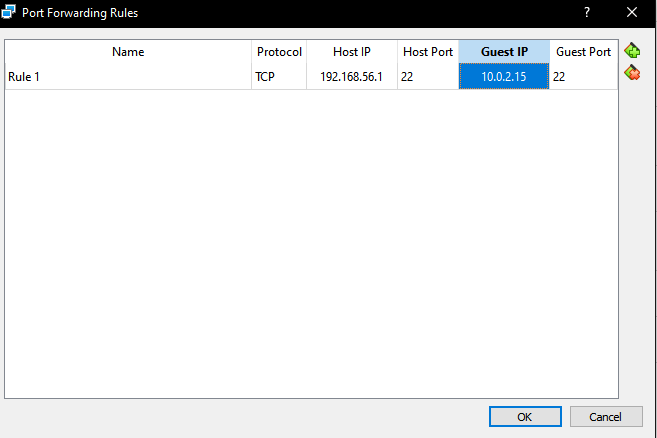
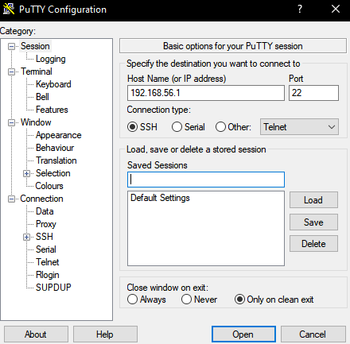
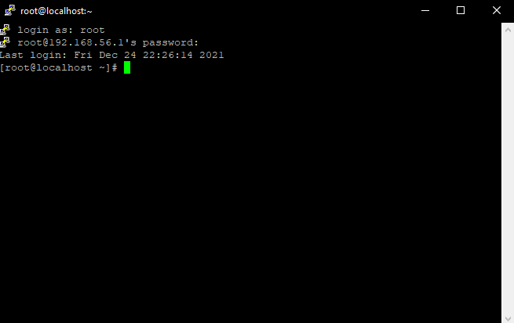

## CentOS PuTTY SSH 접속

#### PuTTY 다운로드 및 설치

- 아래 링크를 통해 그림과 같이 한글 PuTTY를 다운로드, 설치한다.
- http://kldp.net/iputty/release/

---

#### Virtual Box 포트 포워딩

1. Oracle VM Virtual Box Manager의 옵션을 클릭하여 Network로 들어간다. Advanced를 누르면 Port Forwarding을 볼 수 있다. 

2. 포트 포워딩을 추가하기 위해 윈도우의 Prompt로 들어가 `ipconfig`를 입력한다.
- Host PC 인 Window 10의 VirtualBox Host-Only Network: 의 IP주소를 확인한다. 

3. 게스트 PC인 CentOS 7의 IP주소를 아래와 같이 확인한다. 터미널에서 `ifconifg`또는 `ip addr`를 입력한다.

4. 1번에서 보이는 Port Forwarding Rules로 들어가 해당 빈칸을 아래와 같이 채운다.  

5. PuTTY를 키고 Host Name에 Window 10의 VirtualBox Host-Only Network: 의 IP주소를 입력한다.

- 저장하기전에 Appearance에 들어가서 배경색 및 글자색을 바꿀 수 있다.
- 오픈!

6. login: 에 root를 입력하고 엔터, pwd를 입력하고 enter한다.

- 보안상 비밀번호를 입력해도 보이지않으니 안심하고 입력 후 엔터를 누르면 아래와 같이 로그인된다.
- 이제 PuTTY를 통해 리눅스를 할 수 있다.

#### 가상환경에 리눅스를 설치하기 원하면 아래의 링크를 참고하자
- https://lime-jelly.tistory.com/12
- https://github.com/LiJell/TIL/blob/master/Linux_download.md