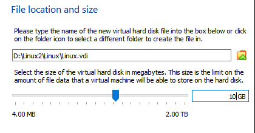

# Linux 가상환경 구성

오늘은 가상환경에 리눅스 설치를 하였다. 
리눅스 설치 후

-  Jupyter Notebook 연결_GPU 연결
-  Linux 환경에서 Github 연결
-  리눅스 명령에 대해 공부할 예정이다.
-  **아래 구성 과정에서 모든 파일은 같은 드라이브에 저장해야한다.**
   -  본인은 VirtualBox와 Linux의 저장위치가 달라 오류가 발생하여 모두 **D드라이브**에 저장했다. 

## 1. 가상환경구성

#### 1) 가상화란? (해당링크 참조)

https://m.blog.naver.com/ilikebigmac/222009981745

#### 2) 오라클 버추얼 박스 다운로드
https://www.virtualbox.org/wiki/Downloads

- 윈도우 PC 안에 작은 PC (논리적으로 구분) 설치한다고 생각하자.
- **모든 파일은 같은 드라이브에 저장하길 권장한다.** 
  - 본인은 **D드라이브**에 저장했다. 

## 2. 가상환경에 CentOS 리눅스 설치하기

#### 1) Centos 리눅스 설치

http://mirror.anigil.com/CentOS/7.9.2009/isos/x86_64/

- 해당 링크에서 CentOS를 다운한다

  CentOS-7-x86_64-DVD-2009.iso을 

---

#### 2) VirtualBox 실행

1. **VirtualBox**를 실행 한 후, 아래 화면에 보이는 New를 누른다.

2. 아래 화면이 나오면 이름을 설정한 후, **Machine Folder을 VirtualBox와 CentOS를 다운 받은 같은 드라이브를 설정한다.** 

3. 타입은 L**inux, Version은 Red Hat (64-bit)**을 선택한다. (윈도우 키를 누르고 dxdiag를 눌러 Operating System에 나오는 환경에 맞는 bit를 선택한다)

- 만약 64bit가 보이지 않는다면 BIOS에서 가상화 기술(Virtualization)을 활성화 해야한다. 아래 링크를 참고해보자.
- https://m.blog.naver.com/n_jihyeon/221099021710

4. Memory size는 원하는 만큼 설정한다. 보통 2048 MB를 추천한다고 한다.

5. Hard disk 설정은 아래와 같이 설정한다. 

6. 원하는 용량을 선택한다. 최소 10GB를 추천 받았으며, Linux내 여러 도구를 사용할 예정이면 용량을 크게 가져가자. 

---
#### 3) 설정이 완료되면 아래와 같이 우리가 지정한 이름의 가상 환경 모습이 보인다. 

---

#### 4) 가상 환경을 실행하기 전에 마우스 세팅을 해보자

---

#### 5) 본격적으로 Linux를 깔아보자.

마우스 설정이 끝나고 Start 버튼을 누르면 아래와 같은 화면이 나온다.

1. 아래의 경로는 우리가 **다운로드 받은 CentOS를 지정**해주면 된다. 

- 아래와 같이 하지 않으면 **Fetal 표시와 오류**가 날 것이다. 

2. **CentOS**를 누르고 시작을 누르면 아래와 같은 화면이 나오고, 키보드를 이용하여 Install CentOS 7을 Enter하면 된다. 만약 잘 모르겠다면 기다리자. 일정 시간 후, 자동으로 실행된다.

3. 이제 기다리다보면, 아래와 같은 화면을 볼 수 있다. 언어를 편한 언어로 설정해주자. 

4. 언어를 설정하고 다음으로 넘어가면 아래와 같은 화면이 나온다

- **설치 대상**을 클릭한다.

- 아래 로컬 표준 디스크를 클릭하고 완료를 눌러준다

5. 완료가 됐다면, **소프트웨어 선택**을 눌러주고 아래와 같이 설정한다. 

6. 설정이 완료되면, **ROOT 암호** 설정과, **사용자 생성**을 한다.

- 설치가 쫌 걸린다. 

7. 위 과정이 끝나면, 라이센스 동의를 하고 재부팅하여 CentOS 환경에서 Linux를 설정을 해보자.

---

## 3. 리눅스 설정하기

#### 1) Root 계정 들어가기

1. 아래 그림에서 '목록에 없습니까?'를 누른다.

2. ''사용자 이름에 root를 입력한 후, 사전에 설정한 root의 암호를 입력한다.

#### 2) 인터넷 설정

1. 혹 인터넷 설정을 하지 않았다면 아래와 같이 따라하자. 

- 시간 옆에있는 체크 표시를 눌러주고 두번째 체크표시인 공구모양을 눌러 설정을 들어간다.

- 설정 >> 네트워크로 들어가서 인터넷을 연결한 후 옆에 톱니바퀴를 누르자

- 자동으로 연결도 눌러주자

#### 3) 화면크기를 설정할 수 있게 변경해보자

1. 장치 >> 제일 아래에 위치한 게스트 확장 CD 삽입을 클릭한다
2. 바로 실행하겠습니까? >> 실행
3. 바탕화면에 아래와 같은 CD모양이 나오면 클릭해 연다

 

4. 아래 표시된 프로그램 실행을 눌러준다.

5. VirtualBox Guest Additions installation이 뜬다. 기다리면 **Yes**할것인지 물어볼 때 yes를 입력하고 기다리면된다. 

- 시간이 조금 걸리는데 완료되면, **버전 번호가** 나오게된다
- 이후, **reboot**을 하면 되지만, 대기하고 있으면 reboot을 해야 적용이된다면서 창을 닫으라고 한다. 확실히 하고자 면 이때까지 기다리자. 

6. reboot

- 확실한 reboot을 위해, 바탕화면에서 오른쪽 클릭을 하여 Terminal을 열어준 후 **reboot**을 입력한다.

#### 4) 화면크기 조정

1. 거의 다 왔다!! 보기 >> 가상화면 1>> 원하는 사이즈를 선택!

## 꿀팁

#### 1) 윈도우와 복사 붙여넣기를 자유롭게

- 터미널 창 열고 #whoami 잘 나오는지 확인
- 리눅스 창에서 상단에 위치한 장치 클릭 >> 클립보드 공유 >> 양방향 클릭
- 메모장 열어서 whoami 치고 ctrl+shift+c, 이후 리눅스에서 ctrl+shift+v를 해보자
- 오예!!!
