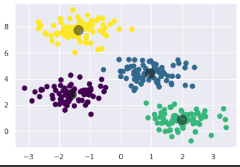
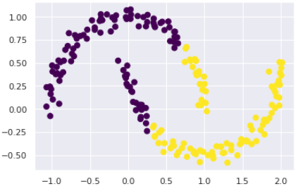
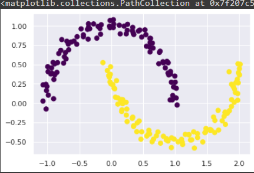
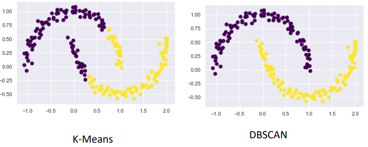
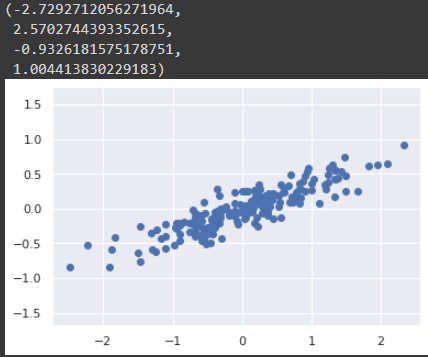
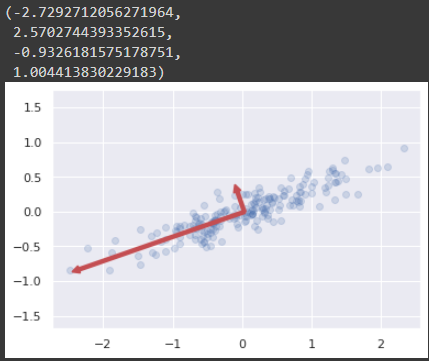
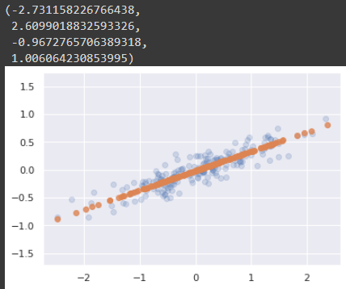
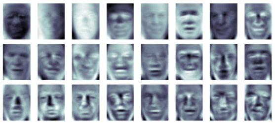

# 군집화 (Clustering)

- 비지도 학습
- 데이터의 성질로 부터 최적으로 분할하고 레이블을 구함
- 활용 분야
  - 시장 분할
  - 지도에서 가까운 지점을 병함
  - 영상 압축
  - 자료에 새 레이블 부여
  - 이상행동 감지
- 방법론
  - K-means clustering, DBSCAN, ect


---

## K- 평균 군집화

- 레이블이 없는 다차원 데이터 세트 내에 사전 정의된 군집의 개수를 찾아내는 방법 
-  최적의 군집화 
  - ''군집의 중앙' 은 해당 군집에 속하는 모든 점의 산술 평균
  - 각 점은 다른 군집의 중앙보다 자신이 속한 군집의 중앙에 더 가깝다.

```python
%matplotlib inline
import matplotlib.pyplot as plt
import seaborn as sns; sns.set()
import numpy as np
```

```python
# 4개 영역의 2차원 자료의 생성
from sklearn.datasets import make_blobs
# y_ture 는 cluster의 num. X는 dot의 좌표값. 따라서 아래에서는 사실 필요없음
X, y_true = make_blobs(n_samples=300, centers=4, 
                       cluster_std = 0.60, random_state = 0)

plt.scatter(X[:,0], X[:,1], s=50)

```


```python
# k-means clustering
from sklearn.cluster import KMeans
kmeans = KMeans(n_clusters = 4)
y_kmeans = kmeans.fit_predict(X)
print(y_kmeans)
'''
[2 3 1 3 2 2 0 1 3 3 0 3 1 3 2 1 1 2 0 0 2 2 1 0 0 1 2 1 0 1 3 3 1 3 3 3 3
 3 0 2 1 0 1 1 0 0 3 0 3 2 0 2 3 2 2 0 3 0 3 2 3 1 3 0 0 0 3 2 3 0 1 0 3 0
 0 3 0 1 2 3 2 1 2 2 3 1 2 1 3 3 1 2 3 0 0 1 2 2 1 0 3 2 3 2 1 2 2 1 3 1 0
 0 2 3 2 1 3 2 2 1 0 2 0 2 2 2 2 0 2 0 3 0 0 2 3 0 0 3 1 3 3 0 1 0 1 0 3 1
 3 3 3 1 3 1 2 0 3 0 2 1 3 1 1 2 1 0 0 1 2 1 1 3 2 1 0 3 2 2 1 0 2 1 0 0 1
 1 1 1 2 3 1 0 1 1 0 0 0 1 0 3 1 0 2 0 1 3 0 3 1 3 1 0 1 1 3 0 0 2 2 1 3 2
 2 0 2 0 1 3 3 1 1 3 1 2 0 1 2 0 3 0 2 1 2 3 3 3 3 0 0 3 1 0 2 1 0 0 0 2 2
 3 1 1 0 2 3 0 1 3 1 2 2 0 0 1 2 2 2 1 3 3 2 2 1 2 2 2 3 0 3 1 2 2 3 3 3 2
 2 1 3 0]
'''
```

```python
# 그룹별로 색깔을 달리 표현하기, 군집 중앙표시
plt.scatter(X[:,0], X[:,1], c=y_kmeans, s=50, cmap = 'viridis')
centers = kmeans.cluster_centers_
plt.scatter(centers[:,0], centers[:,1], c='k', s=200, alpha=0.5)
```



#### K-means 군집화 알고리즘

- 기대값-최대화(E-M) 알고리즘

  ① 일부 군집 중심을 추측한다.(난수 초기값) 

  ② 수렴될 때까지 다음을 반복한다. 

  -  E-단계(기댓값 단계): 점을 가장 가까운 군집 중심에 할당한다. 
  - M-단계(최대화 단계): 군집 중심을 평균값으로 설정한다. (군집에 속한 데이터의 산술 평균)

#### 기대값-최대화(E-M) 알고리즘 관련 주의사항

- 최초의 군집 중심을 난수 초기값으로 정하기 때문에 최적화된 결과를 얻지 못하는 경우도 있다. 
- 군집의 개수가 사전에 정해져야 한다. 
- **K-평균 군집은 선형 군집 경계로 한정된다.** (치명적 단점) 
- K-평균 균집은 표본 수가 많아지면 느려진다 
  - 알고리즘을 반복할 때마다 데이터세트의 모든 점에 접근해야 하므로

```python
# 비선형 경계를 가지는 자료의 경우

from sklearn.datasets import make_moons
X, y = make_moons(200, noise=0.05, random_state = 0)
labels = KMeans(2, random_state = 0).fit_predict(X)
plt.scatter(X[:,0], X[:,1], c=labels, s=50, cmap='viridis')
```



```python
# 필기체 숫자 인식에 적용
from sklearn.datasets import load_digits
digits = load_digits()
digits.data.shape
'''
(1797, 64)
'''
```

```python
# k-meansa clustering
from sklearn.cluster import KMeans
kmeans = KMeans(n_clusters= 10, random_state= 0)
clusters = kmeans.fit_predict(digits.data)
kmeans.cluster_centers_.shape
'''
(10, 64)
'''
```

```python
# 64차원의 군집 10개
fig, ax = plt.subplots(2,5, figsize=(8,3)) # ax는 축
centers = kmeans.cluster_centers_.reshape(10,8,8)
for axi, center in zip(ax.flat, centers):
  axi.set(xticks=[], yticks=[])
  axi.imshow(center, interpolation = 'nearest', cmap=plt.cm.binary)
```


---

## DBSCAN

- Density Based Spatial Clustering of Application with Noise
- 선형 군집 경계로 한정되는 K-평균 군집의 단점을 보완

#### 특징

- 노이즈에 강한 군집 모델 
- 밀도있게 연결되어 있는 데이터 집합을 동일한 클러스터로 결정함 
- 일정한 밀도를 가지는 데이터 무리가 체인처럼 연결되어 있으면 거리의 개념과 관계없이 같은 클러스터로 판단함

- cluster의 개수가 정해져잇지 않음

#### DBSCAN 용어

X : 학습 데이터 전체 집합 

𝜀 ∶ 밀도측정 반지름 

𝑀𝑖𝑛𝑃𝑡𝑠 : 반지름 𝜀 이내에 있는 최소 데이터 개수 

N(x) : 데이터 x의 반지름 𝜀 내에 있는 이웃 데이터(neighbor) 수 

{x} : 데이터 x의 반지름 𝜀 내에 있는 이웃 데이터

- x is 𝑥𝑐𝑜𝑟𝑒 if N(x) ≥ 𝑀𝑖𝑛𝑃𝑡𝑠 ∀𝑥∈𝑋 
- x is 𝑥𝑏𝑜𝑟𝑑𝑒𝑟 if x∈ {𝑥𝑐𝑜𝑟𝑒 } 이고 N(x) < 𝑀𝑖𝑛𝑃𝑡𝑠 ∀𝑥∈𝑋 
- x is 𝑥𝑛𝑜𝑖𝑠𝑒 if x∉ {𝑥𝑐𝑜𝑟𝑒 } 이고 N x < 𝑀𝑖𝑛𝑃𝑡𝑠 ∀𝑥∈𝑋 

#### DBSCAN 알고리즘

1. 밀도 반지름 𝜀 반경 내 최소 데이터 개수(MinPts) 정의, C=0 

2. 모든 데이터 x ∈X에 대하여 다음을 수행 

   2-1) x에 처음 방문하면 방문했다고 표시 

   2-2) 만약 N(x) < MinPts 이면 

   ​	① x는 Noise, C=C+1 

   ​	② 2단계로 돌아가 다른 데이터로 다시 시작 (코어가 없으면 

   2-3) 만약 N(x) > MinPts 이면 

   ​	① x는 코어 

   ​	② x가 아직 소속 클러스터가 없으면 C 할당 

   ​	③ x의 밀도 반지름에 속해있는 모든 점들에 대해 2단계 반복

- 군집화의 과정은 코어->코어->코어-> …->경계 방향


#### DBSCAN

```python
from sklearn.datasets import make_moons
X, y = make_moons(200, noise=0.05, random_state = 0)
```

```python
from sklearn.cluster import DBSCAN
D_labels = DBSCAN(eps=0.3, min_samples= 15).fit_predict(X)
plt.scatter(X[:,0], X[:,1], c=D_labels, s=50, cmap='viridis')
```



##### 장점

- 도넛 모양이나 반달 모양의 데이터 세트에 대한 군집 가능



##### 단점

- 밀도 반지름 및 최소 이웃 수가 문제의 특성에 따라 민감하게 작용함


---


## 비지도 학습: 주성분 분석 (PCA)

- PCA(Principal Component Analysis)

  - 주성분 정보를 벡터와 길이로 분석 

  - 활용 분야 

    ① 주성분 분석: 

    - 데이터의 주축(principal axes)의 목록을 구하고, 그 축을 사용해 데이터 세트를 설명 

    - 특징 추출 

    ② 차원 축소: 
    
    -  데이터의 분산 정보를 가장 많이 포함하는 주축으로 차원 축소

#### 1. 주성분 분석

```python
#PCA 를 위한 자료 준비
rng = np.random.RandomState(1)
X = np.dot(rng.rand(2,2), rng.randn(2, 200)).T
plt.scatter(X[:,0], X[:,1])
plt.axis('equal')
```



- 성분(component): 벡터의 방향
  - 분산이 큰 순서로 PC 축이 차례로 생김. 예) component 1 = PC1 , component 2 = PC2
  - PC 기준으로 축 변경하여 새로운 좌표가 생김 

- 설명 분산(explained variance): 해당 벡터의 제곱 길이

```python
from sklearn.decomposition import PCA
mypca = PCA(n_components = 2) 
mypca.fit(X)
```

```python
print(mypca.components_)
'''
[[-0.94446029 -0.32862557]  # component1 의 좌표
 [-0.32862557  0.94446029]] # component 2 의 좌표
'''
```

```python
print(mypca.explained_variance_)
'''
[0.7625315 0.0184779] # component1까지의 거리, component2까지의 거리
'''
```

- 이 두가지 기준으로 PC축이 생김


#### 축 만들기 함수 

```python
def draw_vector(V0, V1, ax=None):
    ax = ax or plt.gca() # gca()는 현재 Axes 객체를 반환한다.(get current axes)
    arrowprops = dict(color = 'r',
                     arrowstyle='simple',
                     linewidth=2,
                     shrinkA=0,
                     shrinkB=0)
    ax.annotate('', v1, v0, arrowprops=arrowprops)
    
# data plotting
plt.scatter(X[:,0], X[:,1], alpha=0.2)
for length, vector in zip(mypca.explained_variance_, mypca.components_):
    v = vector * 3 * np.sqrt(length)
    draw_vector(mypca.mean_, mypca.mean_ + v)
    
plt.axis('equal')
```



#### 차원축소에 응용

- 가장 작은 주성분 중 하나를 삭제해 최대 데이터 분산을 보존하는 더 작은 차원으로 데이터를 사영함
  - 가장 작은 주성분 = 분산이 제일 적은 PC 제외하여 차원을 축소함 = 오차를 최소화 

```python
dimpca = PCA(n_components=1)
dimpca.fit(X)
X_pca = dimpca.transform(X)
print('original shape: ', X.shape)
print('transformed shape: ', X_pca.shape)
'''
original shape:  (200, 2)
transformed shape:  (200, 1)
'''
```


- 자료 출력

```python
# 역변환
X_new = dimpca.inverse_transform(X_pca)
plt.scatter(X[:,0], X[:,1], alpha = 0.2)
plt.scatter(X_new[:,0], X_new[:,1], alpha = 0.8)
plt.axis('equal')
```




#### 2. 특징 추출: 얼굴 특징 추출

```python
# 고유 얼굴 성분 찾기
from sklearn.datasets import fetch_lfw_people
faces = fetch_lfw_people(min_faces_per_person=60)
print(faces.target_names)
print(faces.images.shape)
'''
['Ariel Sharon' 'Colin Powell' 'Donald Rumsfeld' 'George W Bush'
 'Gerhard Schroeder' 'Hugo Chavez' 'Junichiro Koizumi' 'Tony Blair']
(1348, 62, 47)
'''
```

```python
from sklearn.decomposition import PCA
face_pca = PCA(150)
face_pca.fit(faces.data)
'''
PCA(n_components=150)
'''
```

```python
fig, axes = plt.subplots(3,8, figsize=(9,4),
                        subplot_kw = {'xticks': [], 'yticks': []},
                        gridspec_kw=dict(hspace=0.1, wspace=0.1))

for i, ax in enumerate(axes.flat):
    ax.imshow(face_pca.components_[i].reshape(62,47), cmap='bone')
```




## 성능평가

#### 예측 결과 평가 종류 

- TP(True Positive): 실제 양성인데, 검사 결과 양성 
- TN(True Negative): 실제는 음성인데, 검사 결과 음성
- FP(False Positive): 실제는 음성인데 검사결과는 양성(거짓 양성)
- FN(False Negative): 실제는 양성인데, 검사결과는 음성(거짓 음성)

|           | 실제 양성 | 실제 음성 |
| :-------: | :-------: | :-------: |
| 검사 양성 |    TP     |    FP     |
| 검사 음성 |    FN     |    TN     |

| 결과의 T or F \ 검사결과 | 양성 | 음성 |
| :----------------------: | :--: | :--: |
|           True           |  TP  |  TN  |
|          False           |  FP  |  FN  |

#### 성능 

- 정확도(accuracy) = (𝑇𝑃+𝑇𝑁) / (𝑇𝑃+𝑇𝑁+𝐹𝑃+𝐹𝑁)
- 정밀도(precision) = 𝑇𝑃 / (𝑇𝑃+𝐹𝑃)
- 재현율(recall) = 𝑇𝑃 / (𝑇𝑃+𝐹𝑁) 
- 민감도(Sensitivity) = 𝑇𝑃 / (𝑇𝑃+𝐹𝑃) 
- 특이도(Specificity) = 𝑇𝑁 / (𝑇𝑁+𝐹𝑃)

