# Oracle Cloud Infrastructure에 Instance 만들기

## Instance (VM)

- 앞 포스트에서는 오라클 크라우드의 내부 네트워크 구성인 VCN을 구성해봤다.
- 이번 포스트에서는 인터넷에서 접속을 할 수 있도록 구성된 퍼블륵 서브넷에 인스턴스를 만들어 보려한다
  - 인스턴스는 즉 가상서버(Virtual Machine), VM을 말한다
- 먼저 오라클 클라우드에서 Compute --> Instances로 이동한다

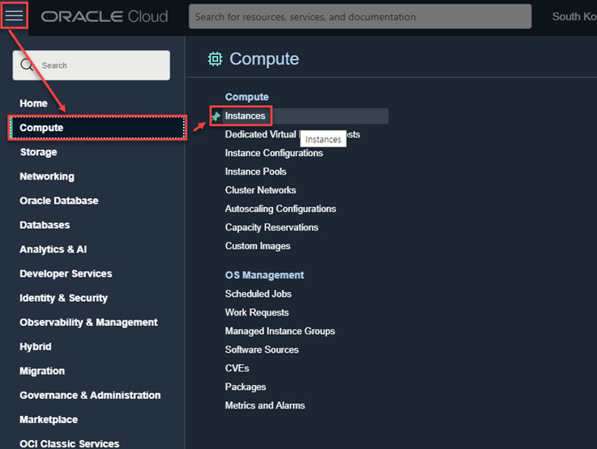

- 생성되어있는 VM의 목록을 보면 처음에는 아무것도 없다고 나온다. 흔히 AWS에서는 EC2 또는 EC2 Instance라고 하는데 오라클에서는 Instance라고 한다
  - 클라우드에서 인스턴스라고 하면 가상서버 또는 가상머신이라고 생각해도 무리가 없다

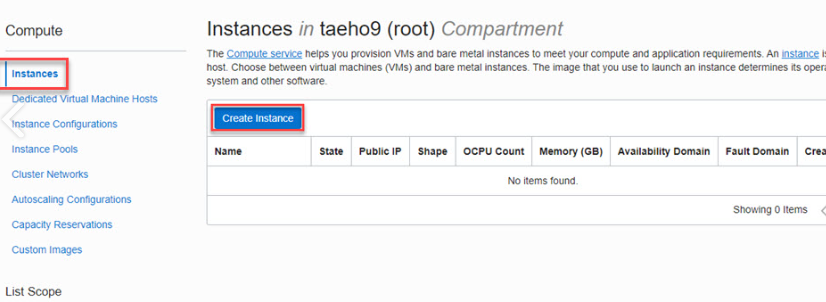

- Create Instance를 눌러보자

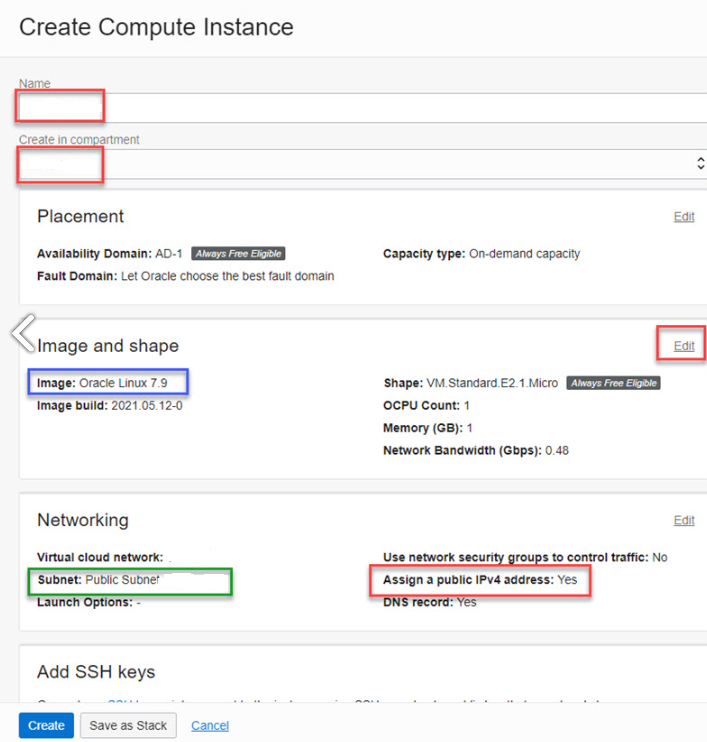

- Name에는 원하는 가상머신의 이름을 넣어주자
  - hostname 명령을 입력했을 때 입력한 이름이 나올것이다
- Create in compartment는 최상위 root를 선택하면 된다. 지금은 무료버전을 사용할 것이라 Compartment는 신경쓰지 않아도 좋다고 한다
- Placement는 인스턴스를 생성할 위치이고 어느 지역의 가용 도메인(AD)에 생성할 것인지 선택하면 된다.
  - 해외로 선택해도 좋다
- Image and shape은 기본적으로 Oracle Linux를 선택되어있는데 본인은 Edit을 눌러 Ubuntu를 선택했다.
  - CentOS와 Ubuntu를 스쳐가듯 많이 들어봐서 선택했다( 아직 지식이 많이 부족하다)
- Shape은 기본적으로 선택되어있는것이 무료라서 그대로 선택했다
  - APM이라고 불리는, Apache웹서버, PHP, MySQL을 설치해서 간단한 운영을 하는데는 충분하다고 한다
  - 필요하면 Edit을 눌러 변경해주자
- Networking에서는 Subnet과 Public IPv4 Address를 할당할 것인지 결정하면된다.
  - 나는 인터넷에서 접속할 수 있는 웹서버를 가정하고 설치하는 것이라 Public 서브넷과 Public IP Address를 할당하는 옵션을 선택했다

### SSH

- SSH는 Secure Shell를 말한다. 서버에 접속할 때 사용하는 보안 장치라고 생각하면 된다

- Image and Shape을 결정했다면 이제 인스턴스에 SSH 접속 시 어떤 인증 방법을 사용할 것인지를 결정해야 한다.
- 본인은 PuTTYgen을 이용해서  SSH키를 생성해주었다. 
- PuTTYgen에 들어가서 Key 메뉴에 들어가 SSH-2 RSA KEY가 선택되어 있는지 확인해본다

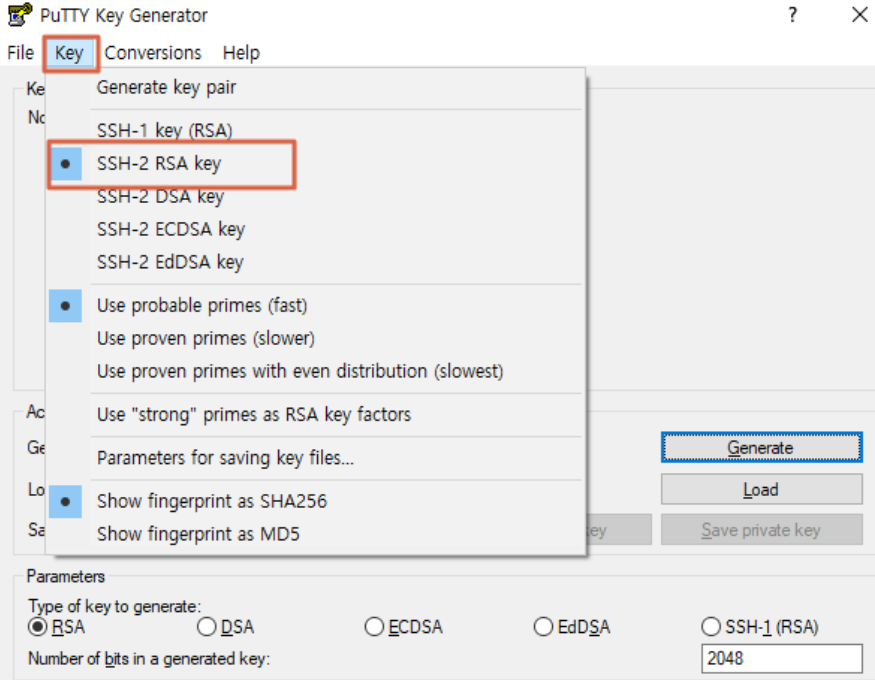

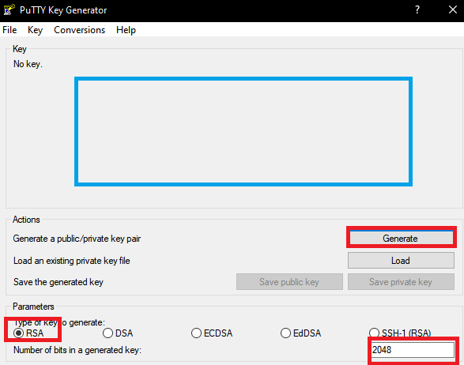

- 아래 Parameters를 확인한 후 Generate을 누르고 파란 박스 안에서 마우스를 움직이면 SSH 키를 만들어준다. 

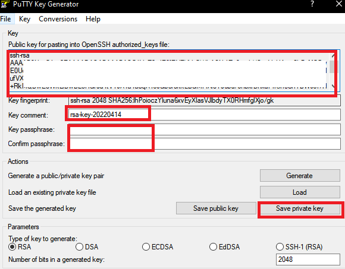

- Key comment는 Key에 대한 설명으로 편한데로 적어주면된다
- Key passphrase는 Key를 이용할 때 사용하는 비밀번호로 편의대로 안적어도 되지만 보안을 위해서 적어주는게 좋다
- 제일 위에 큰 네모에 있는것은 Public Key이다. 서버쪽에 등록할 때 사용된다
- Save private key 버튼을 눌러서 저장한다.

- 여기에서 만든 Key를 Instance SSH에 입력해주었다

### Boot volume

- 볼륨의 크기를 변경하거나 직접 관리하는 암호키를 이용해 볼륨을 암호화할 수 있지만 기본적으로 아무것도 선택하지 않는다고 하여 그렇게 했다

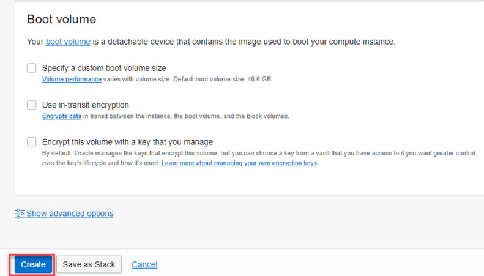

### 생성 확인

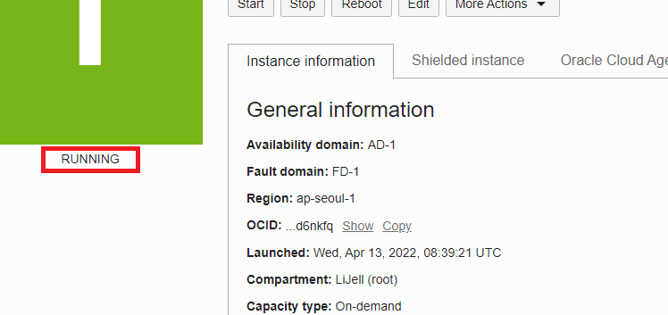

- Running이 나올 때 까지 기다려보자
- RUNNING이 나옴녀 완료된것이다.

## PORT 개방

- 클라우드 서버에서는 포트를 오라클 클라우드 웹사이트와 서버에서 총 2번 개방해야 접속이 가능하다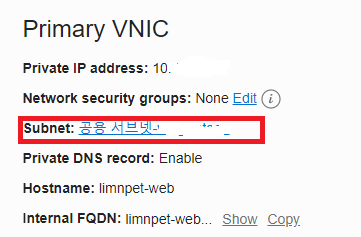

- 위 화면에서 Subnet을 선택해준다 

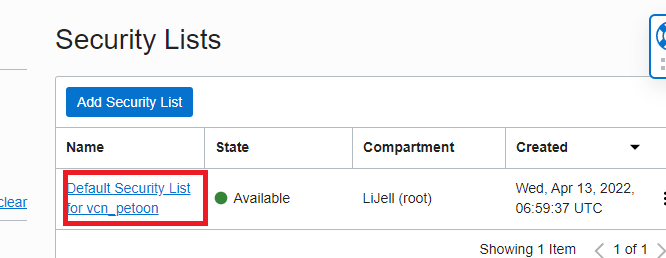

- Security Lists 목록에 빨간 네모칸을 선택한다 

- 디폴트 설정으로 22번만 개방되어있는것을 확인할 수 있다
- Add Ingress Rules를 클릭하여 포트를 추가하자

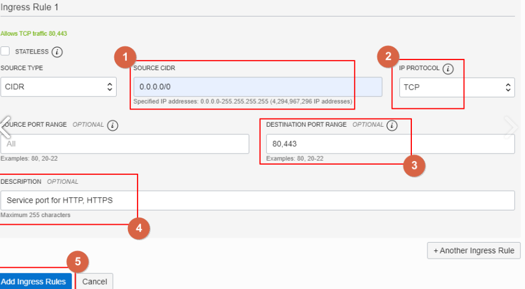

- 접속 가능한 IP를 0.0.0.0/0으로 입력하면 어디서든 접속할 수 있게 된다. 우리는 고객이 어디서든 접속할 수 있게 해야해서 위와 같이 입력한다
- TCP를 선택하고 
- 개방하려는 포트를 입력한다. 한번에 여러개 가능
- 포트에 대한 설명을 입력하고 
- Add Ingress Rules를 클릭하고 추가한다

---

- 이제 80과 443포트를 이용해서 고객이 접속하여 서비스 이용할 수 있게 됐다