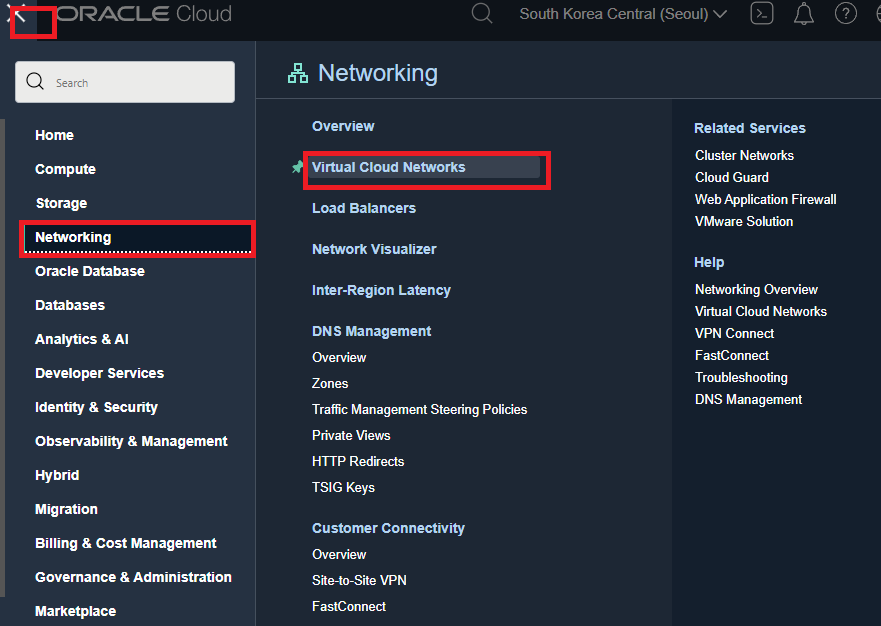
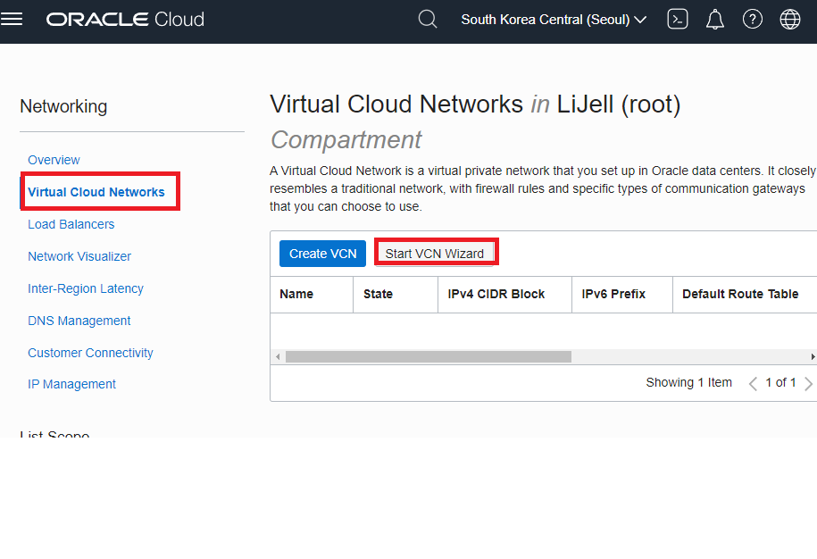
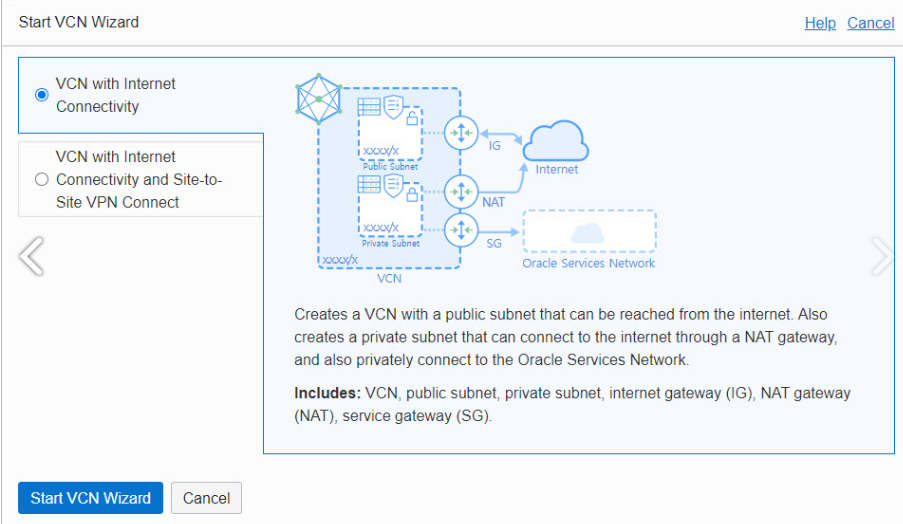
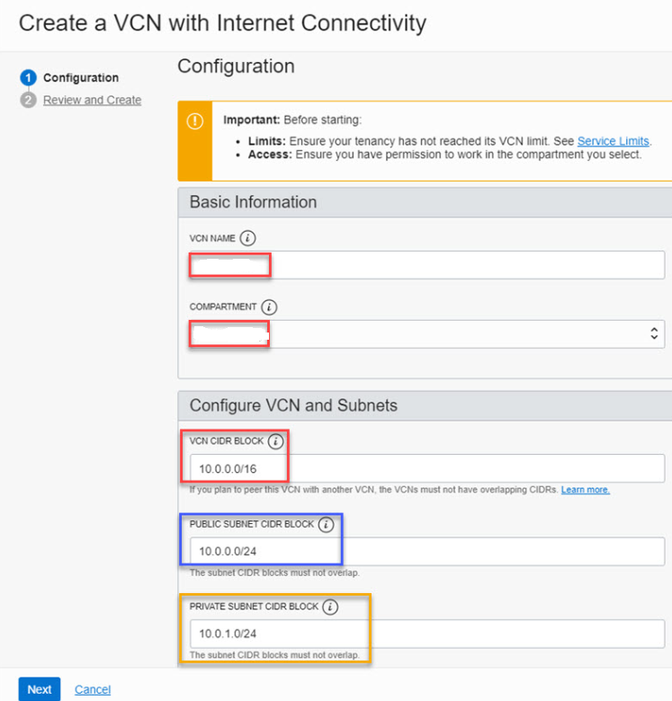

# Oracle Could

## VCN

- VCN은 AWS의 VPC와 같은 개념으로 보면 된다
- Virtual Cloud Network의 약자로 오라클 클라우드의 계정이 소유하는 테넌시에 가상의 네트워크를 구성하는 것이다.

- 왼쪽 위 구석의 햄버거를 클릭 한 후 --> Networking --> Virtual Cloud Networks로 이동한다.

- Virtual Cloud Networks 메뉴에 들어가면 처음에는 아무것도 없다.

- OCI의 VCN 구성에 익숙한 사용자가 아니면 "Start VCN Wizard"를 클릭하자
  - 아래 화면과 같이 선택해주자

- VCN with Internet Connectivity
  - 1개의 인터넷을 통해 접속할 수 있는 Public Subnet 1개로 구성되는 VCN을 구성할 때 사용되고, 가장 기본적인 구성이다

- VCN with Internet Connectivity and Site-to-Site VPN Connect
  - 기업의 중요한 기밀정보가 처리되고 저장되는 중요 서버는 기업 자체적으로 구성한 온-프레미스 영역에 두고 Site-to-Site VPN을 통해 사설망으로 연결하는 방식이다

---

- VCN NAME은 VCN의 이름을 입력하면 된다.

- COMPARTMENT는 테넌시 이름을 그대로 선택해주자 

- CIDR을 잘 알지 못해 Wizard가 기본값으로 표시해주는 네트워크 CIDR을 그대로 입력했다. 문제될 것은 없단다.

- PUBLIC SUBNET CIDR BLOCK는  인터넷에 공개될 DMZ 네트워크라고 보면된다. 공개망을 추후 확장하고 서비스별로 네트워크를 구분하여 접근 통제를 하려는게 아니라면 Wizard가 생성해주는 인터넷 게이트웨이(IG)를 통해 외부에서 접속할 수 있도록 구성되는 공개 네트워크의 CIDR을 입력하면 된다. 

- PRIVATE SUBNET CIDR BLOCK은 추후 내부망을 분리하고 접근통제를 수행하는게 아니라면 그대로 사용해도 된다. 서버 네트워크 중 인터넷에서 접속을 허용하지 않을 내부망의 네트워크 주소다. 

 

- 이후 Next 버튼을 누르고 Create하면된다.

---

Virtual Cloud Networks메뉴에 들어가면 생성된 VCN을 선택하면 Public Subnet과 Private Subnet을 확인할 수 있다.