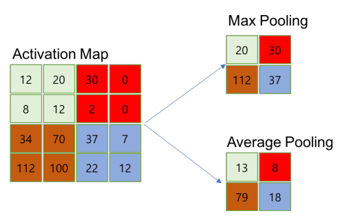
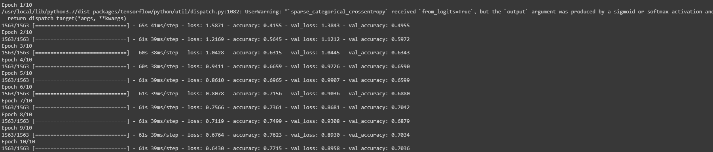

# Convolution Neural Network (CNN)

## CNN

- Fully-Connected Layer만으로 구성된 인공신경망의 입력 데이터는 1차원 형태로 한정
  - Flatten → Dense → 1차원
- 사진 데이터로 FC 신경망을 학습시키는 경우, 사진 데이터를 1차원으로 변환 → 공간정보 의 손실 → 정보 부족으로 특징 추출 및 학습이 비효율적이고 정확도를 높이는데 한계 
- 이미지의 공간정보를 유지한 상태로 학습 가능한 모델이 CNN

- CNN의 특징 
  - 각 레이어의 입출력 데이터의 형상 유지 
  - 이미지의 공간 정보를 유지하면서 인접 이미지와의 특징을 효과적으로 인식 
  - 복수의 필터로 이미지의 **특징 추출 및 학습** 
    - 셀로판지 느낌
  - 추출한 이미지의 특징을 모으고 강화하는 **Pooling layer** 
  - 필터를 **공유 파라미터**로 사용하기 때문에, 일반 인공 신경망과 비교하여 학습 파라미터 가 매우 적음


- 이미지의 특징을 추출(feature extraction)하는 부분과 클래스를 분류(classification)하는 부 분으로 나눌 수 있음 
- 특징 추출 영역은 convolution layer와 pooling layer를 여러 겹 쌓는 형태로 구성 
- Convolution layer는 입력 데이터에 필터를 적용 후 활성화 함수를 반영하는 필수 레이어 
- Conv. Layer 다음에 위치하는 pooling layer는 선택적 레이어 
- 마지막 부분에는 이미지 분류를 위한 fully-connected layer가 추가 
- 이미지의 특징을 추출하는 부분과 이미지를 분류하는 부분 사이에 이미지 형태의 데이터를 배열 형태로 만드는 flatten layer가 위치

## Convolution

- '데이터 전체를 보는 것이 아니라 부분을 보는 것'이 핵심 아이디어 
- '부분'에 해당하는 것을 filter라고 함


- Example) 
  - 7x7 image, 3x3 filter 
  - filter를 옮겨 가며 이미지를 봄 - 옮기는 양을 stride라고 함
    - stride가 2면 2칸씩 이동
- stride = 1
  - 각 스텝마다 1개의 값을 얻음 → 총 5x5의 출력을 얻게 됨 

- Total size: N (i.e. NxN) 
  - 7x7
- Filter size: F (i.e. FxF) 
  - 3x3
- Output size: k = (N-F)/stride + 1 where k is an integer 
- k = (7-3)/1+1 = 5 
- 이 연산의 출력을 convolution layer라고 함


- 각 필터마다 convolution layer를 얻을 수 있음 
- 6개의 필터로부터 6개의 convolution layer를 얻음 → N=7, F=3 이므로 5x5 convolution layer 6개가 만들어 짐 → 5x5x6 convolution layers (activation maps) 
- Activation maps까지 얻는 일련의 과정을 convolution이라 함

- convolution은 한번만 할 수도 있지만 상황에 따라서는 여러번 convolution을 할 수도 있음 
- 5x5x6 activation maps이 나왔으므로, 이를 새로운 이미지로 보고 앞의 과정을 반복


## Channel

- 이미지 픽셀 각각은 실수로 표현 
- 컬러 이미지는 색을 표현하기 위해 각 픽셀을 RGB 3개의 실수로 표현한 3차원 텐서 
- Example 
  - 컬러 이미지 → 3개의 채널(RGB)로 구성. 31(w)x39(h) 의 shape는 (39,31,3) 
  - 흑백 이미지 → 1개 채널 (명암). 31(w)x39(h) 의 shape는 (39,31,1) 
  - Conv. layer에 들어가는 입력 데이터에는 한개 이상의 필터가 적용됨 → 1개 필터는 feature map의 채널이 됨. Conv. Layer에 n개의 필터가 적용 → 출력 데이터는 n개의 채널


## Filter (Kernel)

- 이미지의 특징을 찾아내기 위한 공용 파라미터 
- kernel이라고 하기도 함 
- (3,3) 또는 (4,4) 같은 정사각형 행렬로 정의 
- CNN에서 학습 대상은 **필터 파라미터** 
- 지정된 간격(stride)으로 이동하면서 전체 입력 데이터(image)와 convolution하여 feature map을 만듬


- 하나의 convolution layer에 크기가 같은 여러개의 필터를 적용할 수 있음 → Feature map에 필터 갯수 만큼의 채널이 만들어 짐 
- 입력 데이터에 적용한 필터의 갯수는 출력 데이터인 feature map의 채널이 됨 
- Convolution layer의 입력 데이터를 필터가 순회하며 convolution을 통해 만든 출력 → Feature map 또는 Activation Map 
- Feature map은 convolution으로 만들어 진 행렬 
- Activation map은 feature map 행렬에 활성함수를 적용한 결과 → convolution layer의 최종 출력 결과가 activation map


## Padding

- Convolution layer의 사이즈 k는 일반적으로 N보다 작거나 같음 (stride≥1, F≥1) 
  - K = (N-F) / stride + 1 <= N-F+1 = N-(F-1) <= N
- 7x7 data가 convolution을 거쳐 5x5 data가 됨 → 상당량의 데이터 손실 
- Convolution layer의 출력 데이터가 줄어드는 것을 방지하는 방법 
- 7x7 형태를 그대로 유지 → zero padding technique

- Zero padding으로 확장된 9x9 이미지에 convolution을 하면 7x7 convolution layer가 출력됨


- Total size: N 
- Filter size: F 
- Stride: s 
- Padding size: p 
- Convolution layer size after padding: k = [(N+2p)-F] / s + 1 
- k = N if and only if p=[(N-1)s+F-N]/2


#### padding 단점

- Padding으로 인한 노이즈가 발생 
- 하지만 padding 없이 convolution 하는 것으로 인해 발생하는 데이터 손실보다 영향 이 작음
  - 단점보다 장점이 더 큼


## pooling 

- Convolution을 거쳐 나온 activation maps이 있을 때, 이를 이루는 convolution layer를 resize하여 새 로운 layer를 얻는 것 
- 출력 데이터의 크기를 줄이거나 특정 데이터를 강조하 는 용도로 사용


- Max pooling, Mean pooling 등 
- 일반적으로 pooling 크기와 stride를 같은 크기로 설정하며 모든 원소가 한번씩 처리되 도록 설정




- Pooling layer의 특징 
  - 학습 대상 파라미터가 없음 
  - Pooling layer를 통과하면 행령 크기가 감소 
  - Pooling layer를 통해 채널 수 변경 없음

- Pooling 의 목적 → Overfitting을 방지 

- Example) 

  - 96x96 크기의 image (feature 수는 96 x 96개) 
  - 400개의 filter로 convolution한 size 8 x 8 x 400의 convolution layer 
  - 각 convolution layer에는 (96-8+1) x (96-8+1)=89+89=7921개의 feature (stride = 1) 
  - 400개의 filter → 총 feature 수는 89 x 89 x 400 = 3,168,400개

  - overfitting의 가능성이 커짐 
  - Padding과 pooling을 통해 적절히 조절

#### Example

- Padding 

```python
import tensorflow as tf

t = tf.constant([[1,2,3], [4,5,6], [7,8,9]])
pad = tf.constant([[1,1],[1,1]])
print(t)
'''
tf.Tensor(
[[1 2 3]
 [4 5 6]
 [7 8 9]], shape=(3, 3), dtype=int32)
'''
print(tf.pad(t, pad, "CONSTANT"))
'''
tf.Tensor(
[[0 0 0 0 0]
 [0 1 2 3 0]
 [0 4 5 6 0]
 [0 7 8 9 0]
 [0 0 0 0 0]], shape=(5, 5), dtype=int32)
'''
```


## CNN 구성

- Conv. layer와 Max pooling layer를 반복적으로 stacking하는 특징 추출(feature extraction) 부분과 Fully-connected Layer를 구성하고 마지막 출력층에 softmax를 적용한 분류 부분으로 구성 
- Filter, Stride, Padding을 조절하여 특징 추출 부분의 입력과 출력 크기를 계산하고 맞추는 작업이 중요

```python
from keras.models import Sequential
from keras.layers.convolutional import Conv2D
from keras.layers.convolutional import MaxPooling2D
from keras.layers import Dense
from keras.layers import Flatten

model = Sequential()
# kernel_size = filter_size
model.add(Conv2D(12, kernel_size=(5, 5), activation='relu', input_shape=(120, 60, 1)))
model.add(MaxPooling2D(pool_size=(2, 2)))
model.add(Conv2D(16, kernel_size=(5, 5), activation='relu'))
model.add(MaxPooling2D(pool_size=(2, 2)))
model.add(Conv2D(20, kernel_size=(4, 4), activation='relu'))
model.add(MaxPooling2D(pool_size=(2, 2)))
# 여기까지 2D
# 여기서 부터 1D
model.add(Flatten())
model.add(Dense(128, activation='relu'))
# 마지막 출력은 4개
model.add(Dense(4, activation='softmax')) 
```


## CNN 입출력, 파라미터 계산

- 다음과 같은 조건의 이미지를 학습하는 CNN 각 레이어 별 입출력 데이터의 shape, 네트워크가 학습시키는 파라미터의 개수를 계산 
  - 입력데이터 shape: (39,31,1) 
  - 분류 클래스: 100


- Layer 1의 shape와 파라미터 → 1개의 conv. layer와 1개의 pooling layer로 구성 

  - Conv. Layer 1 

    - 입력데이터 shape : (39, 31, 1) 
    - 입력채널: 1 
    - 필터: (4, 4) 
    - 출력 채널: 20 
    - Stride: 1
    - 입력 이미지에 (4,4)인 필터 20개를 적용할 경우, 출력 데이터(activation map)의 shape

    

    - Activation Map의 shape는 (36, 28, 20) 
    - Input Ch. 1, Filter shape (4, 4), Output Ch. 20 → 학습 파라미터 = 4 * 4 * 20 =320
    - 입력 채널: 1 
    - 출력 데이터 (activation map) shape: (36,28,20) 
    - 학습 파라미터: 320개

  - Max Pooling Layer 1 

    - 입력데이터 shape : (36, 28, 20) 
    - Max Pooling size: (2, 2) 
    - 입력 채널: 20 
    - 출력 데이터 shape: (18, 14, 20) 
    - 학습 파라미터: 0

- Layer 2의 shape와 파라미터 
  - Conv. Layer 2 
    - 입력데이터 shape : (18, 24, 20) 
    - 입력채널: 20 
    - 필터: (3, 3, 40) 
    - 출력 채널: 40 
    - Stride: 1
    - 입력 채널: 20 
    - 출력 데이터 (activation map) shape: (16, 12, 40) 
    - 학습 파라미터: 7200개 (20 * 3 * 3 * 40)
  - Max Pooling Layer 2 
    - 입력데이터 shape : (16, 12, 40) 
    - Max Pooling size: (2, 2) 
    - 입력 채널: 40 
    - 출력 데이터 shape: (8, 6, 40) 
    - 학습 파라미터: 0

- Layer 3의 shape와 파라미터 
  - Conv. Layer 3 
    - 입력데이터 shape : (8, 6, 40) 
    - 입력채널: 40 
    - 필터: (3, 3) 
    - 출력 채널: 60 
    - Stride: 1
    - 입력 채널: 40 
    - 출력 데이터 (activation map) shape: (6, 4, 60) 
    - 학습 파라미터: 9600개 (40 * 3 * 3 * 60)
  - Max Pooling Layer 3 
    - 입력데이터 shape : (6, 4, 60) 
    - Max Pooling size: (2, 2) 
    - 입력 채널: 60 
    - 출력 데이터 shape: (3, 2, 60) 
    - 학습 파라미터: 0

- Layer 4의 shape와 파라미터 → 1개의 conv. layer로 구성 

  - Conv. Layer 4 

    - 입력데이터 shape : (3, 2, 60) 
    - 입력채널: 60 
    - 필터: (2, 2) 
    - 출력 채널: 80 
    - Stride: 1
    - 입력 채널: 60 
    - 출력 데이터 (activation map) shape: (2, 1, 80) 
    - 학습 파라미터: 320 (2 * 2 * 80)
  
- Flatten Layer → CNN의 데이터타입을 fully-connected neural network의 형태로 변 경하는 레이어. 파라미터가 존재하지 않고 입력 데이터 shape 변경만 수행 
  
  - 입력 데이터 shape: (2, 1, 80) 
  - 출력 데이터 shape: (160, 1)
  
- Softmax Layer → 분류 클래스가 100개이므로 출력은 (100,1) 

  - 입력 데이터 shape: (160, 1) 
  - 출력 데이터 shape: (100, 1) 
  - Weight shape는 (100, 160) → 파라미터는 160000


## Summary

- CNN은 이미지 공간 정보를 유지하면서 인접 이미지와의 특징을 효과적으로 인식하고 강조하는 방식으로 이미지의 특징을 추출하는 부분과 이미지를 분류하는 부분으로 구성 
- 특징 추출 영역은 필터를 사용하여 공유파라미터 수를 최소화 하면서 이미지의 특징을 찾는 conv. 레이어와 특징을 강화하고 모으는 pooling layer로 구성 
- CNN은 필터의 크기, stride, padding과 pooling크기로 데이터 크기를 조절하고 필터의 개수로 출력 데이터의 채널을 결정 
- CNN은 같은 레이어 크기의 FC neural network에 비해 학습 파라미터의 양은 20%규모. 은닉층이 깊어질수록 학습 파라미터의 차이는 더 커짐. CNN은 FC neural network 에 비해 더 적은 학습 파라미터로 더 높은 인식률을 제공


## Tutorial

- Tensorflow import 

```python
import tensorflow as tf
from tensorflow.keras import datasets, layers, models
import matplotlib.pyplot as plt
```

- Download CIFAR10 dataset
  - CIFAR10 contains 60000 color images in 10 classes, with 6000 images in each class 
  - 50000 training images & 10000 test images 
  - Classes are mutually exclusive and no overlap between them

```python
(train_images, train_labels), (test_images, test_labels) = datasets.cifar10.load_data()

# Normalize pixel values to be between 0 and 1
# float으로 하기 위해 255가 아닌 255.0으로 나누어 줌
train_images, test_images = train_images / 255.0, test_images / 255.0
```

- Verify the data

```python
class_names = ['airplane','automobile','bird','cat','deer',
              'dog','frog','horse','ship','truck']
plt.figure(figsize=(10, 10))
for i in range(25):
    plt.subplot(5,5,i+1)
 	plt.xticks([])
	plt.yticks([])
	plt.grid(False)
	plt.imshow(train_images[i], cmap=plt.cm.binary)
	# The CIFAR labels happen to be arrays,
	# which is why you need the extra index
	plt.xlabel(class_names[train_labels[i][0]])
plt.show()
```


- Create the convolutional base

```python
model = models.Sequential()
model.add(layers.Conv2D(32, (3,3), activation = 'relu', input_shape = (32,32,3)))
model.add(layers.MaxPooling2D((2,2)))
model.add(layers.Conv2D(64, (3,3), activation = 'relu'))
model.add(layers.MaxPooling2D((2,2)))
model.add(layers.Conv2D(64, (3,3), activation = 'relu'))
```

- Architecture of the model

```python
model.summary()
```


- Add Dense Layers on top

```python
model.add(layers.Flatten())
model.add(layers.Dense(64, activation='relu'))
model.add(layers.Dense(10, activation = 'softmax'))
```
- Architecture of the model

```python
model.summary()
```


- Compile and train the model

```python
model.compile(optimizer = 'adam',
             loss = tf.keras.losses.SparseCategoricalCrossentropy(from_logits = True),
             metrics = ['accuracy'])

history = model.fit(train_images, train_labels, epochs = 10,
                   validation_data=(test_images, test_labels))
```



- Evaluate the model

```python
plt.plot(history.history['accuracy'], label='accuracy')
plt.plot(history.history['val_accuracy'], label = 'val_accuracy')
plt.xlabel('Epoch')
plt.ylabel('Accuracy')
plt.ylim([0.5, 1])
plt.legend(loc='lower right')

test_loss, test_acc = model.evaluate(test_images, test_labels, verbose=2)
```


```python
print(test_loss)
print(test_acc)
'''
0.7035999894142151
0.895819902420044
'''
```


