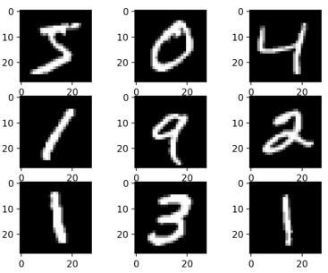
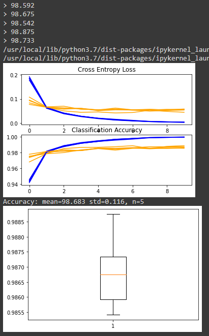

# CNN for MNIST

## MNIST Handwritten Digit Classification Dataset

- MNIST (Modified National Institute of Standard and Technology) dataset

```python
from keras.datasets import mnist
from matplotlib import pyplot

# load dataset
(trainX, trainy), (testX, testy) = mnist.load_data()

# summarize loaded dataset
print('Train: X=%s, y=%s' % (trainX.shape, trainy.shape))
print('Test: X=%s, y=%s' % (testX.shape, testy.shape))

# plot first few images
for i in range(9):
    # define subplot
    pyplot.subplot(330 + 1 + i)
    # plot raw pixel data
    pyplot.imshow(trainX[i], cmap=pyplot.get_cmap('gray'))
    
    # show the figure
    pyplot.show()
    

```



## Model Evaluation Methodology

- Develop a new model from scratch 
- Split the training set into a. Train and validation dataset for estimating the performance of a model for a given training run 
- Performance on the train and validation dataset over each run can then be plotted to provide learning curves and insight into how well a model is learning the problem 
- Keras API support this by specifying the 'validation_data' argument to the model.fit()

```python
# record model performance on a validation dataset during training
history = model.fit(..., validation_data=(valX, valY))
```

- K-fold cross-validation, perhaps 5-fold cross-validation for estimating the performance of a model 
- Can use KFold class from scikit-learn API to implement the k-fold crossvalidation evaluation of a given neural network model

```python
# example of k-fold cv for a neural net
data = ...
# prepare cross validation
kfold = KFold(5, shuffle=True, random_state=1)
# enumerate splits
for train_ix, test_ix in kfold.split(data):
 model = ...
...
```


## Develop a Baseline Model

- Load dataset

```python
# load dataset
(trainX, trainY), (testX, testY) = mnist.load_data()
print(trainX.shape)
print(testX.shape)
'''
(60000, 28, 28)
(10000, 28, 28)
'''
# reshape dataset to have a single channel
trainX = trainX.reshape((trainX.shape[0], 28, 28, 1))
testX = testX.reshape((testX.shape[0], 28, 28, 1))
```

- One-hot encoding for labels

```python
# one hot encode target values
from tensorflow.keras.utils import to_categorical
trainY = to_categorical(trainY)
testY = to_categorical(testY)
```

---


- All together

```python
from tensorflow.keras.utils import to_categorical
# load train and test dataset
def load_dataset():
    # load dataset
    (trainX, trainY), (testX, testY) = mnist.load_data()
    
    # reshape dataset to have a single channel
    trainX = trainX.reshape((trainX.shape[0], 28, 28, 1))
	testX = testX.reshape((testX.shape[0], 28, 28, 1))
    
    # one hot encode target values
	
	trainY = to_categorical(trainY)
	testY = to_categorical(testY)
    return trainX, trainY, testX,  testY
```

---


#### Prepare Pixel Data

```python
def prep_pixels(train, test):
	# convert from integers to float
	train_norm = train.astype('float32')
	test_norm = test.astype('float32')

	# normalize to range 0-1
	train_norm = train_norm / 255.0
	test_norm = test_notm / 255.0
    
    #return normalized images
    return train_norm, test_norm
```

---


#### Define Model 

- Start with a small filter size (3,3) and a modest number of filters (32) followed by max pooling layer 
- Multi-class classification task → require an output layer with 10 nodes in order to predict the probability distribution of an image belonging to each of the 10 classes → use a softmax activation function 
- Between the feature extractor and the output layer, add dense layer to interpret the features with 100 nodes 
- All layers use ReLU activation function 
- Use a stochastic gradient descent optimizer with a learning rate of 0.01 and a momentum of 0.9 
- Categorical cross-entropy loss function : suitable for multi-class classification

```python
# define cnn model
def define_model():
    model = Sequential()
    model.add(Conv2D(32, (3, 3), activation = 'relu', kernel_initializer = 'he_uniform',
                     input_shape=(28,28,1)))
    model.add(Maxpooling2D((2,2)))
    model.add(Flatten())
    model.add(Dense(100, activation = 'relu', kernel_initializer='he_uniform'))
    model.add(Dense(10, actication = 'softmax'))
    
    # compile model
    opt = SGD(lr= 0.01, momentum = 0.9)
    model.compile(optimizer=opt, loss='categorical_crossentropy', metrics=['accuracy'])
    return model
```

---


#### Evaluate Model

- Model will be evaluated using 5-fold cross-validation 
- Value of k=5 was chosen to provide a baseline for both repeated evaluation and to not be so large as to require a long running time 
- Each test set will be 20% of the training dataset 
- Training dataset is shuffled prior to being split, and the sample shuffling is performed each time → any model have the same train and test datasets in each fold, providing an apples-to-apples comparison between models

- Train the baseline model for a modest 10 training epochs with a default batch size of 32 samples 
- Test set for each fold will be used to evaluate the model both during each epoch of the training run → create learning curve later

```python
# evaluate a model using k-fold cross-validation
def evaluate_model(dataX, dataY, n_folds=5):
    scores, histories = list(), list()
    
    # prepare coess validation
    kfold = KFold(n_folds, shuffle=True, random_state = 1)
    
    #enumerate splits
    for train_ix, test_ix in kfold.split(dataX):
        #define model
        model = define_model()
        # select rows for train and test
        trainX, trainY, testX, testY = dataX[train_ix], dataY[train_ix], dataX[test_ix],
        dataY[test_ix]
        # fit model
        history = model.fit(trainX, trainY, epochs=10, batch_size=32,
                            validation_data=(testX, testY), verbose=0)
        # evaluate model
        _, acc = model.evaluate(testX, testY, verbose=0)
		print('> %.3f' % (acc * 100.0))
		# stores scores
		scores.append(acc)
		histories.append(history)
	return scores, histories

```

---

#### Present results

- The diagnostics of the learning behavior of the model during training 
- Estimation of the model performance

```python
# plot diagnostic learning curves
def summarize_diagnostics(histories):
	for i in range(len(histories)):
		# plot loss
		pyplot.subplot(2, 1, 1)
		pyplot.title('Cross Entropy Loss')
		pyplot.plot(histories[i].history['loss'], color='blue', label='train')
		pyplot.plot(histories[i].history['val_loss'], color='orange', label='test')
		# plot accuracy
        pyplot.subplot(2, 1, 2)
        pyplot.title('Classification Accuracy')
        pyplot.plot(histories[i].history['accuracy'], color='blue', label='train')
        pyplot.plot(histories[i].history['val_accuracy'], color='orange', label='test')
	pyplot.show()
```

```python
# summarize model performance
def summarize_performance(scores):
    # print summary
	print('Accuracy: mean=%.3f std=%.3f, n=%d' % (mean(scores)*100, std(scores)*100,
                                                  len(scores)))
	# box and whisker plots of results
	pyplot.boxplot(scores)
	pyplot.show()
```

---

#### Running

```python
# run the test harness for evaluating a model
def run_test_harness():
    # load dataset
    trainX, trainY, testX, testY = load_dataset()
    # prepare pixel data
    trainX, testX = prep_pixels(trainX, testX)
    # evaluate model
    scores, histories = evaluate_model(trainX, trainY)
    # learning curves
    summarize_diagnostics(histories)
    # summarize estimated performance
    summarize_performance(scores)
```

---

## Complete Example

```python
# baseline cnn model for mnist
from numpy import mean
from numpy import std
from matplotlib import pyplot
from sklearn.model_selection import KFold
from keras.datasets import mnist
from tensorflow.keras.utils import to_categorical
from keras.models import Sequential
from keras.layers import Conv2D, MaxPooling2D, Dense, Flatten
from tensorflow.keras.optimizers import SGD

# load train and test dataset
def load_dataset():
    # load dataset
    (trainX, trainY), (testX, testY) = mnist.load_data()
    # reshape dataset to have a single channel
    trainX = trainX.reshape((trainX.shape[0], 28, 28, 1))
    testX = testX.reshape((testX.shape[0], 28, 28, 1))
    # one hot encode target values
    trainY = to_categorical(trainY)
    testY = to_categorical(testY)
    return trainX, trainY, testX, testY

# scale pixels
def prep_pixels(train, test):
    # convert from integers to floats
    train_norm = train.astype('float32')
    test_norm = test.astype('float32')
    # normalize to range 0-1
    train_norm = train_norm / 255.0
    test_norm = test_norm / 255.0
    # return normalized images
    return train_norm, test_norm
# define cnn model
def define_model():
    model = Sequential()
    model.add(Conv2D(32, (3, 3), activation='relu', kernel_initializer='he_uniform', input_shape=(28, 28, 1)))
    model.add(MaxPooling2D((2, 2)))
    model.add(Flatten())
    model.add(Dense(100, activation='relu', kernel_initializer='he_uniform'))
    model.add(Dense(10, activation='softmax'))
    # compile model
    opt = SGD(learning_rate=0.01, momentum=0.9)
    model.compile(optimizer=opt, loss='categorical_crossentropy', metrics=['accuracy'])
    return model

# evaluate a model using k-fold cross-validation
def evaluate_model(dataX, dataY, n_folds=5):
    scores, histories = list(), list()
    # prepare cross validation
    kfold = KFold(n_folds, shuffle=True, random_state=1)
    # enumerate splits
    for train_ix, test_ix in kfold.split(dataX):
        # define model
        model = define_model()
        # select rows for train and test
        trainX, trainY, testX, testY = dataX[train_ix], dataY[train_ix], dataX[test_ix], dataY[test_ix]
        # fit model
        history = model.fit(trainX, trainY, epochs=10, batch_size=32, validation_data=(testX, testY), verbose=0)
        # evaluate model
        _, acc = model.evaluate(testX, testY, verbose=0)
        print('> %.3f' % (acc * 100.0))
        # stores scores
        scores.append(acc)
        histories.append(history)
    return scores, histories

# plot diagnostic learning curves
def summarize_diagnostics(histories):
    for i in range(len(histories)):
        # plot loss
        pyplot.subplot(2, 1, 1)
        pyplot.title('Cross Entropy Loss')
        pyplot.plot(histories[i].history['loss'], color='blue', label='train')
        pyplot.plot(histories[i].history['val_loss'], color='orange', label='test')
        # plot accuracy
        pyplot.subplot(2, 1, 2)
        pyplot.title('Classification Accuracy')
        pyplot.plot(histories[i].history['accuracy'], color='blue', label='train')
        pyplot.plot(histories[i].history['val_accuracy'], color='orange', label='test')
    pyplot.show()
# summarize model performance
def summarize_performance(scores):
    # print summary
    print('Accuracy: mean=%.3f std=%.3f, n=%d' % (mean(scores)*100, std(scores)*100, len(scores)))
    # box and whisker plots of results
    pyplot.boxplot(scores)
    pyplot.show()
    
# run the test harness for evaluating a model
def run_test_harness():
    # load dataset
    trainX, trainY, testX, testY = load_dataset()
    # prepare pixel data
    trainX, testX = prep_pixels(trainX, testX)
    # evaluate model
    scores, histories = evaluate_model(trainX, trainY)
    # learning curves
    summarize_diagnostics(histories)
    # summarize estimated performance
    summarize_performance(scores)
# entry point, run the test harness
run_test_harness()
```


