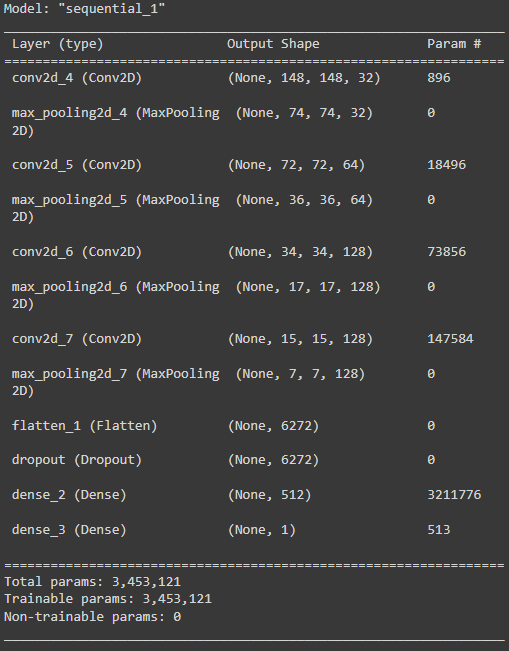
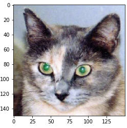
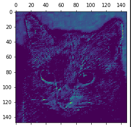
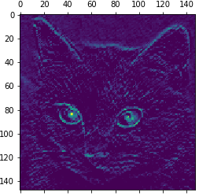
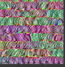
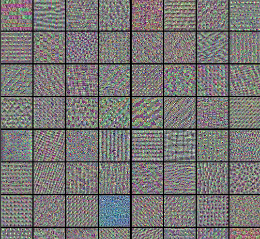

# Convnet Visualization

## Visualizing what convnets learn

- Deep Learning model as Blackbox 
- Convnet은 시각적인 개념을 학습한 것 → 시각화 하기 아주 좋음 
- 시각화에 유용한 기법 
  - 컨브넷 중간층의 출력(중간층에 있는 활성화)을 시각화 
  - 컨브넷 필터 시각화 
  - 클래스 활성화에 대한 히트맵(heatmap)을 이미지에 시각화

#### Visualizing Intermediate activations

- 어떤 입력이 주어졌을 때 네트워크에 있는 여러 합성곱과 풀링층이 출력하는 특성맵을 그 리는 것 
- 네트워크에 의해 학습된 필터들이 어떻게 입력을 분해하는지 보여줌 
- 넓이, 높이, 깊이(채널) 3개의 차원에 대해 특성맵을 시각화하는 것이 좋음 
- 각 채널은 비교적 독립적 특성을 인코딩하므로 특성맵의 각 채널 내용을 독립적인 2D 이미 지로 그림

```python
from tensorflow.keras.models import load_model
model = load_model('/content/drive/MyDrive/tensflow/cats_and_dogs_small_2.h5')
model.summary() 
```



```python
img_path = '/content/drive/MyDrive/tensflow/cats_and_dogs_small/test/cats/cat.1700.jpg'
from tensorflow.keras.preprocessing import image 
import numpy as np
img = image.load_img(img_path, target_size=(150, 150))
img_tensor = image.img_to_array(img)
img_tensor = np.expand_dims(img_tensor, axis=0)
img_tensor /= 255.
print(img_tensor.shape)
'''
(1, 150, 150, 3)
'''
```

```python
import matplotlib.pyplot as plt
plt.imshow(img_tensor[0])
plt.show()
```



- 확인하고 싶은 특성맵을 추출하기 위해 이미지 배치를 입력으로 받아 모든 합성곱과 풀링 층의 활성화를 출력하는 케라스 모델을 구축 → keras의 Model 클래스를 사용 
- 모델 인스턴스를 만들 때 2개의 파라미터가 필요 → 입력텐서(또는 입력 텐서 리스트)와 출 력텐서(또는 출력 텐서 리스트) 
- 반환되는 객체는 Sequential과 같은 keras 모델이지만 특정 입력과 특정 출력을 매핑 
- Model 클래스는 Sequential과 달리 여러개의 출력을 가진 모델을 만들 수 있음

```python
from keras import models

layer_outputs = [layer.output for layer in model.layers[:8]]
activation_model = models.Model(inputs=model.input, outputs=layer_outputs)
```
- 입력 이미지가 주어지면 이 모델은 원본 모델의 활성화 값을 반환 → 이 모델은 1개의 입력 과 층의 활성화마다 하나씩 총 8개의 출력을 가짐


```python
activations = activation_model.predict(img_tensor)
```

```python
first_layer_activation = activations[0]
print(first_layer_activation.shape)
'''
(1, 148, 148, 32)
'''
```

- 원본 모델의 첫번째 층 활성화 중에서 20번째 채널을 시각화

```python
import matplotlib.pyplot as plt
plt.matshow(first_layer_activation[0, :, :, 19], cmap='viridis')
```



- 원본 모델의 첫번째 층 활성화 중에서 16번째 채널을 시각화

```python
plt.matshow(first_layer_activation[0, :, :, 15], cmap='viridis')
```



- 주안층의 모든 활성화 채널 시각화

```python
layer_names = []
for layer in model.layers[:8]:
  layer_names.append(layer.name)

images_per_row = 16

for layer_name, layer_activation in zip(layer_names, activations):
  n_features = layer_activation.shape[-1]
  size = layer_activation.shape[1]
  n_cols = n_features // images_per_row
  display_grid = np.zeros((size * n_cols, images_per_row * size))
  for col in range(n_cols):
    for row in range(images_per_row):
      channel_image = layer_activation[0, :, :, col * images_per_row + row]
      channel_image -= channel_image.mean()
      channel_image /= channel_image.std()
      channel_image *= 64
      channel_image += 128
      channel_image = np.clip(channel_image, 0, 255).astype('uint8')
      display_grid[col * size : (col + 1) * size, row * size : (row + 1) * size] = channel_image
scale = 1. / size
plt.figure(figsize=(scale * display_grid.shape[1], scale * display_grid.shape[0]))
plt.title(layer_name)
plt.grid(False)
plt.imshow(display_grid, aspect='auto', cmap='viridis')
```

- 첫번째 층은 여러 종류의 에지 감지기를 모아놓은 것과 같음 → 초기 사진에 있는 거의 모 든 정보가 유지됨 
- 상위층으로 갈수록 활성화는 점점 더 추상적 → 시각적으로 이해하기 어려워짐 
- 상위층의 표현은 이미지의 시각적 콘텐츠에 대한 정보가 점점 감소하고 이미지의 클래스에 관한 정보가 점점 증가 
- 상위층으로 갈수록 비어있는 활성화가 늘어남 → 첫번째 층에서는 모든 필터가 입력 이미지에 활성화 되었지만 층을 올라갈수록 활성화되지 않는 필터들이 생기기 시작 → 필터에 인코딩 된 패턴이 입력 이미지에 없다는 의미
- 층에서 추출한 특성은 층의 깊이를 따라 점점 더 추상화 됨 
- 높은 층의 활성화는 특정 입력에 관한 시각적 정보가 점점 줄어들고 타깃에 관한 정보가 점점 더 증가 
- 반복적인 변환을 통해 관계없는 정보(예를 들어 이미지에 있는 특정 요소)를 걸러내고 유용한 정보는 강조되고 개선됨

- 사람은 몇초동안 한 장면을 보고 난 후 그 안에 있던 추상적 물체를 기억할 수 있음 → 하지만 이 물체의 구체적 모양은 기억하지 못함 
- 우리 뇌는 시각적 입력에서 관련성이 적은 요소를 필터링하여 고수준 개념으로 변환 → 완전 추상적으로 학습하기 때문에 눈으로 본 것을 자세기 기억하기는 매우 어려움

#### Visualizing convnet filters

- 각 필터가 반응하는 시각적 패턴을 그려보는 것 
- 빈 입력 이미지에서 시작해서 특정 필터의 응답을 최대화하기 위해 컨브넷 입력 이미지에 경사상승법을 적용 → 결과적으로 입력 이미지는 선택된 필터가 최대로 응답하는 이미지 가 됨 
- 특성 합성곱층의 한 필터 값을 최대화하는 손실함수를 정의 → 이 값을 최대화하기 위해 입력 이미지를 변경하도록 확률적 경사상승법을 사용

```python
import numpy as np
import tensorflow as tf
from tensorflow import keras

# The dimensions of our input image
img_width = 180
img_height = 180
# Our target layer: we will visualize the filters from this layer.
# See `model.summary()` for list of layer names, if you want to change this.
layer_name = "conv3_block4_out"
# Build a ResNet50V2 model loaded with pre-trained ImageNet weights
model = keras.applications.ResNet50V2(weights="imagenet", include_top=False)
# Set up a model that returns the activation values for our target layer
layer = model.get_layer(name=layer_name)
feature_extractor = keras.Model(inputs=model.inputs, outputs=layer.output)
```

```python
def compute_loss(input_image, filter_index):
  activation = feature_extractor(input_image)
  # We avoid border artifacts by only involving non-border pixels in the loss.
  filter_activation = activation[:, 2:-2, 2:-2, filter_index]
  return tf.reduce_mean(filter_activation)
@tf.function
def gradient_ascent_step(img, filter_index, learning_rate):
  with tf.GradientTape() as tape:
    tape.watch(img)
    loss = compute_loss(img, filter_index)
  # Compute gradients.
  grads = tape.gradient(loss, img)
  # Normalize gradients.
  grads = tf.math.l2_normalize(grads)
  img += learning_rate * grads
  return loss, img
```

```python
def initialize_image():
  # We start from a gray image with some random noise
  img = tf.random.uniform((1, img_width, img_height, 3))
  # ResNet50V2 expects inputs in the range [-1, +1].
  # Here we scale our random inputs to [-0.125, +0.125]
  return (img - 0.5) * 0.25

def visualize_filter(filter_index):
  # We run gradient ascent for 20 steps
  iterations = 30
  learning_rate = 10.0
  img = initialize_image()
  for iteration in range(iterations):
    loss, img = gradient_ascent_step(img, filter_index, learning_rate)
  # Decode the resulting input image
  img = deprocess_image(img[0].numpy())
  return loss, img
```

```python
def deprocess_image(img):
 # Normalize array: center on 0., ensure variance is 0.15
 img -= img.mean()
 img /= img.std() + 1e-5
 img *= 0.15
 # Center crop
 img = img[25:-25, 25:-25, :]
 # Clip to [0, 1]
 img += 0.5
 img = np.clip(img, 0, 1)
 # Convert to RGB array
 img *= 255
 img = np.clip(img, 0, 255).astype("uint8")
 return img
```

```python
from IPython.display import Image, display

loss, img = visualize_filter(0)
keras.preprocessing.image.save_img("0.png", img)

display(Image("0.png"))
```



```python
# Compute image inputs that maximize per-filter activations
# for the first 64 filters of our target layer
all_imgs = []
for filter_index in range(64):
 print("Processing filter %d" % (filter_index,))
 loss, img = visualize_filter(filter_index)
 all_imgs.append(img)
# Build a black picture with enough space for
# our 8 x 8 filters of size 128 x 128, with a 5px margin in between
margin = 5
n = 8
cropped_width = img_width - 25 * 2
cropped_height = img_height - 25 * 2
width = n * cropped_width + (n - 1) * margin
height = n * cropped_height + (n - 1) * margin
stitched_filters = np.zeros((width, height, 3))
```

```python
# Fill the picture with our saved filters
for i in range(n):
  for j in range(n):
    img = all_imgs[i * n + j]
    stitched_filters[
                     (cropped_width + margin) * i : (cropped_width + margin) * i + cropped_width,
                     (cropped_height + margin) * j : (cropped_height + margin) * j+ cropped_height,:,] = img
keras.preprocessing.image.save_img("stiched_filters.png", stitched_filters)
from IPython.display import Image, display
display(Image("stiched_filters.png"))

```


