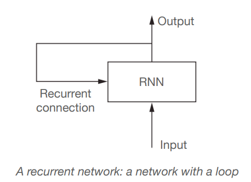
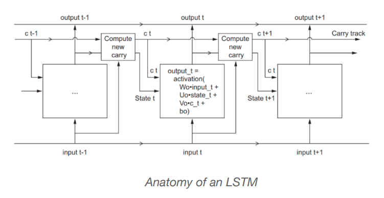

# RNN by example in Python

## Using a Recurrent Neural Network to write Patent Abstracts

### Introduction

- LSTM cell의 특정 아키텍쳐에 대해서 모든것을 이해할 필요는 없다. 사람이 할 일이 아니다. LSTM이 뜻하는 것은 과거정보다 나중에 다시 reinfected될 수 있게 해주는 것이다.
- 데이터 사이언스 기슬울 배우는 가장 효율적인 방법은 **문제를 찾고 해결하는 것이다**

- Top-down approach: 다시 돌아가고 이론을 covering하기 전에 어떻게 구현해야하는지 배워보자
  - 내가 필요한 방법을 계속 고민하고 언제 연구 컨셉으로 다시 돌아가 공부해야하는지 알아야한다. 어떤 프레임워크를 어떤 아이디어에 적용시킬지에 대한것들 등 끊임없는 고민이 필요하다. 
  - 어떻게  Keras에서 recurrent neural network로 어떻게 글을 요약하는지 봐보자.

### Recurrent Neural Network

- 높은 수준의 RNN 시퀸스 과정은 매일의 주가라던가, 센서 측정 등등 하나의 요소의 특정 시간을 과거의 시퀸스의 메모리로 다시 학습한다.
- **Recurrent라는 말은 현재의 Output이 다음 과정의 Input이 되는것을 말한다**. 각각의 시퀸스의 요소는 모델이 현재의 input뿐만 아니라  선행요소로도 고려된다.

- 이 메모리를 통해 네트워크는 long-term dependencies를 학습할 수 있다
- RNN은 사람들의 방법을 모망해서 디자인됐다. 스스로 단어들의 리스폰스를 만들 때 전체 문장을 고려하는 방식을 말한다 
- 예를 들어, "The concert was boring for the first 15 minutes while the band warmed up but then was terribly exciting" 가 있다면 
  - ML는 a bag of words model 같이 각 단어들을 고립해서 고려해서 부정적인 결과를 나타낼 수도 있다.
  - RNN은 반대로 "but" 과 "terribly exciting" 등을 알아볼 수 있고, 전체적은 문장을 고려하기 때문에 문장이 부정적 --> 긍정적으로 변화는 것도 알 수 있다
  - 전체 문장을 읽는것은 우리들에게 문장의 흐름을 이해할 수 있다는 것을 의미하고 --> concept encoded in RNN이라고 말할 수 있다

 
