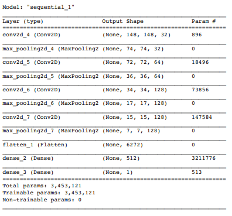
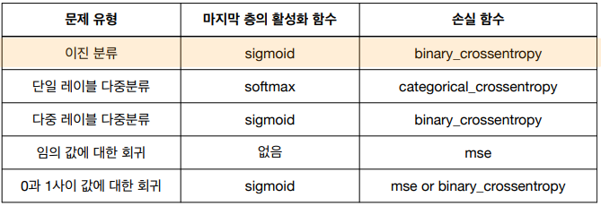
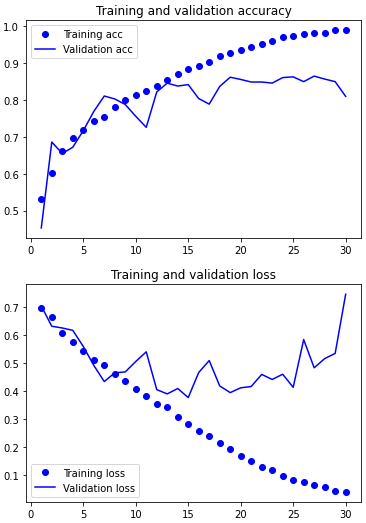
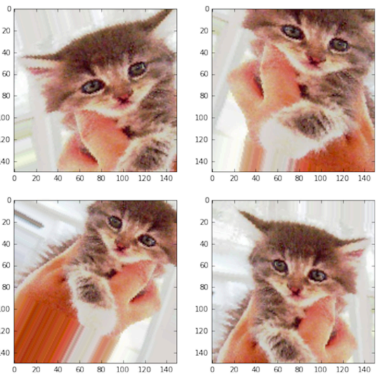
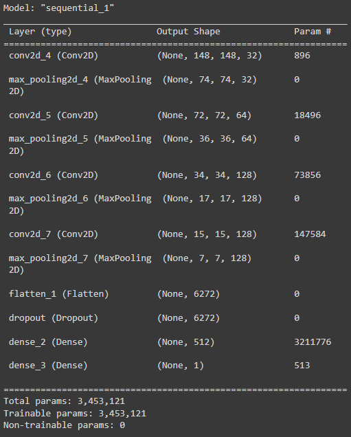
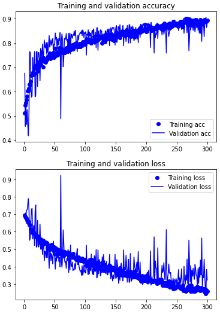

# Dogs vs. Cats

- Google Colab 사용
  - Runtime에서 TPU 사용 추천

- Dogs vs Cats dataset 
  - https://www.kaggle.com/c/dogs-vs-cats/data 
  - 25000 images (12500 cats and 12500 dogs) 
  - Create dataset 
    - Training: 1000 samples for each class 
    - Validation: 500 samples for each class 
    - Test: 500 samples for each class

## Training a convnet from scratch on a small dataset

#### Prepare dataset

```python
import os, shutil

original_db_dir = './train'

base_dir = './cats_and_dogs_small'
os.mkdir(base_dir)
train_dir = os.path.join(base_dir, 'train')
os.mkdir(train_dir)
validation_dir = os.path.join(base_dir, 'validation')
os.mkdir(validation_dir)
test_dir = os.path.join(base_dir, 'test')
os.mkdir(test_dir)

train_cats_dir = os.path.join(train_dir, 'cats')
os.mkdir(train_cats_dir)
train_dogs_dir = os.path.join(train_dir, 'dogs')
os.mkdir(train_dogs_dir)

validation_cats_dir = os.path.join(validation_dir, 'cats')
os.mkdir(validation_cats_dir)
validation_dogs_dir = os.path.join(validation_dir, 'dogs')
os.mkdir(validation_dogs_dir)

test_cats_dir = os.path.join(test_dir, 'cats')
os.mkdir(test_cats_dir)
test_dogs_dir = os.path.join(test_dir, 'dogs')
os.mkdir(test_dogs_dir)

frames = ['cat.{}.jpg'.format(i) for i in range(1000)]
for fname in frames:
 src = os.path.join(original_db_dir, fname)
 dst = os.path.join(train_cats_dir, fname)
 shutil.copyfile(src,dst)

frames = ['cat.{}.jpg'.format(i) for i in range(1000,1500)]
for fname in frames:
 src = os.path.join(original_db_dir, fname)
 dst = os.path.join(validation_cats_dir, fname)
 shutil.copyfile(src,dst)

frames = ['cat.{}.jpg'.format(i) for i in range(1500,2000)]
for fname in frames:
 src = os.path.join(original_db_dir, fname)
 dst = os.path.join(test_cats_dir, fname)
 shutil.copyfile(src,dst)

frames = ['dog.{}.jpg'.format(i) for i in range(1000)]
for fname in frames:
 src = os.path.join(original_db_dir, fname)
 dst = os.path.join(train_dogs_dir, fname)
 shutil.copyfile(src,dst)

frames = ['dog.{}.jpg'.format(i) for i in range(1000,1500)]
for fname in frames:
 src = os.path.join(original_db_dir, fname)
 dst = os.path.join(validation_dogs_dir, fname)
 shutil.copyfile(src,dst)

frames = ['dog.{}.jpg'.format(i) for i in range(1500,2000)]
for fname in frames:
 src = os.path.join(original_db_dir, fname)
 dst = os.path.join(test_dogs_dir, fname)
 shutil.copyfile(src,dst)
```

---


#### Create Neural Network

```python
from keras.layers import Conv2D, MaxPooling2D, Flatten, Dense, Dropout
from keras import models

model = models.Sequential()
model.add(Conv2D(32, (3,3), activation='relu', input_shape=(150,150,3)))
model.add(MaxPooling2D((2,2)))
model.add(Conv2D(64, (3,3), activation='relu'))
model.add(MaxPooling2D((2,2)))
model.add(Conv2D(128, (3,3), activation='relu'))
model.add(MaxPooling2D((2,2)))
model.add(Conv2D(128, (3,3), activation='relu'))
model.add(MaxPooling2D((2,2)))
model.add(Flatten())
model.add(Dense(512, activation='relu'))
model.add(Dense(1, activation='sigmoid'))

model.summary()

from keras import optimizers

model.compile(loss='binary_crossentropy', optimizer=optimizers.RMSprop(lr=1e-4), metrics=['acc'])
```



- 문제 유형마다 함수가 어느정도 정해져있음



---


#### Data Preprocessing

```python
from tensorflow.keras.preprocessing.image import ImageDataGenerator


train_datagen = ImageDataGenerator(rescale=1./255)
test_datagen = ImageDataGenerator(rescale=1./255)
train_generator = train_datagen.flow_from_directory(
 train_dir,
 target_size=(150,150),
 batch_size=20,
 class_mode='binary'
)
validation_generator = test_datagen.flow_from_directory(
 validation_dir,
 target_size=(150,150),
 batch_size=20,
 class_mode='binary'
)
```

- ImageDataGenerator 클래스는 디스크에 있는 이미지 파일을 읽어 전처리 된 배치 텐서로 자동으로 바꾸어 주는 파이썬 제너레이터를 만들어 줌

```python
for data_batch, labels_batch in train_generator:
  print('배치 데이터 크기:', data_batch.shape)
  print('배치 레이블 크기:',  labels_batch.shape)
  break

'''
배치 데이터 크기: (20, 150, 150, 3)
배치 레이블 크기: (20,)
'''
```

```python
history = model.fit_generator( # 배치 제너레이터를 사용하여 모델 훈련
 train_generator,
 steps_per_epoch=100,
 epochs=30,
 validation_data=validation_generator,
 validation_steps=50
)
model.save('/content/drive/MyDrive/tensflow/cats_and_dogs_small_1.h5') # 모델 저장
```

```python
import matplotlib.pyplot as plt

acc = history.history['acc']
val_acc = history.history['val_acc']
loss = history.history['loss']
val_loss = history.history['val_loss']

epochs = range(1, len(acc)+1)

plt.plot(epochs, acc, 'bo', label='Training acc')
plt.plot(epochs, val_acc, 'b', label='Validation acc')
plt.title('Training and validation accuracy')
plt.legend()
plt.figure()

plt.plot(epochs, loss, 'bo', label='Training loss')
plt.plot(epochs, val_loss, 'b', label='Validation loss')
plt.title('Training and validation loss')
plt.legend()

plt.show()
```



---


#### Data Augmentation

- 성능 향상을 위해 원래 데이터에 랜덤변환을 적용하여 부풀림

```python
datagen = ImageDataGenerator(
 rotation_range=20,
 width_shift_range=0.1,
 height_shift_range=0.1,
 shear_range=0.1,
 zoom_range=0.1,
 horizontal_flip=True,
 fill_mode='nearest'
)
```

```python
from keras.preprocessing import image
fnames = sorted([os.path.join(train_cats_dir, fname) for fname in os.listdir(train_cats_dir)])
img_path = fnames[3] # 증식할 이미지 선택
img = image.load_img(img_path, target_size=(150,150)) # 이미지를 읽고 크기 변경
x = image.img_to_array(img) # (150,150,3) 크기의 numpy 배열로 변환
x = x.reshape((1,)+x.shape) # (1,150,150,3) 크기로 변환
i=0
for batch in datagen.flow(x, batch_size=1):
 plt.figure(i)
 imgplot = plt.imshow(image.array_to_img(batch[0]))
 i += 1
 if i%4 == 0:
 break
plt.show()
```



```python
model = models.Sequential()
model.add(Conv2D(32, (3,3), activation='relu', input_shape=(150,150,3)))
model.add(MaxPooling2D((2,2)))
model.add(Conv2D(64, (3,3), activation='relu'))
model.add(MaxPooling2D((2,2)))
model.add(Conv2D(128, (3,3), activation='relu'))
model.add(MaxPooling2D((2,2)))
model.add(Conv2D(128, (3,3), activation='relu'))
model.add(MaxPooling2D((2,2)))
model.add(Flatten())
model.add(Dropout(0.5))
model.add(Dense(512, activation='relu'))
model.add(Dense(1, activation='sigmoid'))
model.summary()
from tensorflow.keras import optimizers
model.compile(loss='binary_crossentropy', optimizer=optimizers.RMSprop(lr=1e-4), metrics=['acc'])
```



```python
train_datagen = ImageDataGenerator(
 rescale=1./255,
 rotation_range=40,
 width_shift_range=0.2,
 height_shift_range=0.2,
 shear_range=0.2,
 zoom_range=0.2,
 horizontal_flip=True,
 )
test_datagen = ImageDataGenerator(rescale=1./255) # 검증 데이터는 증식되민 안됨
train_generator = train_datagen.flow_from_directory(
 train_dir,
 target_size=(150,150),
 batch_size=32,
 class_mode='binary'
)
validation_generator = test_datagen.flow_from_directory(
 validation_dir,
 target_size=(150,150),
 batch_size=32,
 class_mode='binary'
)
'''
Found 2000 images belonging to 2 classes.
Found 2000 images belonging to 2 classes.
'''
```

```python
history = model.fit_generator( # 배치 제너레이터를 사용하여 모델 훈련
 train_generator,
 steps_per_epoch=50,
 epochs=300,
 validation_data=validation_generator,
 validation_steps=50
)
# 마운드한 구글 드라이브에 저장
model.save('/content/drive/MyDrive/tensflow/cats_and_dogs_small_2.h5') 
```

```python
import matplotlib.pyplot as plt
acc = history.history['acc']
val_acc = history.history['val_acc']
loss = history.history['loss']
val_loss = history.history['val_loss']
epochs = range(1, len(acc)+1)
plt.plot(epochs, acc, 'bo', label='Training acc')
plt.plot(epochs, val_acc, 'b', label='Validation acc')
plt.title('Training and validation accuracy')
plt.legend()
plt.figure()
plt.plot(epochs, loss, 'bo', label='Training loss')
plt.plot(epochs, val_loss, 'b', label='Validation loss')
plt.title('Training and validation loss')
plt.legend()
plt.show()
```


