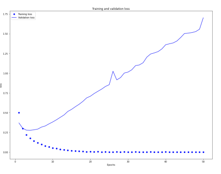
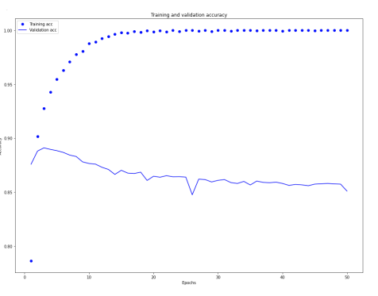
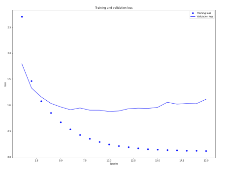
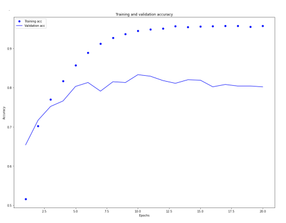

# 2. Neural Network

## 2.1. 신경망의 구조

- 신경망 훈련 요소 
  - 네트워크(또는 모델)를 구성하는 층(layer) 
  - 입력 데이터와 그에 상응하는 타깃(target) 
  - 학습에 사용할 피드백 신호를 정의하는 손실함수(loss function) 
  - 학습 진행 방식을 결정하는 옵티마이저(optimizer)


#### 2.1.1. Layer

- 딥러닝의 구성 단위 
- 하나 이상의 텐서를 입력으로 받아 하나 이상의 텐서를 출력하는 데이터 처리 모듈 
- 대부분의 경우 가중치라는 층의 상태를 가짐 
- 가중치는 확률적 경사 하강법에 의해 학습되는 하나 이상의 텐서이며 여기에 네 트워크가 학습한 지식이 담겨 있음

- 층마다 적절한 텐서 포맷과 데이터 처리 방식이 다름 
  - (samples, features) 크기의 2D텐서가 저장된 간단한 벡터 데이터는 완전 연 결층(fully connected layer)나 밀집층(dense layer)이라고도 불리는 밀집 연결층(densely connected layer)에 의해 처리되는 경우가 많음 
  - (samples, timesteps, features) 크기의 3D 텐서로 저장된 시퀀스 데이터 는 보통 LSTM같은 순환층(recurrent layer)에 의해 처리 
  - 4D 텐서로 저장되어 있는 이미지 데이터는 일반적으로 2D 합성곱 층 (convolution layer)에 의해 처리

- 딥러닝의 레고 블록처럼 생각할 수 있음 
- 호환 가능한 층들을 엮어 데이터 변환 파이프라인(pipeline)을 구성하여 딥러닝 모델을 만듬 
- 층 호환성(layer compatibility) - 각 층이 특정 크기의 입력 텐서만 받고 특정 크기의 출력 텐서를 반환한다는 사실을 말함

```python
from keras import layers
layer = layers.Dense(32, input_shape=(784,)) # 32개의 유닛으로 된 밀집층
```

- 첫 번째 차원이 784인 2D 텐서만 입력으로 받는 층. 이 층은 첫 번째 차원 크기 가 32로 변환된 텐서를 출력 → 32차원의 벡터를 입력으로 받는 하위층이 연결 되어야 함 
- 케라스에서는 모델에 추가된 층을 자동으로 상위 층의 크기에 맞추어 주기 때문 에 호환성을 걱정할 필요가 없음

```python
from keras import models
from keras import layers
model = models.Sequential()
model.add(layers.Dense(32, input_shape=(784,))) # 32개의 유닛으로 된 밀집층
model.add(layers.Dense(10))
```

- 두 번째 층에서는 input_shape를 지정하지 않았음 → 앞선 층의 출력 크기를 입력 크기로 자동으로 채택


#### 2.1.2. Model

- 층의 네트워크 
- 딥러닝 모델은 층으로 만든 비순환 유향 그래프(Directed Acyclic Graph, DAG) 
- 가장 일반적인 예 → 하나의 입력을 하나의 출력으로 매핑하는 층을 순서대로 쌓 는 것 
- 머신 러닝 → '가능성 있는 공간을 사전에 정의하고 피드백 신호의 도움을 받아 입력 데이터에 대한 유용한 변환을 찾는 것' 
- 딱 맞는 네트워크 구조를 찾아내는 것은 과학보다 예술에 가까움


#### 2.1.3. Loss Function and Optimizer

- 손실함수(loss function) (목적함수(objective function)) - 훈련하는 도안 최 소화 될 값 → 주어진 문제에 대한 성공지표 
- 옵티마이저(optimizer) - 손실함수를 기반으로 네트워크가 어떻게 업데이트될 지 결정. 특정 종류의 확률적 경사 하강법(SGD)을 구현 
- 문제에 맞는 올바른 목적함수를 선택하는 것이 매우 중요 → 네트워크가 손실을 최소화하기 위해 편법을 사용할 수도 있음 
- 예) 모든 인류의 평균 행복지수를 최대화하기
  - 행복지수가 높은 인류 빼고 모두 죽이면 됨

- 분류, 회귀, 시퀀스 예측 같은 일반적인 문제에서는 올바른 손실 함수를 선택하는 간단한 지침이 존재 
  - 2개의 클래스 분류 - 이진 크로스엔트로피(binary crossentropy) 
  - 여러개의 클래스 분류 - 범주형 크로스엔트로피(categorical crossentropy) 
  - 회귀 - 평균 제곱 오차(mean square error, MSE) 
  - 시퀀스 학습 - CTC(Connected Temporal Classification)


## 2.2. Keras

- Sequential 클래스 또는 함수형 API를 사용해 모델 정의

```python
from keras import models
from keras import layers
model = models.Sequential()
model.add(layers.Dense(32, activation='relu', input_shape=(784,)))
model.add(layers.Dense(10, activation='softmax'))

#------------------------------------------- 

from keras import models
from keras import layers
input_tensor = layers.Input(shape=(784,))
x = layers.Dense(32, activation='relu')(input_tensor)
output_tensor = layers.Dense(10, activation='softmax')(x)
model = models.Model(inputs=input_tensor, outputs=output_tensor)
```

-  모델 구조가 정의된 후에는 Sequential모델을 사용했는지 함수형 API를 사용 했는지는 상관 없음 
- 컴파일 단계에서 학습과정이 설정 → 모델이 사용할 옵티마이저와 손실함수, 훈련하는 동안 모니터링하기 위해 필요한 측정지표를 지정

```python
from keras import optimizers
model.compile(optimizer=optimizers.RMSprop(lr=0.001), loss='mse', metrics=['accuracy'])
```

- 입력데이터의 넘파이 배일을 모델의 fit() 메서드에 전달함으로써 학습과정이 이루어 짐

```python
model.fit(input_tensor, target_tensor, batch_size=128, epochs=10)
```


#### 2.2.1. 영화 리뷰 분류 - 이진 분류

- 리뷰 텍스트를 기반으로 영화리뷰를 긍정(positive)과 부정(negative)로 분류 
- 인터넷 영화 데이터베이스에서 가져온 양극단의 리뷰 5만개로 이루어 진 IMDB 데이터 셋을 사용 
- 훈련데이터 25000개와 테스트데이터 25000개 
- 각각 50%는 긍정, 50%는 부정리뷰로 구성

- 같은 데이터에서 머신 러닝 모델을 훈련하고 테스트해서는 절대 안됨 
- 모델이 훈련데이터에서 잘 작동한다는 것이 처음 만난 데이터에서도 잘 작동한다 는 것을 보장하지 않음 → 중요한 것은 새로운 데이터에 대한 모델의 성능

-  IMDB 데이터셋도 케라스에 포함되어 있음 → 전처리되어 있어 각 리뷰(단어 시 퀀스)가 숫자 시퀀스로 변환되어 있음 → 각 숫자는 사전에 있는 고유한 단어를 나타냄 
- 데이터셋을 로드

```python
from keras.datasets import imdb
(train_data, train_labels), (test_data, test_labels) = imdb.load_data(num_words=10000)
```

- num_words=10000 매개변수는 훈련데이터에서 가장 자주 나타나는 단어 1 만개만 사용하겠다는 의미

```python
>>> print (train_data[0])
[1, 14, 22, 16, 43, 530, 973, 1622, 1385, 65, 458, 4468, ..., 19, 178, 32]
>>> print (train_labels[0])
1
>>> print (max([max(sequence) for sequence in train_data]))
9999
>>> word_index = imdb.get_word_index()
>>> reverse_word_index = dict([(value, key) for (key, value) in word_index.items()])
>>> decoded_review = ' '.join([reverse_word_index.get(i-3, '?') for i in train_data[0]])
>>> print (decoded_review)
? this film was just brilliant casting location scenery story ... shared with us all
```

- 신경망에 숫자 리스트를 주입할 수는 없음 → 리스트를 텐서로 변환 
  - 같은 길이가 되도록 리스트에 패딩(padding)을 추가하고 (samples, sequence_length) 크기의 정수 텐서로 변환 → 정수 텐서를 다룰 수 있는 층 (Embedding)을 신경망의 첫번째 층으로 사용 
  - 리스트를 원-핫 인코딩(one-hot encoding)하여 0과 1의 벡터로 변환 → 부 동 소수 벡터데이터를 다룰 수 있는 Dense 층을 신경망의 첫번째 층으로 사용
- 정수 시퀀스를 이진 행렬로 인코딩

```python
import numpy as np
def vectorize_sequences(seqs, dim=10000):
    results = np.zeros((len(seqs), dim))
    for i, seq in enumerate(seqs):
        results[i, seq] = 1. # 특정 인덱스의 위치를 1.으로 만듬
    return results

x_train = vectorize_sequences(train_data)
x_test = np.asarray(test_labels)
```

```python
print (x_train[0])
```

```python
y_train = np.asarray(train_labels).astype('float32')
y_test = np.asarray(test_labels).astype('float32')
```

- 신경망 모델 만들기 
  - 입력 데이터가 벡터, 레이블은 스칼라(0 또는 1) 
  - 이런 문제에 잘 작동하는 네트워크 종류는 relu 활성화 함수를 사용한 완전연 결층(Dense(16, activation='relu'))을 그냥 쌓은 것 
  - 매개변수 16은 은닉유닛(hidden unit)의 개수 → 가중치 행렬 W의 크기가 (input_dimension, 16) → 입력 데이터와 W를 점곱하면 입력 데이터가 16차 원으로 표현된 공간으로 투영 
  - 표현 공간의 차원 → 신경망이 내재된 표현을 학습할 때 가질 수 있는 자유도

- 은닉유닛을 늘리면 (표현공간을 더 고차원으로 만들면) 신경망이 더 복잡한 표 현을 학습할 수 있음 → 계산 비용이 커지고 원하지 않는 패턴을 학습할 수도 있 음 (훈련데이터에서는 성능이 향상되지만 테스트 데이터에서는 그렇지 않은 패 턴) 
- Dense층을 쌓을 때 두가지 중요한 구조상 결정이 필요 
  - 얼마나 많은 층을 사용 
  - 각 층에 얼마나 많은 은닉유닛을 사용

```python
from keras import models
from keras import layers

model = models.Sequential()
model.add(layers.Dense(16, activation = 'relu', input_shape=(10000,)))
model.add(layers.Dense(16, activation = 'relu'))
model.add(layers.Dense(1, activation = 'sigmoid'))
```

- 손실함수와 옵티마이저를 선택 
  - 이진분류 문제고 신경망의 출력이 확률이므로 네트워크의 마지막에 시그모이 드 활성화함수를 사용한 하나의 유닛으로 된 층을 사용 → binary crossentropy 손실함수가 적합 
  - MSE도 사용할 수 있음 
  - 확률을 출력하는 모델을 사용할 때는 크로스엔트로피가 최선의 선택

- rmsprop 옵티마이저와 binary_crossentropy 손실함수로 모델을 설정 
- 훈련하는 동안 정확도를 사용하여 모니터링

```python
model.compile(optimizer='rmsprop', loss='binary_crossentropy', metrics=['accuracy'])

#---------------------------------------------------------------------------------

from keras import optimizers
model.compile(optimizer = optimizers.RMSprop(lr= 0.001), loss='binary_crossentropy', metrics=['accuracy'])

#----------------------------------------------------------------------------------

from keras import losses
from keras import metrics

model.compile(optimizers.RMSprop(lr=0.001), loss=losses.binary_crossentropy, metrics=[metrics.binary_accuracy])
```

- 훈련 검증 
  - 훈련하는 동안 처음 본 데이터에 대한 모델의 정확도를 측정하기 위해 원본 훈 련데이터에서 10000개의 샘플을 떼어 검증 세트를 만듬

```python
x_val = x_train[:10000]
partial_x_train = x_train[10000:]
y_val = y_train[:10000]
partial_y_train = y_train[10000:]
```

- 모델을 512개의 샘플씩 미니 배치를 만들어 20번의 에포크 동안 훈련시킴 (x_train과 t_train 텐서에 있는 모든 샘플에 대해 20번 반복) 
- 동시에 따로 떼어놓은 1만개의 샘플에서 손실과 정확도를 측정

```python
model.compile(optimizer = 'rmsprop', loss = 'binary_crossentropy', metrics = ['acc'])
history = model.fit(partial_x_train, partial_y_train, epochs = 50, batch_size 512, validation_data = (x_val, y_val))
```

- model.fit() 메서드는 History 객체를 반환 → 훈련하는 동안 발생한 모든 정보 를 담고 있는 딕셔너리인 history 속성을 가지고 있음

```python
history_dict = history.history
history_dict.keys()
```

```python
import matplotlib.pyplot as plt

history_dict = history.history
loss = history_dict['loss']
val_loss = history_dict['val_loss']

epochs = range(1, len(loss)+1)

plt.figure(figsize=(16,12))
plt.plot(epochs, loss, 'bo', label = 'Training loss')
plt.plot(epochs, val_loss, 'b', label = 'Validation loss')
plt.title('Training and validation loss')
plt.xlabel('Epochs')
plt.ylabel('loss')
plt.legend()
plt.show()

```



```python
plt.clf()
acc = history_dict['acc']
val_acc = history_dict['val_acc']

plt.figure(figsize=(16,12))
plt.plot(epochs, acc, 'bo', label='Training acc')
plt.plot(epochs, val_acc, 'b', label='Validation acc')
plt.title('Training and validation accuracy')
plt.xlabel('Epochs')
plt.ylabel('Accuracy')
plt.lengend()
plt.show()
```



- 훈련손실이 에포크마다 감소하고 훈련정확도는 에포크마다 증가 
- 경사 하강법 최적화를 사용했을 때 반복마다 최소화되는 것이 손실이므로 기대와 동일 
- 검증 손실과 검증 정확도는 훈련손실/정확도와 같지 않음 → 4번째 에포크에서 역전 
- 훈련세트에서 잘 작동하는 모델이 처음 보는 데이터에서는 잘 작동하지 않는 예 → 과대 적합(overfitting) → 훈련데이터에 과도하게 최적화되어 훈련데이터에 특화된 표현을 학습하므로 훈련세트 이외의 데이터에는 일반화되지 못함 
- 훈련데이터에 대해 성능이 향상됨에 따라 신경망은 과대적합되기 시작 → 이전에 본 적 없는 데이터에서는 결과가 점점 나빠짐 → 항상 훈련세트 이외의 데이터에서 성능을 모니 터링 해야 함

- 과대적합을 방지하기 위해 세번째 에포크 이후에 훈련을 중지할 수 있음
  - 오버피팅한 지점을 알아냈으면 새로운 모델을 다시 만들어서 실행해야함
  - 안그러면 이미 50번 학습한 모델에 추가적인 학습을 하는 꼴

```python
model = models.Sequential()
model.add(layers.Dense(16, activation ='relu', input_shape=(10000,)))
model.add(layers.Dense(16, activation ='relu'))
model.add(layers.Dense(1, activation ='sigmoid'))

model.compile(optimizer='rmsprop', loss='binary_crossentropy', metrics=['accuracy'])
model.fit(x_train, y_train, epochs=4, batch_size=512)
results = model.evaluate(x_test. y_test)
print(results)
```

- 훈련된 모델로 새로운 데이터에 대해 예측

```python
model.predict(x_test)
```


#### 2.2.2. 뉴스 기사 분류 - 다중 분류


```python
from keras.datasets import reuters
(train_data, train_labels), (test_data, test_labels) = imdb.load_data(num_words=10000)
```

- num_words=10000 매개변수는 훈련데이터에서 가장 자주 나타나는 단어 1 만개만 사용하겠다는 의미

```python
print (len(train_data)
print (len(test_data)

print (train_data[0])
print (train_labels[0]) # index로 0~45 사이의 정수
```

- 데이터 준비
  - 데이터를 벡터로 변환


```python
import numpy as np
def vectorize_sequences(seqs, dim=10000):
    results = np.zeros((len(seqs), dim))
    for i, seq in enumerate(seqs):
        results[i, seq] = 1. # 특정 인덱스의 위치를 1.으로 만듬
    return results

x_train = vectorize_sequences(train_data)
x_test = vectorize_sequences(test_data)
```

- 레이블을 벡터로 변환 -> one-hot encoding이 범주형 데이터에 널리 사용

```python
def to_one_hot(labels, dim=46) :
    results = np.zeros((len(labels),dim))
    for i, l in enumerate(labels):
        results[i,l] = 1.
    return results

one_hot_train_labels = to_one_hot(train_labels)
one_hot_test_labels = to_one_hot(test_labels)
```

```python
from keras.utils.np_utils import to_categorical

one_hot_train_labels = to_categorical(train_labels)
one_hot_test_labels = to_categorical(test_labels)
```

- 모델 구성 
  - 영화리뷰와 비슷해 보이나 출력 클래스의 개수가 2개에서 46개로 늘어남 → 출력 공간의 차원이 훨씬 커짐 
  - Dense층을 쌓으면 각 층은 이전 층의 출력에서 제공한 정보만 사용 가능 
  - 한 층이 분류문제에 필요한 일부 정보를 누락하면 그 다음 층에서 이를 복원 할 수 없음 → 각 층은 정보의 병목(bottleneck)이 될 수 있음 
  - 영화리뷰에선 16차원을 가진 중간층 사용 → 16차원 공간은 46개 클래스를 구분하기에 제약이 많을거 같음


```python
from keras import models
from keras import layers

model = models.Sequential()
model.add(layers.Dense(64, activation = 'relu', input_shape=(10000,)))
model.add(layers.Dense(64, activation = 'relu'))
model.add(layers.Dense(46, activation = 'softmax'))
```

- 마지막 Dense층의 크기가 46 → 각 입력 샘플에 대해 46차원의 벡터를 출력. 이 벡터의 각 원소는 각기 다른 출력 클래스가 인코딩 된 것
- 마지막 층에 softmax 활성화 함수 사용 → 각 입력 샘플마다 46개의 출력 클래스에 대한 확률 분포를 출력. 46차원 출력벡터를 만들며 output[i]는 어 떤 샘플이 클래스 i에 속할 확률. 46개 값을 모두 더하면 1이 됨
- 이런 문제에 사용할 최선의 손실함수는 categorical_crossentropy

```python
model.complie(optimizer='rmsprop', loss = 'categorical_crossentropy', metrics = ['accuracy'])
```

- 훈련 검증 
  - 훈련 데이터에서 1000개의 샘플을 따로 떼어 검증세트로 사용

```python
x_val = x_train[:10000]
partial_x_train = x_train[10000:]
y_val = one_hot_train_labels[:10000]
partial_y_train = one_hot_train_labels[10000:]
```

- 20번의 에포크로 모델을 훈련

```python
history = model.fit(partial_x_train, partial_y_train, epochs= 20, batch_size = 512, validation_data = (x_val, y_val))
```


```python
import matplotlib.pyplot as plt

history_dict = history.history
loss = history_dict['loss']
val_loss = history_dict['val_loss']

epochs = range(1, len(loss)+1)

plt.figure(figsize=(16,12))
plt.plot(epochs, loss, 'bo', label = 'Training loss')
plt.plot(epochs, val_loss, 'b', label = 'Validation loss')
plt.title('Training and validation loss')
plt.xlabel('Epochs')
plt.ylabel('loss')
plt.legend()
plt.show()

```



```python
plt.clf()
acc = history_dict['accuracy']
val_acc = history_dict['val_accuracy']

plt.figure(figsize=(16,12))
plt.plot(epochs, acc, 'bo', label='Training acc')
plt.plot(epochs, val_acc, 'b', label='Validation acc')
plt.title('Training and validation accuracy')
plt.xlabel('Epochs')
plt.ylabel('Accuracy')
plt.lengend()
plt.show()
```



-  9번째 에포크에서 과대적합 시작 → 9번의 에포크로 새로운 모델을 훈련

```python
model = models.Sequential()
model.add(layers.Dense(64, activation ='relu', input_shape=(10000,)))
model.add(layers.Dense(64, activation ='relu'))
model.add(layers.Dense(46, activation ='softmax'))

model.compile(optimizer='rmsprop', loss='categorical_crossentropy', metrics=['accuracy'])
model.fit(partial_x_train, partial_ytrain, epochs=9, batch_size=512)
results = model.evaluate(x_test, one_hot_test_labels)
print(results)
```
- 새로운 데이터에 대해 예측

```python
predictions = model.predict(x_test)
predictions[0].shape
np.sum(predictions[0])
np.argmax(predictions[0])
```

- 충분히 큰 중간층을 두어야 하는 이유 
  - 마지막 출력이 46차원 → 중간층의 히든 유닛이 46보다 많이 적어서는 안됨
  - 병목현상
  - 데이터 소실
  - 성능 안좋아짐

```python
model = models.Sequential()
model.add(layers.Dense(64, activation ='relu', input_shape=(10000,)))
model.add(layers.Dense(4, activation ='relu'))
model.add(layers.Dense(46, activation ='softmax'))

model.compile(optimizer='rmsprop', loss='categorical_crossentropy', metrics=['accuracy'])
model.fit(x_train, y_train, epochs=9, batch_size=512)
results = model.evaluate(x_test. y_test)
print(results)
```

