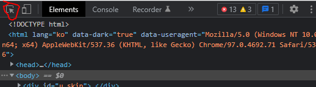

- crawling 기초: https://lime-jelly.tistory.com/39

# 3. 멜론, 벅스, 지니 차트 크롤링

## 3.1. selenium & Chrome Driver

- 라이브러리 불러오기

```python
from selenium import webdriver
```

- import 에러가 날 경우 라이브러리 설치: !pip install selenium
- 크롬 드라이버 다운받기: https://chromedriver.chromium.org/downloads
  - 본인의 크롬 버전과 알맞는 버전을 이용하시면 됩니다.

#### 3.1.1. Chrome Driver 활용하기

```python
from selenium import webdriver
ser = Service('../chromedriver/chromedriver.exe') # 크롬드라이버 파일이 있는 경로를 설정
driver = webdriver.Chrome(service = ser)
```

#### 3.1.2. 웹 페이지 접속

```python
url = 'https://www.naver.com/'
driver.get(url)
```

#### 3.1.3. 웹 페이지(HTML) 다운로드

```python
html_naver = driver.page_source
```

#### 3.1.4. BeautifulSoup을 이용하여 parsing 하기 

```python
from bs4 import Beautifulsoup

soup = BeautifulSoup(html_melon, 'html.parser')
```


## 3.2. 멜론 (Melon)

#### 3.2.1 멜론에서 HTML 다운하기

- 필요한 라이브러리

```python
from selenium import webdriver
from selenium.webdriver.chrome.service import Service
from bs4 import BeautifulSoup

import pandas as pd
import numpy as np
from pandas import Series, DataFrame
```

- 크롬 드라이버 실행
```python
ser = Service('../chromedriver/chromedriver.exe')
driver = webdriver.Chrome(service = ser)
```

- 멜론 인기차트 웹페이지 접속하기

```python
url = 'https://www.melon.com/chart/index.htm'
driver.get(url)
```

- HTML 다운로드 및 BeautifulSoup으로 읽기

```python
html_melon = driver.page_source


soup = BeautifulSoup(html_melon, 'html.parser')
soup
'''
너무 길어 생략
'''
```

#### 3.2.2. HTML를 보고, 필요한 태그(tags) 찾기

- 웹페이지에서 **F12**를 누르면 HTML 환경을 볼 수 있음
- 아래 버튼을 클릭하면 화면에서 원하는 부분이 어떤 태그에 위치하고 있는지 확인이 가능함



#### 3.2.3. 1부터 100까지 만들기

- 순위, 제목, 가수

- 원하는 자료는 'Top 100'이므로 songs의 len() 값이 100이 나와 알맞는 것을 확인
- 이후 songs를 출력해 원하는 정보가 잘 들어있는지 확인 

```python
songs = soup.select('tbody > tr')
print(len(songs))
# 100

songs = soup.select('tbody > tr') # 필요한 정보가 모두 들어있는 범위 확보
song = songs[0] 
song_data = []
rank = 1

for song in songs:
    title = song.select('div.ellipsis.rank01 > span > a')[0].text # 타이틀의 text 추출
    singer = song.select('div.ellipsis.rank02 > a')[0].text       # 가수의 text 추출
    print(rank, title, singer, sep='|')                           
    mylist = ['melon', rank, title, singer]
    song_data.append(mylist)
    rank += 1

'''
1|취중고백|김민석 (멜로망스)
2|사랑은 늘 도망가|임영웅
3|회전목마 (Feat. Zion.T, 원슈타인) (Prod. Slom)|sokodomo
4|Counting Stars (Feat. Beenzino)|BE'O (비오)
5|겨울잠|아이유
6|ELEVEN|IVE (아이브)
7|리무진 (Feat. MINO) (Prod. GRAY)|BE'O (비오)
8|Dreams Come True|aespa
9|눈이 오잖아(Feat.헤이즈)|이무진
10|만남은 쉽고 이별은 어려워 (Feat. Leellamarz) (Prod. TOIL)|베이식 (Basick)
11|다정히 내 이름을 부르면|경서예지
12|strawberry moon|아이유
13|드라마|아이유
14|Step Back|GOT the beat
15|이제 나만 믿어요|임영웅
16|신호등|이무진
17|Christmas Tree|V
18|Savage|aespa
19|STAY|The Kid LAROI
20|흰눈|먼데이 키즈 (Monday Kiz)
21|Next Level|aespa
22|불협화음 (Feat. AKMU) (Prod. GRAY)|Mudd the student
23|우리가 헤어져야 했던 이유|비비 (BIBI)
24|그대라는 사치|임영웅
25|별빛 같은 나의 사랑아|임영웅
26|다시 사랑한다면 (김필 Ver.)|임영웅
27|언덕나무|이승윤
28|잊었니|임영웅
29|HERO|임영웅
30|서랍|10CM
31|너를 생각해|주시크 (Joosiq)
32|끝사랑|임영웅
33|쉬어 (Feat. MINO) (Prod. GRAY)|아넌딜라이트(Anandelight)
34|네가 없는 밤 (Feat. ASH ISLAND) (Prod. GRAY)|BE'O (비오)
35|Butter|방탄소년단
36|이별후회|김나영
37|OHAYO MY NIGHT|디핵 (D-Hack)
38|Bk Love|임영웅
39|Permission to Dance|방탄소년단
40|바라만 본다|MSG워너비(M.O.M)
41|사랑이 아니었다고 말하지 마요|이예준
42|Wake Up (Prod. 코드 쿤스트)|개코
43|정거장|아이유
44|My Universe|Coldplay
45|Dynamite|방탄소년단
46|낙하 (with 아이유)|AKMU (악뮤)
47|문득|BE'O (비오)
48|Still I Love You|토요태
49|그게 더 편할 것 같아 (N번째 연애 X 멜로망스)|멜로망스
50|Celebrity|아이유
51|계단말고 엘리베이터|임영웅
52|여름비|샘김 (Sam Kim)
53|헤픈 우연|헤이즈 (Heize)
54|Weekend|태연 (TAEYEON)
55|러브레터|아이유
56|안녕 우린 헤어져야만 해|전상근
57|라일락|아이유
58|Bad Habits|Ed Sheeran
59|밤하늘의 별을(2020)|경서
60|찰나가 영원이 될 때 (The Eternal Moment)|마크툽 (MAKTUB)
61|고백|멜로망스
62|너|아이유
63|어떻게 이별까지 사랑하겠어, 널 사랑하는 거지|AKMU (악뮤)
64|사이렌 Remix (Feat. UNEDUCATED KID, Paul Blanco)|호미들
65|모든 날, 모든 순간 (Every day, Every Moment)|폴킴
66|롤린 (Rollin')|브레이브걸스
67|내 손을 잡아|아이유
68|추억은 만남보다 이별에 남아|정동하
69|Dun Dun Dance|오마이걸 (OH MY GIRL)
70|아직도 좋아해|양요섭
71|밝게 빛나는 별이 되어 비춰줄게|송이한
72|죽을 만큼 아파서 (Feat. JAMIE (제이미))|MC몽
73|MBTI (Feat. 쿠기 & 로꼬) (Prod. GRAY)|BE'O (비오)
74|Blueming|아이유
75|봄날|방탄소년단
76|Off My Face|Justin Bieber
77|시간을 거슬러 (낮에 뜨는 달 X 케이윌)|케이윌
78|작은 것들을 위한 시 (Boy With Luv) (Feat. Halsey)|방탄소년단
79|오늘도 빛나는 너에게 (To You My Light) (Feat.이라온)|마크툽 (MAKTUB)
80|매일 크리스마스 (Everyday Christmas)|다비치
81|1초 1분 1시간 (사귄 건 아닌데 X 2am)|2am
82|너의 모든 순간|성시경
83|그날에 나는 맘이 편했을까|이예준
84|좋아좋아|조정석
85|비가 오는 날엔 (2021)|헤이즈 (Heize)
86|Snowman|Sia
87|취기를 빌려 (취향저격 그녀 X 산들)|산들
88|Queendom|Red Velvet (레드벨벳)
89|Savage Love (Laxed - Siren Beat) (BTS Remix)|Jawsh 685
90|DUMB DUMB|전소미
91|나 그댈위해 시 한편을 쓰겠어|케이시 (Kassy)
92|Life Goes On|방탄소년단
93|멜로디|ASH ISLAND
94|탕!♡|MINO (송민호)
95|비와 당신|이무진
96|ASAP|STAYC(스테이씨)
97|Peaches (Feat. Daniel Caesar & Giveon)|Justin Bieber
98|호우주의 (Feat. 개코, 넉살 (Nucksal)) (Prod. 코드 쿤스트)|조광일
99|밤새 서로 미루다|존박
100|깐부 (Feat. 염따, ASH ISLAND) (Prod. TOIL)|쿤타
'''
```

#### 3.2.4. excel에 저장

```python
# DataFrame으로 변경
pd_data = pd.DataFrame(song_data, columns = ['서비스','순위','타이틀','가수']) 
# 원하는 경로에 저장
pd_data.to_excel('./files/melon_class.xlsx', na_rep = 'NaN', sheet_name = 'melon_top_100', index = False)
```

---


## 3.3 벅스 (Bugs)

#### 3.3.1. 크롤링하기

- 같은 방법으로 실행한다

```python
from selenium import webdriver
from selenium.webdriver.chrome.service import Service
from bs4 import BeautifulSoup

import pandas as pd
import numpy as np
from pandas import Series, DataFrame
```


```python
ser = Service('../chromedriver/chromedriver.exe')
driver = webdriver.Chrome(service= ser)

url = 'https://music.bugs.co.kr/chart'
driver.get(url)

html_bugs = driver.page_source

soup = BeautifulSoup(html_bugs,'html.parser')
soup
```

```python
song_bugs= soup.select('table.byChart > tbody > tr ')
print(len(song_bugs))
# 100
song = song_bugs[0]
song

title = song.select('th > p.title > a')[0].text
singer = song.select('td > p.artist > a')[0].text

```
- ['서비스', '순위','타이틀','가수']
```python
song_list=[]
rank = 1
song_bugs= soup.select('table.byChart > tbody > tr ')

for song in song_bugs:
    title = song.select('th > p.title > a')[0].text
    singer = song.select('td > p.artist > a')[0].text
    print(title, singer, sep= '|')
    mylist = ['Bugs', rank, title, singer]
    song_list.append(mylist)
    rank += 1
    
'''
Step Back|GOT the beat
여름비|샘김(Sam Kim)
Christmas Tree|V
서랍|10CM
Dreams Come True|aespa
드라마|아이유(IU)
ELEVEN|IVE (아이브)
다시 겨울이야|박정현
Counting Stars (Feat. Beenzino)|BE'O (비오)
아직도 좋아해|양요섭
취중고백|김민석 (멜로망스)
우리가 헤어져야 했던 이유|비비(BIBI)
겨울잠|아이유(IU)
이별후회|김나영
언덕나무|이승윤
회전목마 (Feat. Zion.T, 원슈타인) (Prod. Slom)|sokodomo
사랑은 늘 도망가|임영웅
리무진 (Feat. MINO) (Prod. GRAY)|BE'O (비오)
그대 손 놓아요|이선희
흰눈|먼데이 키즈(Monday Kiz)
strawberry moon|아이유(IU)
눈이 오잖아(Feat.헤이즈)|이무진
Permission to Dance|방탄소년단
Layin' Low (feat. Jooyoung)|효린
Next Level|aespa
Savage|aespa
정거장|아이유(IU)
가라그래 (Feat. 소연)|정다경
Blessed-Cursed|ENHYPEN
STAY|The Kid LAROI
너무 아픈 사랑은 사랑이 아니었음을|싱어게인2 33호 가수
러브레터|아이유(IU)
Still I Love You|토요태
만남은 쉽고 이별은 어려워 (Feat. Leellamarz) (Prod. TOIL)|베이식(Basick)
다정히 내 이름을 부르면|경서예지
신호등|이무진
불협화음 (Feat. AKMU) (Prod. GRAY)|Mudd the student
Polaroid Love|ENHYPEN
너|아이유(IU)
My Universe|Coldplay(콜드플레이)
라일락|아이유(IU)
헤픈 우연|헤이즈(Heize)
1초 1분 1시간 (사귄 건 아닌데 X 2am)|2am
Celebrity|아이유(IU)
사랑이 아니었다고 말하지 마요|이예준
Out of Time|The Weeknd(위켄드)
Butter|방탄소년단
죽을 만큼 아파서 (Feat. JAMIE (제이미))|MC몽
Dynamite|방탄소년단
문득|BE'O (비오)
어제 너는 나를 버렸어|10CM
Peaches (feat. Daniel Caesar, Giveon)|Justin Bieber(저스틴 비버)
SCIENTIST|TWICE (트와이스)
네가 없는 밤 (Feat. ASH ISLAND) (Prod. GRAY)|BE'O (비오)
낙하 (with 아이유)|AKMU(악뮤)
Bad Habits|Ed Sheeran(에드 시런)
Off My Face|Justin Bieber(저스틴 비버)
Tamed-Dashed|ENHYPEN
매일 크리스마스 (Everyday Christmas)|다비치
그게 더 편할 것 같아 (N번째 연애 X 멜로망스)|멜로망스(MeloMance)
밤새 서로 미루다|존 박
abcdefu|Gayle
Wildfire|Against The Current(어게인스트 더 커런트)
너를 생각해|주시크 (Joosiq)
Outro : Day 2|ENHYPEN
OHAYO MY NIGHT|디핵(D-Hack)
비가 오는 날엔 (2021)|헤이즈(Heize)
Weekend|태연 (TAEYEON)
낮 밤 (feat. 박재범)|이영지
바라만 본다|MSG워너비(M.O.M)
추억의 책장을 넘기면|싱어게인2 64호 가수
WA DA DA|Kep1er (케플러)
어떻게 이별까지 사랑하겠어, 널 사랑하는 거지|AKMU(악뮤)
너는 내 세상이었어|볼빨간사춘기
묘해, 너와|어쿠스틱 콜라보(Acoustic Collabo)
쉬어 (Feat. MINO) (Prod. GRAY)|MINO(송민호)
Queendom|Red Velvet (레드벨벳)
Leave The Door Open|Bruno Mars(브루노 마스)
Blueming|아이유(IU)
Black Mamba|aespa
Shivers|Ed Sheeran(에드 시런)
너의 모든 순간|성시경
아로하|조정석
Paris In The Rain|Lauv(라우브)
Snowman|Sia(시아)
안녕 (Hello)|조이 (JOY)
별빛 같은 나의 사랑아|임영웅
이젠 잊기로 해요 (Drama Ver.)|미도와 파라솔
Dun Dun Dance|오마이걸(OH MY GIRL)
Tiny Riot|Sam Ryder
나 그댈위해 시 한편을 쓰겠어|케이시
모든 날, 모든 순간 (Every day, Every Moment)|폴킴(Paul Kim)
사랑하게 될 줄 알았어|전미도
고백|멜로망스(MeloMance)
Wake Up (Prod. 코드 쿤스트)|개코
사랑은 말로 표현하는게 아니래요|규현 (KYUHYUN)
RE : WIND|이세계 아이돌
Love Yourself|Justin Bieber(저스틴 비버)
Hey Mama (feat. Nicki Minaj, Bebe Rexha & Afrojack)|David Guetta(데이빗 게타)
나무|카더가든
'''
```

#### 3.3.2. excel에 저장하기

```python
pd_data= pd.DataFrame(song_list,
                     columns = ['서비스','순위','타이틀','가수'])

pd_data.to_excel('./files/bugs_class.xlsx', index = False, sheet_name = 'Bugs_top_100')

```

---


## 3.4 지니 (Genie)

#### 3.4.1 크롤링하기

- 위 방법과 같다 

```python
from selenium import webdriver
from selenium.webdriver.chrome.service import Service
from bs4 import BeautifulSoup

import pandas as pd
import numpy as np
from pandas import Series, DataFrame
```

```python
ser = Service('../chromedriver/chromedriver.exe')
driver = webdriver.Chrome(service = ser)

url= 'https://www.genie.co.kr/chart/top200'
driver.get(url)

html_genie = driver.page_source
soup = BeautifulSoup(html_genie, 'html.parser')


songs = soup.select('tr.list')
print(len(songs))
song = songs[0]

singer = song.select('tr.list > td > a.artist.ellipsis')[0].text
title = song.select('tr.list > td > a.title.ellipsis')[0].text.strip()

rank = 1
songs_list = []
song = songs[0]

for song in songs:
    singer = song.select('tr.list > td > a.artist.ellipsis')[0].text
    title = song.select('tr.list > td > a.title.ellipsis')[0].text.strip()
    print(title, singer, sep='|')
    my_list = ['genie',rank, title, singer]
    songs_list.append(my_list)
    rank += 1
    
'''
취중고백|김민석 (멜로망스)
회전목마 (Feat. Zion.T & 원슈타인) (Prod. by Slom)|sokodomo
사랑은 늘 도망가|임영웅
겨울잠|아이유 (IU)
리무진 (Feat. MINO) (Prod. by GRAY)|BE'O (비오)
ELEVEN|IVE (아이브)
Counting Stars (Feat. Beenzino)|BE'O (비오)
다정히 내 이름을 부르면|경서예지 & 전건호
만남은 쉽고 이별은 어려워 (Feat. Leellamarz) (Prod. by TOIL)|베이식
strawberry moon|아이유 (IU)
눈이 오잖아 (Feat. 헤이즈)|이무진
드라마|아이유 (IU)
Stay|The Kid LAROI & Justin Bieber
신호등|이무진
흰눈|먼데이 키즈 (Monday Kiz)
Step Back|GOT the beat
문득|BE'O (비오)
Dreams Come True|aespa
서랍|10CM
Next Level|aespa
Savage|aespa
Celebrity|아이유 (IU)
불협화음 (Feat. AKMU) (Prod. by GRAY)|Mudd the student
이제 나만 믿어요|임영웅
여름비|샘김 (Sam Kim)
OHAYO MY NIGHT|디핵 (D-Hack) & PATEKO
쉬어 (Feat. MINO) (Prod. by GRAY)|아넌딜라이트 (Anandelight) & Unofficialboyy & BE'O (비오) & 지구인 & Mudd The Student
매일 크리스마스 (Everyday Christmas)|다비치
너를 생각해|주시크 (Joosiq)
Christmas Tree|V
다시 사랑한다면 (김필 Ver.)|임영웅
우리가 헤어져야 했던 이유|비비 (BIBI)
바라만 본다|MSG워너비 (M.O.M)
My Universe|Coldplay & 방탄소년단
낙하 (With 아이유)|AKMU (악뮤)
Wake Up (Prod. by 코드 쿤스트)|개코 & 아우릴고트 (OUREALGOAT) & SINCE & 안병웅 & Tabber & 조광일
정거장|아이유 (IU)
Bad Habits|Ed Sheeran
이별후회|김나영
별빛 같은 나의 사랑아|임영웅
Butter|방탄소년단
Hey Mama (Feat. Nicki Minaj & Bebe Rexha & Afrojack)|David Guetta
헤픈 우연|헤이즈 (Heize)
찰나가 영원이 될 때 (The Eternal Moment)|마크툽 (Maktub)
Permission to Dance|방탄소년단
너의 모든 순간|성시경
내 손을 잡아|아이유 (IU)
네가 없는 밤 (Feat. ASH ISLAND) (Prod. by GRAY)|BE'O (비오)
Dynamite|방탄소년단
그대라는 사치|임영웅
'''
```

#### 3.4.2. excel에 저장하기

```python
pd.data=pd.DataFrame(songs_list, columns = ['서비스','순위','타이틀','가수'])

pd.data.to_excel('./files/genie_class.xlsx', na_rep='NaN', sheet_name='genie_top_100', index = False)
```

---


## 3.5 데이터 합치기

```python
import pandas as pd
from pandas import Series,DataFrame
import numpy as np
excel_names = ['./files/genie_class.xlsx', # 세 파일의 경로
              './files/bugs_class.xlsx',
              './files/melon_class.xlsx']

append_data = pd.DataFrame()

for name in excel_names:
    pd_data = pd.read_excel(name)
    append_data = append_data.append(pd_data)

# 저장 원하는 경로
append_data.to_excel('../2_Data_Analysis_Basic/files/append_data_class.xlsx', index = False)
```

