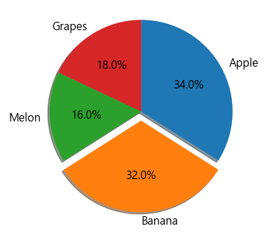
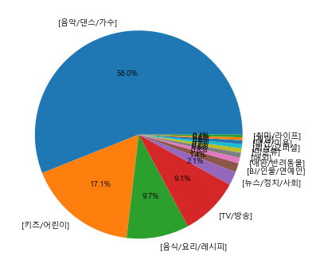
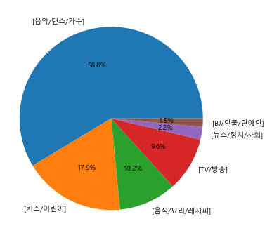

# 5. Youtube data visualizing 

- **유튜브 크롤링**| Youtube rank crawling:  https://lime-jelly.tistory.com/41

- 멜론, 벅스, 지니 차트 크롤링 : https://lime-jelly.tistory.com/40


## 5.1. 시각화를 위해 필요한 라이브러리 불러오기

#### 5.1.1. 시각화 그래프에 한글 적용을 위한 라이브러리

```python
from matplotlib import rc, font_manager
```


#### 5.1.2. 한글 폰트 적용

```python
path = 'c:/Windows/Fonts/malgun.ttf' # 폰트가 있는 경로
font_name = font_manager.FontProperties(fname = path).get_name()
# font_name 
rc('font', family = font_name)
```


## 5.2.  시각화를 위한 데이터 가공

#### 목적

- 카테고리 별 구독자 수 총 합과 카테고리 개수 알아내기

---


#### 5.2.1.  저장된 excel data 불러오기

- 저장된 데이터가 없으면 위 링크를 참고해 주세요 

```python
df = pd.read_excel('./files/youtube_rank.xlsx')
df.head()
'''
	rank	category	channel	subscriber	view	video
0	1	[음악/댄스/가수]	BLACKPINK	7130만	220억2860만	395개
1	2	[음악/댄스/가수]	HYBE LABELS	6360만	210억1371만	786개
2	3	[음악/댄스/가수]	BANGTANTV	6290만	146억8130만	1,665개
3	4	[음악/댄스/가수]	SMTOWN	2970만	234억3321만	3,841개
4	5	[키즈/어린이]	Boram Tube Vlog [보람튜브 브이로그]	2650만	110억5288만	223개
'''
```

---


#### 5.2.2. 데이터 확인 및 가공

- 카테고리 별 개수 확인

```python
df['category'].value_counts()
'''
[음악/댄스/가수]     37
[키즈/어린이]       22
[음식/요리/레시피]    14
[TV/방송]        13
[뉴스/정치/사회]      3
[BJ/인물/연예인]     3
[애완/반려동물]       2
[해외]            1
[미분류]           1
[회사/오피셜]        1
[패션/미용]         1
[게임]            1
[취미/라이프]        1
Name: category, dtype: int64
'''
```

- 구독자 수 가공

```python
df['subscriber']
# 구독자 수를 '만' > '0000'으로 바꾸고 str > int로 변환
df['replaced_subscriber'] = df['subscriber'].str.replace('만','0000').astype('int') 
df['replaced_subscriber'] 
'''
0     71300000
1     63600000
2     62900000
3     29700000
4     26500000
        ...   
95     3850000
96     3810000
97     3810000
98     3770000
99     3750000
Name: replaced_subscriber, Length: 100, dtype: int32
'''

```

- 중간 확인

```python
df.head()
'''

rank	category	channel	subscriber	view	video	replaced_subscriber
0	1	[음악/댄스/가수]	BLACKPINK	7130만	220억2860만	395개	71300000
1	2	[음악/댄스/가수]	HYBE LABELS	6360만	210억1371만	786개	63600000
2	3	[음악/댄스/가수]	BANGTANTV	6290만	146억8130만	1,665개	62900000
3	4	[음악/댄스/가수]	SMTOWN	2970만	234억3321만	3,841개	29700000
4	5	[키즈/어린이]	Boram Tube Vlog [보람튜브 브이로그]	2650만	110억5288만	223개	26500000
'''
```

---


#### 5.2.3. 피봇 테이블

```python
pivot_df = df.pivot_table(values = 'replaced_subscriber',
              index = 'category',
              aggfunc= ['sum','count'])

pivot_df.head()
'''
							sum				count
			replaced_subscriber	replaced_subscriber
category		
[BJ/인물/연예인]	13570000			   3
[TV/방송]		  87520000				 13
[게임]		  4260000				 1
[뉴스/정치/사회] 20430000			      3
[미분류]		 6550000				1
'''
```


- index와 columns 재설정

```python
pivot_df.columns = ['subscriber_sum', 'subscriber_count']
pivot_df
pivot_df = pivot_df.reset_index()
pivot_df.head()
'''
	category		subscriber_sum	subscriber_count
0	[BJ/인물/연예인]		  13570000		  3
1	[TV/방송]				87520000		13
2	[게임]				4260000		 	1
3	[뉴스/정치/사회]		  20430000		  3
4	[미분류]				6550000		    1
'''
```

 

- 구독자 수 합을 기준으로 sort

```python
# 구독자 수 기준으로 내림차순 정렬
pivot_df = pivot_df.sort_values(by = 'subscriber_sum', ascending = False)

pivot_df
# sort 이후 전 index 값을 가지고 있기 때문에 다시 reset
pivot_df.reset_index( drop= True, inplace = True) 
pivot_df
'''
	category	subscriber_sum	subscriber_count
0	[음악/댄스/가수]	535880000	37
1	[키즈/어린이]	163730000	22
2	[음식/요리/레시피]	92900000	14
3	[TV/방송]	87520000	13
4	[뉴스/정치/사회]	20430000	3
5	[BJ/인물/연예인]	13570000	3
6	[애완/반려동물]	8080000	2
7	[해외]	7810000	1
8	[미분류]	6550000	1
9	[회사/오피셜]	5950000	1
10	[패션/미용]	5920000	1
11	[게임]	4260000	1
12	[취미/라이프]	4000000	1
'''
```

---


## 5.3. pie chart practice

```python
import matplotlib.pyplot as plt
```

```python
## pie
plt.rcParams['font.size'] = 16
ratio = [34, 32, 16, 18]
labels = ['Apple','Banana','Melon','Grapes']
explodes = [0, 0.1 ,0 ,0] # 튀어 나올 파이 정하기
colors = [ 'rgb color 번호 넣으면 됨',' 각','각','넣으셈']
# plt.figure
plt.figure(figsize = (6,6))
plt.pie(ratio, 
       labels = labels, # 라벨 위에 정한데로
       autopct = '%.1f%%', # float으로 소수점 첫째 까지
       counterclock =False, # 순서 정방향으로 바꾸기
       startangle = 90,  # 시작점 변경
       explode = explodes, # 튀어 나올 사람? 
       shadow = True) # 그림자 원하면.. 
plt.show()
```



---


## 5.4. 유튜브 데이터로 해보기

```python
plt.rcParams['font.size'] = 10
plt.figure(figsize = (6,6))
plt.pie(pivot_df['subscriber_sum'],
        labels = pivot_df['category'],
       autopct= '%.1f%%')
plt.show()
```



- 출력은 했으나 깔끔하지 않으니 6개만 해보자

```python
# plt.rcParams['font.size'] = 10
plt.figure(figsize = (6,6))
plt.pie(pivot_df.head(6)['subscriber_sum'],
        labels = pivot_df.head(6)['category'],
       autopct= '%.1f%%')
plt.show()
```


