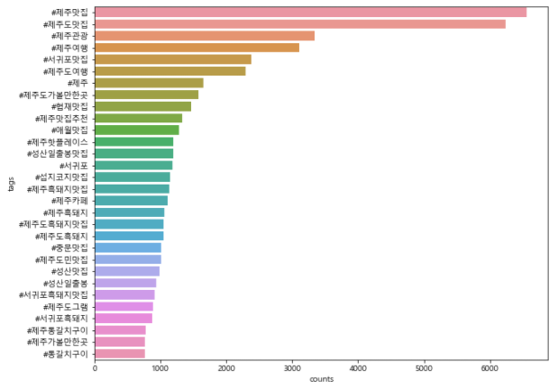

# 9. 인스타그램 데이터 비쥬얼라이징 (instagram data visualizing)


## 9.1. 해시태그 데이터

#### 9.1.1. 데이터 불러오기
```python
import pandas as pd
raw_total = pd.read_excel('./files/1_crawling_raw.xlsx')
raw_total['tags']
```

#### 9.1.2. 해시태그 통합 저장하기

```python
tags_total = []

for tags in raw_total['tags']:
    tags_list = tags[2:-2].split("', '") # 필요없는 부분 삭제
    for tag in tags_list:
        tags_total.append(tag)
tags_total
# 다른 방법
# raw_total['tags'][1].str[2:-2]
```


## 9.2. 해시태그 출현 빈도

```python
from collections import Counter
tag_counts = Counter(tags_total)
type(tag_counts)
# collections.Counter
tag_counts
```

- 상위 50개 찾아보기

```python
tag_counts.most_common(50)
```


## 9.3. 해시태그 정제하기

```python
STOPWORDS = ['#일상', '#서귀포눈썹문신','#선팔','#제주도','#jeju','#반영구','#섭지코지','#제주자연눈썹','#서귀포눈썹문신','#제주눈썹문신', '#소통','#맞팔','#제주속눈썹','#제주일상','#여행스타그램','#눈썹문신','#카멜리아힐','#daily','#제주도민','#제주해안도로','#제주반영구','#제주시','#서귀포반영구','#서귀포속눈썹','#제주남자눈썹문신','#서귀포자연눈썹','#제주속눈썹연장','#서귀포남자눈썹문신']

tag_total_selected = []

for tag in tags_total:
    if not tag in STOPWORDS:
        tag_total_selected.append(tag)
        
tag_counts_selected = Counter(tag_total_selected)
tag_counts_selected.most_common(50)

# 모두 정제하진 못했어요 핳ㅎ..
```


## 9.4. 막대 그래프로 살펴보기

```python
import matplotlib.pyplot as plt
from matplotlib import rc
import sys
import seaborn as sns
# 한글 
rc('font', family = 'Malgun Gothic')

# 많아서 개수 줄였어요
tag_counts_df = pd.DataFrame(tag_counts_selected.most_common(30))
tag_counts_df.columns = ['tags', 'counts']
tag_counts_df.head()

#blank  지우기
tag_counts_df['tags'].replace(' ', None, inplace = True)
tag_counts_df['tags']

tag_counts_df.dropna(subset = ['tags'], inplace = True)
```

```python
plt.figure(figsize = (10, 8))
sns.barplot(x = 'counts', y = 'tags', data = tag_counts_df)
plt.show()
```


