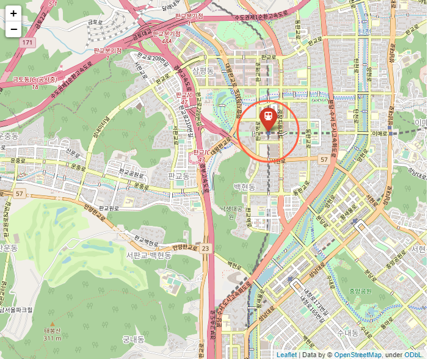
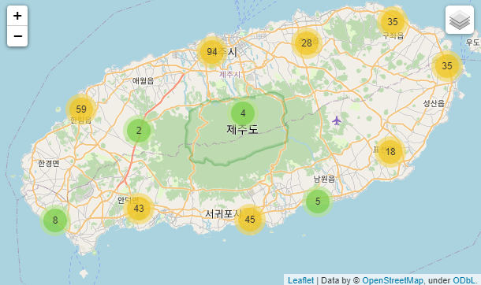

# 10. instagram data map visualizing (인스타 크롤링 맵으로 비주얼라이징)

- 파일 받아오기 주소 : https://github.com/Play-with-data/datasalon/tree/master/02_%EA%B0%9C%EC%A0%95%ED%8C%90/5_Jeju_Hotplace

## 10.1. 데이터 준비

#### 10.1.1. 데이터 불러오기

```python
# 9. 포스팅에서 저장한 크롤링 데이터 불러오기
import pandas as pd
raw_total = pd.read_excel('./files/1_crawling_raw.xlsx')
raw_total.head()
'''
	content	data	like	place	tags
0	제주도 도착~~공항근처 #제주분식 에서 먹은 첫식사만족만족!#제주맛집#제주도맛집#제...	2019-01-01	705	NaN	['#제주분식', '#제주맛집', '#제주도맛집', '#제주맛집추천', '#제주도맛...
1	#함덕맛집 무거버거 바다 보면서 먹으니까 더 꿀맛👍🏻 #제주도카페투어#제주일상#함...	2019-01-01	384	NaN	['#함덕맛집', '#제주도카페투어', '#제주일상', '#함덕', '#jejudo...
2	.대만족 제주스!.#동문시장#제주동문시장#제주도기념품#제주기념품#제주스는완벽#제주도...	2019-01-01	595	NaN	['#동문시장', '#제주동문시장', '#제주도기념품', '#제주기념품', '#제주...
3	#제주여행#2일차무거버거 제주와서 먹은것중에 제일 맛있었음!#제주도여행#제주맛집#함...	2019-01-01	412	NaN	['#제주여행', '#2일차무거버거', '#제주도여행', '#제주맛집', '#함덕맛...
4	🥇1월 영업 안내🥇-1월 2일, 3일(수,목)은 쉬어갑니다-1월 4일,5일,6일(금...	2019-01-01	364	로타리과자점	[]
'''
```

#### 10.1.2. 위치 정보 가저오기

```python
location_counts = raw_total['place'].value_counts()
type(location_counts)
'''
pandas.core.series.Series
'''
```

#### 10.1.3. 위치정보별 빈도수 데이터

```python
location_counts_df = pd.DataFrame(location_counts)
location_counts_df
'''
	place
Jeju	241
Jeju-do	172
Jungle Book by Alice	101
Seogwipo	65
제주도 크리스마스 박물관	59
...	...
에코랜드 라벤다앤그린티로즈가든역	1
청사포 수민이네	1
제주몬트락	1
Jeju National University	1
디스이즈핫	1
1027 rows × 1 columns
'''
```

- 저장

```python
location_counts_df.to_excel('./files/3_location_counts.xlsx', index = True)
```

- 위치정보 종류 확인

```python
locations = list(location_counts_df.index)
```

---


## 10.2. 카카오 API를 활용한 장소 검색

- 카카오 API 받기
- https://developers.kakao.com/console/app
- 카카오 아이디로 로그인 후, 내 애플리케이션으로 들어가서 추가
- REST API 키를 복사해서 아래 API 값에 적용

```python
import requests
# 안되면
# ! pip install requests
url = 'http://dapi.kakao.com/v2/local/search/keyword.json?query={}'.format(searching)
url
'''
'http://dapi.kakao.com/v2/local/search/keyword.json?query=합정 스타벅스'
'''

headers = {
    "Authorization": "KakaoAK 여기에 카카오 API키 입력"
    # 입력시 KakaoAK 뒤에 한 칸 띄우고 API 값 입력하세요
}

places = requests.get(url, headers= headers).json()['documents']
places[0]['place_name']
print('경도= '  ,places[0]['x'])
print('위도= '  ,places[0]['y'])
# 최소 소수점 6째 자리까지 써주는게 오차가 적어서 좋다.
'''
경도=  126.91253700818196
위도=  37.54994959743763
'''
```

#### 10.2.1. API 활용한 장소 검색 함수 만들기

```python
def find_places(searching):
    # 접속 URL 
    url = 'http://dapi.kakao.com/v2/local/search/keyword.json?query={}'.format(searching)
    # headers 입력
    headers = {
    "Authorization": "KakaoAK ****************************" # 개인정보라 *로 표기했습니다.
    }
    # API 요청 및 정보 받기
    places = requests.get(url, headers= headers).json()['documents']
    # 필요한 정보 선택
    place = places[0]
    name = place['place_name']
    x = place['x']
    y = place['y']
    
    data = [name, x, y, searching]
    
    return(data)
```

- 예시로 활용해보기

```python
data = find_places('제주공항')
data
'''
['제주국제공항', '126.492769004244', '33.5070789578184', '제주공항']
'''
```

## 10.3. 함수 활용

#### 10.3.1. 인스타그램 위치명 위치정보 검색하기

```python
#양이 많을 때 현재 진행상황 보는 방법
from tqdm.notebook import tqdm
# ! pip install tqdm
```

 ```python
 import time
 #확인
 locations_inform = []
 # 많으니까 200개만 돌려보자 # 확인 후 되면 나중에 전부 돌려보세요!
 for location in tqdm(locations[:200]):
     try:
         data = find_places(location)
         locations_inform.append(data)
         time.sleep(1)
     
     except:
         pass
 
     
 locations_inform
 ```

#### 10.3.2. 위치정보 저장

```python
# 저장할 땐 모두 돌린 후 저장
locations_inform_df = pd.DataFrame(locations_inform)
locations_inform_df.columns = ['name_office', '경도','위도','name']
locations_inform_df.head()

locations_inform_df.to_excel('./files/3_locations.xlsx', index=False)
```

#### 10.3.3. 인스타 게시량 및 위치정보 데이터 불러오기

```python
location_counts_df = pd.read_excel('./files/3_location_counts.xlsx', index_col = 0)
location_inform_df = pd.read_excel('./files/3_locations.xlsx')
```

#### 10.3.4. 위치 데이터 병합

```python
location_data = pd.merge(location_inform_df,
                        location_counts_df, how = 'inner', # inner 교집합이 있는것만
                        left_on = 'name_official',
                        right_index = True)

location_data.head()
'''
	name_official	경도	위도	인스타위치명	place
1	서귀포잠수함	126.558616	33.239303	Seogwipo	1
308	서귀포잠수함	126.558616	33.239303	서귀포잠수함	1
3	할로비치	127.020826	37.518211	할로비치	51
4	제주에인감귤밭	126.539410	33.256610	제주에인감귤밭	48
5	제주도	126.545876	33.379777	Jeju Island	4
'''
```

#### 10.3.5. 중복 데이터 확인

```python
# 중복 데이터 확인
location_data['name_official'].value_counts()
'''
오설록티뮤지엄           3
서귀포잠수함            2
천지연폭포             2
빌라드아토             2
비자림               2
                 ..
투썸플레이스 제주애월한담점    1
하늘고래              1
문쏘                1
성산일출봉             1
신풍목장              1
Name: name_official, Length: 416, dtype: int64
'''
```

#### 10.3.6. 장소 이름 기준 병합

```python
# 중복 합치기
location_data = location_data.pivot_table(values = 'place',
                         index = ['name_official', '경도','위도'],
                         aggfunc= 'sum')
location_data.sort_values(by= 'place', ascending = False)

'''
			place
name_official	경도	위도	
할로비치	127.020826	37.518211	51
제주에인감귤밭	126.539410	33.256610	48
석부작박물관	126.536502	33.250403	36
위미동백나무군락	126.674731	33.272939	18
서우봉	126.677894	33.545843	16
...	...	...	...
산방산	126.313425	33.241304	1
사이카레	126.381107	33.484245	1
사락	126.307741	33.228771	1
뽕끄랑	126.555112	33.243034	1
흑송	129.196513	35.175011	1
416 rows × 1 columns
'''
```

#### 10.3.7. 병합 데이터 저장하기

```python
location_data.to_excel('./files/3_location_inform.xlsx')
```

---


## 10.4. folium을 이용한 지도 시각화 

#### 10.4.1. 데이터 불러오기

- 저장하기 전 location_data의 info()를 확인해보면, column이 place만 나온다
- 하지만 엑셀에 저장 후 불러오면 다시 column에 모두 들어간다

```python
location_data = pd.read_excel('./files/3_location_inform.xlsx')
location_data.info()
'''
<class 'pandas.core.frame.DataFrame'>
RangeIndex: 416 entries, 0 to 415
Data columns (total 4 columns):
 #   Column         Non-Null Count  Dtype  
---  ------         --------------  -----  
 0   name_official  416 non-null    object 
 1   경도             416 non-null    float64
 2   위도             416 non-null    float64
 3   place          416 non-null    int64  
dtypes: float64(2), int64(1), object(1)
memory usage: 13.1+ KB
'''
```

 ```python
 # 정리 한번
 location_data = location_data.sort_values(by= 'place', ascending = False)
 ```

#### 10.4.2. 시각화 연습

```python
# 안되면 ! pip install folium 
# 지도 그려주는 툴 leaflet. js에서 나온것. 자주 쓰임!
import folium 
```


```python
# 사용법
# 기본좌표 
latitude = 37.394946
longitude = 127.111104

m = folium.Map(location = [latitude, longitude], #이미지 센터 이야기
              width = 700,
              height = 300,
              zoom_start = 15)
#마커 추가
folium.Marker(location = [latitude, longitude], # 원하는 마커 위치 (위랑 같은데 넣은것 뿐)
              # popup을 클릭하면 뜸. 유튜브 소스코드나, 하이퍼링크, 일반 문자 모드 가능
             popup = '<iframe width="640" height="360" src="https://www.youtube.com/embed/VMQl78z1DiY" title="YouTube video player" frameborder="0" allow="accelerometer; autoplay; clipboard-write; encrypted-media; gyroscope; picture-in-picture" allowfullscreen></iframe>', # 클릭하면 뜨는거
             tooltip= '판교역 입구', # 커서 올려두면 뜨는거
             icon = folium.Icon(color = 'red', # 아이콘 추가와 바깥쪽 색 추가
                               icon_color= 'white', # 아이콘 안쪽 색
                               icon = 'subway', # 아이콘 모양
                               prefix = 'fa')).add_to(m) #fa는 아이콘 가져온 사이트 https://fontawesome.com/v5.15/icons?d=gallery&p=2&q=subway

folium.CircleMarker(location= [latitude, longitude], # 원넣기
                   color='tomato',
                   radius = 50, # 변수를 직접 넣을 수 있음
                   tooltip = '활동반경',
                   ).add_to(m)


m
```



#### 10.4.3. 시각해 해보기

```python
location_data =pd.read_excel('./files/3_location_inform.xlsx')
location_data.info()
'''
<class 'pandas.core.frame.DataFrame'>
RangeIndex: 417 entries, 0 to 416
Data columns (total 4 columns):
 #   Column         Non-Null Count  Dtype  
---  ------         --------------  -----  
 0   name_official  416 non-null    object 
 1   경도             417 non-null    float64
 2   위도             417 non-null    float64
 3   place          417 non-null    int64  
dtypes: float64(2), int64(1), object(1)
memory usage: 13.2+ KB
'''
location_data.head()
'''
	name_official	경도	위도	place
0	73st	126.455109	33.456989	1
1	가드망제	126.532954	33.500991	1
2	가배	126.505570	33.231541	1
3	가시식당	126.771438	33.353060	2
4	가시아방국수	126.918072	33.438605	2
'''
```

```python
import folium

Mt_Hanla = [33.362500, 126.533694]
map_jeju = folium.Map(location = Mt_Hanla,
                      zoom_start = 10)

# folium.TileLayer('원하는 형식').add_to(map_jeju) # 지도 표현형식 바꾸기
# https://deparkes.co.uk/2016/06/10/folium-map-tiles/

# len  대신 location_data.shape[0] 도 가능
for i in range(len(location_data)):
    name = location_data['name_official'][i]
    count = location_data['place'][i]
    size = int(count*2)
    lng = location_data['경도'][i]
    lat = location_data['위도'][i]
    folium.CircleMarker(location = [lat, lng],
                       radius = size,
                       color = 'red',
                       popup = name).add_to(map_jeju)
    
map_jeju
```


- 저장

```python
map_jeju.save('./files/3_jeju.html')
```

#### 10.4.4. 보기 더 좋게 바꿔보기

```python
from folium.plugins import MarkerCluster
```

```python
locations = []
names = []

for i in range(len(location_data)):
    data = location_data.iloc[i]
    locations.append([data['위도'], data['경도']])
    names.append(data['name_official'])
    
# locations
# names

Mt_Hanla = [33.362500, 126.533694]
map_jeju2 = folium.Map(location = Mt_Hanla,
                      zoom_start = 10)

tiles = ['stamenwatercolor', 'cartodbpositron', 
         'openstreetmap', 'stamenterrain']

for tile in tiles:
    folium.TileLayer(tile).add_to(map_jeju2)
    
    
marker_cluster = MarkerCluster(locations = locations,
                            popups = names,
                            name = 'Jeju',
                            overlay = True, 
                            control = True
                            ).add_to(map_jeju2)

folium.LayerControl().add_to(map_jeju2)
map_jeju2

```




- 가까이 가면 위치별로 분할되어 정보를 볼 수 있다
- 클릭으로 이동도 가능하다 
- 오른쪽 위 버튼을 누르면 위에 입력한 다양한 지도 형식으로 변환도 가능하다

- 저장

```python
map_jeju2.save('./files/3_jeju2.html')
```


---


## 10.5. 특정 단어 게시글 찾기

#### 10.5.1. 데이터 불러오기

```python

raw_total = pd.read_excel('./files/1_crawling_raw.xlsx')
raw_total
'''
생략
'''
```

#### 10.5.2. 단어 선택

```python
select_word = '해돋이'

check_list = []

for content in raw_total['content']:
    if select_word in content:
        check_list.append(True)
    else:
        check_list.append(False)

check_list # True 와 False값이 들어있다
select_df = raw_total[check_list] # True값을 가진 raw_total 추출
select_df['content']

```

```python
# for 문으로 목적에 따른 정보 추출

for i in select_df.index:
    print(select_df.loc[i, 'content'])
    print('-'*50) # 구분하기 위해
```

#### 10.5.3. 함수화

```python
select_word_list = ['해돋이', '박물관','힐링','게스트하우스','섭지코지']

check_list = []

def select_word(select_word_list):
    for select_word in select_word_list:
        check_list = []
        for content in raw_total['content']:
            if select_word in content:
                check_list.append(True)
            else:
                check_list.append(False)
    
        select_df = raw_total[check_list]
        fpath = './files/4_select_data_{}.xlsx'.format(select_word)
        select_df.to_excel(fpath, index = False)

```

```python
select_word_list = ['해돋이', '박물관','힐링','게스트하우스','섭지코지']
select_word(select_word_list)
```

- 저장된걸 확인할 수 있다.
