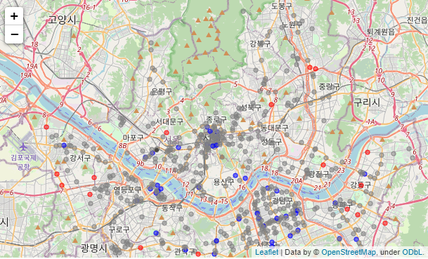
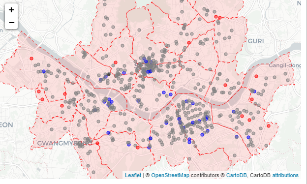
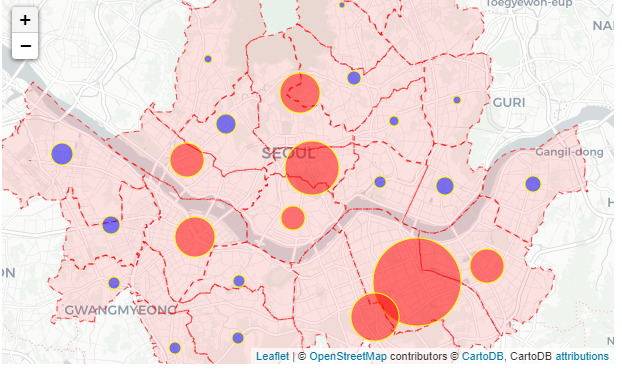
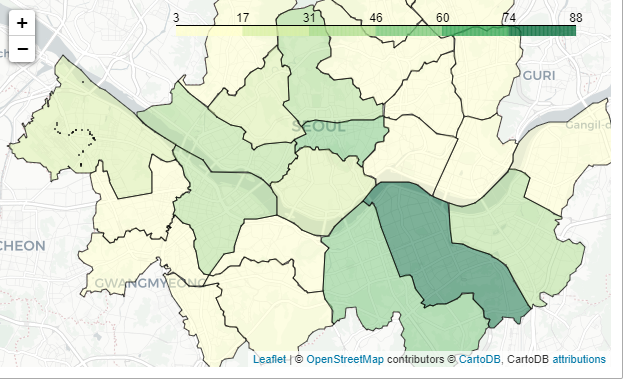
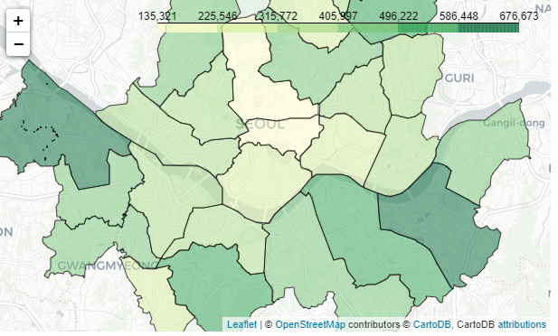
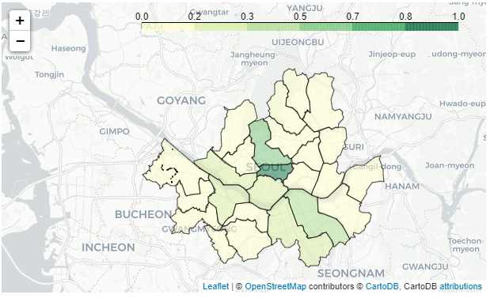
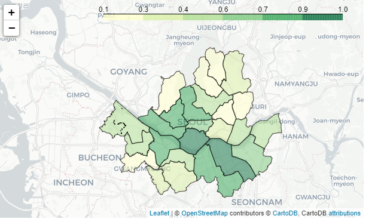
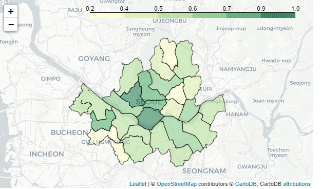
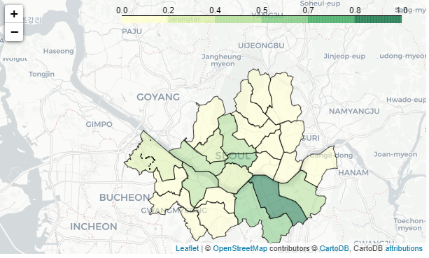

# 13. Starbucks data visualizing (스타벅스 데이터 비주얼라이징)

## 13.1 스타벅스 매장분포 시각화

```python
import folium
import json

import pandas as pd
import numpy as np
```

```python
## 스타벅스 매장분포
seoul_starbucks = pd.read_excel('./files/seoul_starbucks_list_class.xlsx')
seoul_starbucks.head()

'''
매장명	위도	경도	매장타입	주소	전화번호	시군구명
0	역삼아레나빌딩	37.501087	127.043069	general	서울특별시 강남구 언주로 425 (역삼동)	1522-3232	강남구
1	논현역사거리	37.510178	127.022223	general	서울특별시 강남구 강남대로 538 (논현동)	1522-3232	강남구
2	신사역성일빌딩	37.514132	127.020563	general	서울특별시 강남구 강남대로 584 (논현동)	1522-3232	강남구
3	국기원사거리	37.499517	127.031495	general	서울특별시 강남구 테헤란로 125 (역삼동)	1522-3232	강남구
4	대치재경빌딩R	37.494668	127.062583	reserve	서울특별시 강남구 남부순환로 2947 (대치동)	1522-3232	강남구
'''
```

```python
starbucks_map = folium.Map(location = [37.573050, 126.979189],
                          tiles = 'StamenTerrain',
                          zoom_start = 11)

# seoul_starbucks.index = index의 개수만큼
for idx in seoul_starbucks.index:
    
    lat = seoul_starbucks.loc[idx, '위도']
    lng = seoul_starbucks.loc[idx, '경도']
    store_type = seoul_starbucks.loc[idx, '매장타입']
    
    
    folium.CircleMarker(location = [lat, lng],
                       color = 'yellow',
                       radius= 3,
                        weight = 1, # 원두께
                       fill = True,
                       fill_color = 'green',
                       fill_opacity = 0.5 #투명도
                       ).add_to(starbucks_map)
    
starbucks_map
```


```python
starbucks_map2 = folium.Map(
    location=[37.573050, 126.979189],
    tiles='openstreetmap',
    zoom_start=11
)

for idx in seoul_starbucks.index:
    lat = seoul_starbucks.loc[idx, '위도']
    lng = seoul_starbucks.loc[idx, '경도']
    store_type = seoul_starbucks.loc[idx, '매장타입']
    names = seoul_starbucks.loc[idx, '매장명']
    address = seoul_starbucks.loc[idx, '주소']
    # 매장 타입별 색상 선택을 위한 조건문
    fillColor = ''
    if store_type == 'general':
        fillColor = 'gray'
       
    elif store_type == 'reserve':
        fillColor = 'blue'
        
    elif store_type == 'generalDT':
        fillColor = 'red'
       

    folium.CircleMarker(
        location=[lat, lng],
        color=fillColor,
        popup = '<pre>'+address+'</pre>', # pre는 가로로 표기하기
        tooltip = names,
        fill = True,
        fill_color = fillColor, 
        fill_opacity = 0.5,
        weight = 1,
        radius = 3
    ).add_to(starbucks_map2)

starbucks_map2
```



---


## 13.2. 매장 수 시각화

```python
seoul_sgg_stat = pd.read_excel('./files/seoul_sgg.xlsx')
seoul_sgg_stat.head()
'''
	시군구코드	시군구명	위도	경도	주민등록인구	종사자수	사업체수	스타벅스_매장수
0	11320	도봉구	37.665861	127.031767	329,300	74,314	18,894	3
1	11380	은평구	37.617612	126.922700	485,842	90,049	24,873	8
2	11230	동대문구	37.583801	127.050700	358,679	140,748	31,878	9
3	11590	동작구	37.496504	126.944307	404,617	112,564	19,916	11
4	11545	금천구	37.460097	126.900155	249,641	234,012	32,472	11
'''
```

```python
sgg_geojson_file_path = './maps/seoul_sgg.geojson'
seoul_sgg_geo = json.load(open(sgg_geojson_file_path, encoding = 'utf-8'))
seoul_sgg_geo['features'][0]['properties']
'''
{'SIG_CD': '11320',
 'SIG_KOR_NM': '도봉구',
 'SIG_ENG_NM': 'Dobong-gu',
 'ESRI_PK': 0,
 'SHAPE_AREA': 0.00210990544544,
 'SHAPE_LEN': 0.239901251347}
'''
```


```python
starbucks_bubble = folium.Map(location = [37.573050, 126.979189],
                             tiles = 'CartoDB positron',
                             zoom_start=11)
# 구역별 선 그리기
def style_function(feature):
    return{
        'opacity': 0.7,
        'weight' : 1,
        'color' : 'red',
        'fillOpacity':0.1,
        'dashArray': '5, 5' #5픽셀 그리고 5픽셀 쉬고
    }
# 위에 거랑 합치기
folium.GeoJson(seoul_sgg_geo,
              style_function = style_function
              ).add_to(starbucks_bubble)

starbucks_map2 = folium.Map(
    location=[37.573050, 126.979189],
    tiles='openstreetmap',
    zoom_start=11
)

for idx in seoul_starbucks.index:
    lat = seoul_starbucks.loc[idx, '위도']
    lng = seoul_starbucks.loc[idx, '경도']
    store_type = seoul_starbucks.loc[idx, '매장타입']
    names = seoul_starbucks.loc[idx, '매장명']
    address = seoul_starbucks.loc[idx, '주소']
    # 매장 타입별 색상 선택을 위한 조건문
    fillColor = ''
    if store_type == 'general':
        fillColor = 'gray'
       
    elif store_type == 'reserve':
        fillColor = 'blue'
        
    elif store_type == 'generalDT':
        fillColor = 'red'
       

    folium.CircleMarker(
        location=[lat, lng],
        color=fillColor,
        popup = '<pre>'+address+'</pre>', # pre는 가로로 표기하기
        tooltip = names,
        fill = True,
        fill_color = fillColor, 
        fill_opacity = 0.5,
        weight = 1,
        radius = 3
    ).add_to(starbucks_bubble)


starbucks_bubble
```



---


## 13.3. 시군구별 스타벅스 매장 수를 단계구분도로시각화

```python
# 평균수
starbucks_mean = seoul_sgg_stat['스타벅스_매장수'].mean()
starbucks_mean
```

```python
# 평균과 비교하여 색 변화 밑 count에 따른 크기 변화
starbucks_bubble = folium.Map(location = [37.573050, 126.979189],
                             tiles = 'CartoDB positron',
                             zoom_start=11)
# 구역별 선 그리기
def style_function(feature):
    return{
        'opacity': 0.7,
        'weight' : 1,
        'color' : 'red',
        'fillOpacity':0.1,
        'dashArray': '5, 5' #5픽셀 그리고 5픽셀 쉬고
    }
# 위에 거랑 합치기
folium.GeoJson(seoul_sgg_geo,
              style_function = style_function
              ).add_to(starbucks_bubble)


for idx in seoul_sgg_stat.index:
    lat = seoul_sgg_stat.loc[idx, '위도']
    lng = seoul_sgg_stat.loc[idx, '경도']
    count = seoul_sgg_stat.loc[idx, '스타벅스_매장수']
    
    
    if count > starbucks_mean:
        fillColor = 'red'
       
    else:
        fillColor = 'blue'
        
    folium.CircleMarker(
        location=[lat, lng],
        color= '#FFFF00', # hex color참고. 그냥 색 해도 됨
        popup = '<pre>'+address+'</pre>', # pre는 가로로 표기하기
        tooltip = names,
        fill = True,
        fill_color = fillColor, 
        fill_opacity = 0.5,
        weight = 1,
        radius = count/2 # count 만 하려면 int(count)해야함 
        #json does not recognize NumPy data types. Convert the number to a Python int before serializing the object:
    ).add_to(starbucks_bubble)


starbucks_bubble
```



---


## 13.4. 매장 수와 인구수 비교
#### 13.4.1. 매장 수
```python
# 매장수
sgg_geojson_file_path = './maps/seoul_sgg.geojson'

seoul_sgg_geo_2 = json.load(open(sgg_geojson_file_path, encoding = 'utf-8'))

# 맵을 깔려면 타일이 필요함
# 단계 구분도
starbucks_choropleth = folium.Map(location = [37.573050, 126.979189],
                             tiles = 'CartoDB positron',
                             zoom_start=11)

folium.Choropleth(seoul_sgg_geo_2,
                 data = seoul_sgg_stat,
                 columns = ['시군구명','스타벅스_매장수'],
                 key_on = 'properties.SIG_KOR_NM',
                 fill_color = 'YlGn', # matplotlib에서 지원해주는 색, 일반색 X
                 fill_opacity = 0.5,
                 line_opacity = 0.7).add_to(starbucks_choropleth)

starbucks_choropleth
```



#### 13.4.2. 인구수

```python
# 주민등록 인구수
sgg_geojson_file_path = './maps/seoul_sgg.geojson'

seoul_sgg_geo_2 = json.load(open(sgg_geojson_file_path, encoding = 'utf-8'))

# 주민등록 인구가 object이기 때문에 ','을 빼주고 int로 변환
seoul_sgg_stat['주민등록인구'] = seoul_sgg_stat['주민등록인구'].str.replace(',','').astype(int)

# 에초에 불러올 때 아래와 같은 옵션을 추가해도 됨
# seoul_sgg_stat = pd.read_excel('./files/seoul_sgg_stat.xlsx', thousands = ',')

# 맵을 깔려면 타일이 필요함
# 단계 구분도
starbucks_choropleth1 = folium.Map(location = [37.573050, 126.979189],
                             tiles = 'CartoDB positron',
                             zoom_start=11)

folium.Choropleth(seoul_sgg_geo_2,
                 data = seoul_sgg_stat,
                 columns = ['시군구명','주민등록인구'],
                 key_on = 'properties.SIG_KOR_NM',
                 fill_color = 'YlGn', # matplotlib에서 지원해주는 색, 일반색 X
                 fill_opacity = 0.5,
                 line_opacity = 0.7).add_to(starbucks_choropleth1)

starbucks_choropleth1
```



---

## 13.5. 다른 값들과의 비교 및 normalization

```python
## 기준 수치가 다르기 때문에 비교를 위해 스케일을 적당히 해주자 
# 이번에는 편하게 max로 해보자


seoul_sgg_stat['인구당_매장수'] = seoul_sgg_stat['스타벅스_매장수']/(seoul_sgg_stat['주민등록인구'])
seoul_sgg_stat['사업체당_매장수'] = seoul_sgg_stat['스타벅스_매장수']/(seoul_sgg_stat['사업체수'])
seoul_sgg_stat['종사자당_매장수'] = seoul_sgg_stat['스타벅스_매장수']/(seoul_sgg_stat['종사자수'])


seoul_sgg_stat['인구당_매장수_norm'] = (seoul_sgg_stat['인구당_매장수']/\
seoul_sgg_stat['인구당_매장수'].max())

seoul_sgg_stat['사업체당_매장수_norm'] = (seoul_sgg_stat['사업체당_매장수']/\
seoul_sgg_stat['사업체당_매장수'].max())

seoul_sgg_stat['종사자당_매장수_norm'] = (seoul_sgg_stat['종사자당_매장수']/\
seoul_sgg_stat['종사자당_매장수'].max())

seoul_sgg_stat['스타벅스_매장수_norm'] = (seoul_sgg_stat['스타벅스_매장수']/\
seoul_sgg_stat['스타벅스_매장수'].max())

```

- 인구당



- 사업체당



- 종사자당



- 매장수



---

## 13.5. 결론

- 색진하기의 차이를 비교했을 때 사업체가 많은 장소에 매장 수 또한 많은 것을 유추할 수 있다.

- p value와 effect size를 고려하지 않았기 때문에 참고는 할 수 있지만 중요도는 떨어짐

