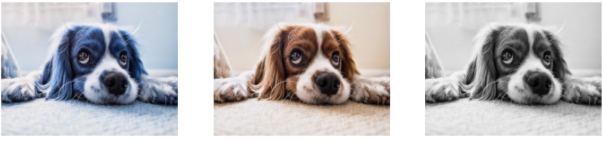

# 1. OpenCV intro

## 참고자료 

#### Opencv tutorials: https://docs.opencv.org/master/

#### [http://opencv.org](http://opencv.org/)

#### http://answers.opencv.org/questions/

##### Amazon Go : https://youtu.be/NrmMk1Myrxc

---


## 1.1. OpenCV-python 설치

```python
! pip install opencv-python
```

```python
import cv2
import numpy as np
import sys
cv2.__version__
'''
'4.5.5'
'''
```

---


## 1.2. 영상읽기

- 원하는 사진을 폴더에 넣거나 인터넷에서 다운받아 사용하세요

```python
# 640 x 426
img = cv2.imread('./Ch_1_Opencv_Intro/fig/puppy.bmp',
                flags = cv2.IMREAD_COLOR) # default 값이며 컬로로 읽는다.


if img is None:
    print('Image read failed')
    sys.exit()

# Window 만들기
cv2.namedWindow('puppy') # 팝업창 이름
cv2.imshow('puppy',img)

# Keyboard 입력 (모든 키) 을 기다리는 동안 영상을 출력 
cv2.waitKey()

# 키보드 입력을 받으면 화면에 나타난 모든 창을 닫음
cv2.destroyAllWindows()
```

---


## 1.3. OpenCV 주요함수 설명

#### Opencv tutorials: https://docs.opencv.org/master/

---


## 1.4. 다양한 옵션 사용하기

```python
# 다시 연습

import cv2
import numpy as np
import sys

img = cv2.imread('./Ch_1_Opencv_Intro/fig/cat.bmp'
                 , cv2.IMREAD_GRAYSCALE) # 이미지 옵션: 흑백으로 바꾸기
# cv2.IMREAD_UNCHANGED 알파 채널 이미지 부를 땐 꼭 이 옵션을 입력해야한다.

# 이미지가 없을 때.. 조건주기
if img is None:
    print('image read failed')
    sys.exit()
    
    
cv2.namedWindow('image')
cv2.imshow('image', img)
cv2.waitKey() 

cv2.destroyAllWindows()
```

----


## 1.5. 핸드폰에서 받은 사진 읽어보기

#### 1.5.1. 사진읽기

```python
# 핸드폰에서 가져온건 이미지가 엄청 큼.. 
img = cv2.imread('./Ch_1_Opencv_Intro/fig/KakaoTalk_20190131_155701951.jpg')

if img is None:
    print('image read failed')
    sys.exit()
    
cv2.namedWindow('image')
cv2.imshow('image', img)
cv2.waitKey()

cv2.destroyAllWindows()
```

- 엄청 크게 출력이 된다.

#### 1.5.2. 사이즈 조정 방법 1

- 읽을 때 줄이기

```python
img = cv2.imread('./Ch_1_Opencv_Intro/fig/KakaoTalk_20190131_155701951.jpg',
                 cv2.IMREAD_REDUCED_GRAYSCALE_4) # 숫자가 작아질 수록 작아짐

print(img.shape)
'''
(214, 320) # numpy 값이다. gray라 두개만 나옴
'''
cv2.namedWindow('image')
cv2.imshow('image', img)
cv2.waitKey()

cv2.destroyAllWindows()
```

#### 1.5.3. 사이즈 조장 방법 2

- 읽고나서 줄일 때

```python
img = cv2.imread('./Ch_1_Opencv_Intro/fig/KakaoTalk_20190131_155701951.jpg',
                 cv2.IMREAD_COLOR) 


# numpy로 나와서 세로, 가로, 
if  img is None:
    print('img read failed')
    sys.exit()
    
print(img.shape)
# 이건 넘파이로 나타내서 row, column순
'''
(480, 640, 3)
'''
# img_re = cv2.resize(img, (240,320), interpolation = cv2.INTER_AREA) 
# open cv는 영상좌표라 column, row 순 
# 위 넘파이 값은 순서가 row, column 순서이기 때문에 순서를 바꿔야함
# 아래 방법이 맞음
img_re2 = cv2.resize(img, (320,240), interpolation = cv2.INTER_AREA) 


cv2.namedWindow('image')
# cv2.namedWindow('image_re')
cv2.namedWindow('image_re2')
cv2.imshow('image', img)
# cv2.imshow('image_re', img_re)
cv2.imshow('image_re2', img_re2)


# 저장하기
cv2.imwrite('./Ch_1_Opencv_Intro/fig/Kakao_resize.png', img_re2)


cv2.waitKey()
cv2.destroyAllWindows()
```

#### 1.5.4. window pop 화면 위치 설정

```python

img = cv2.imread('./Ch_1_Opencv_Intro/fig/puppy_1280_853.jpg', cv2.IMREAD_COLOR)
# img_re = cv2.resize(img, (320, 240), cv2.INTER_AREA)

if img is None:
    print('image read failed')
    sys.exit()
    
cv2.namedWindow('image', cv2.WINDOW_AUTOSIZE) # AUTOSIZE는 사진 크기에 맞게 
# cv2.namedWindow('image', cv2.WINDOW_NORMAL) # NORMAL은 사이즈 조절됨
cv2.moveWindow('image', 0, 100) # 화면이 뜨는 위치 설정해주는 것

cv2.imshow('image', img)
# cv2.imshow('image_re', img_re)
cv2.waitKey()
cv2.destroyAllWindows()
```

---


## 1.6.  사진 종료 방법

```python
img = cv2.imread('./Ch_1_Opencv_Intro/fig/puppy.bmp', cv2.IMREAD_COLOR)

if img is None:
    print('image read failed')
    sys.exit()
    
cv2.namedWindow('image')
cv2.imshow('image',img)

# key = cv2.waitKey(3000) # ms 단위 # 일정 시간 후 종료
# print(key) # 아스카 코드의 키 값이 print 됨

# while True:
#     if cv2.waitKey() == 27: # 아스카 코드의 키 값이 27인 것은 ESC임. ESC 누르면 꺼짐
#         break

while True:
    if cv2.waitKey() == ord('q'): # 아스카 코드를 몰라도 입력하는 방법. 'q'누르면 꺼짐
        break


cv2.destroyAllWindows()
    
```

---


## 1.7. matplotlib 로 사진 출력하기

```python
import matplotlib.pyplot as  plt
```

```python
img = cv2.imread('./Ch_1_Opencv_Intro/fig/puppy.bmp', cv2.IMREAD_COLOR)

if img is None:
    print('read failed')
    sys.exit()
# opencv bgr 순서
# matplot rgb순서
# 순서 바꿔주기
imgRGB = cv2.cvtColor(img, cv2.COLOR_BGR2RGB) 
# 흑백으로 바꿔볼까
imgGray = cv2.cvtColor(img, cv2.COLOR_BGR2GRAY)

plt.figure(figsize = (12,6))
plt.subplot(131), plt.imshow(img), plt.axis('off')
plt.subplot(132), plt.imshow(imgRGB), plt.axis('off')
plt.subplot(133), plt.imshow(imgGray, cmap = 'gray'), plt.axis('off')
plt.show()
# plt.imshow(imgGray, cmap = 'gray') #  cmap안하면 이상하게 나옴
# plt.imshow(imgRGB)
# plt.axis('off')
# plt.show()


# while True:
#     if cv2.waitKey() == 27:
#         break
    
# cv2.destroyAllWindows()
```



- RGB 순서를 잘 맞춰 넣지 않으면 첫번 째 사진 처럼 됨.
- Gray로 바꾸고 싶을 땐 , cmap을 꼭 해줘야함.

---


## 1.8. 한번에 한 폴더 안에 있는 여러 사진 화면 보호기 처럼 나오게 해보기

```python
import os
import cv2
import numpy as np
import sys


img_list = os.listdir('./Ch_1_Opencv_Intro/fig/images/')
print(img_list)
'''
['autumn_forest_park_128379_1920x1080.jpg', 'boat_mountains_lake_135258_1920x1080.jpg', 'forest_fog_trees_128751_1920x1080.jpg', 'pier_dock_sea_dusk_shore_118549_1920x1080.jpg', 'road_marking_evening_clouds_horizon_120298_1920x1080.jpg']
'''

img_path = []
for i in img_list:
    
    img_path_all = './Ch_1_Opencv_Intro/fig/images/' + i 
    img_path.append(img_path_all)
    
cv2.namedWindow('image', cv2.WINDOW_NORMAL) # AUTOSIZE로 하면 원래 사진 사이즈로 나옴
cv2.setWindowProperty('image', cv2.WND_PROP_FULLSCREEN, # 전체화면 만들기
                     cv2.WINDOW_FULLSCREEN)

# 특정 키 누를 때 까지 반복해서 출력하기
idx = 0
while True:
    img_name = img_path[idx]
    img = cv2.imread(img_name, cv2.IMREAD_COLOR)
    cv2.imshow('image', img)
    key = cv2.waitKey(3000)
    if key == 27 or key == ord('q'):
        break
    
    idx += 1
    
    if idx >= len(img_path):
        idx = 0
cv2.destroyAllWindows()   
```

