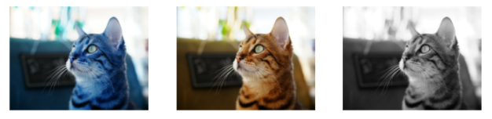

# 2. OpenCV Intro Review + α

```python
import numpy as np
import cv2
import sys

cv2.__version__
'''
'4.5.5'
'''
```

## 2.1. 파일 불러오기 

#### 2.1.1. COLOR

```python
img = cv2.imread('./Ch_1_Opencv_Intro/fig/puppy.bmp', cv2.IMREAD_COLOR)

if img is None:
    print('read failed')
    sys.exit()
    
cv2.namedWindow('image')
cv2.imshow('image', img) # image에 뭐를? img 파일을 


while True:
    if cv2.waitKey() == 27:
        break


cv2.destroyAllWindows()
```

#### 2.1.2. GRAYSCALE

```python
img = cv2.imread('./Ch_1_Opencv_Intro/fig/puppy.bmp', cv2.IMREAD_GRAYSCALE)

if img is None:
    print('read failed')
    sys.exit()
    
cv2.namedWindow('image')
cv2.imshow('image', img) # image에 뭐를? img 파일을 


while True:
    if cv2.waitKey() == 27:
        break


cv2.destroyAllWindows()
```

## 2.2. 사이즈 줄이기
#### 2.2.1. 파일 읽을 때 줄이기

```python
img = cv2.imread('./Ch_1_Opencv_Intro/fig/puppy.bmp',
                 cv2.IMREAD_REDUCED_COLOR_2) # 사이즈 줄일 때

if img is None:
    print('read failed')
    sys.exit()
    
cv2.namedWindow('image')
cv2.imshow('image', img) # image에 뭐를? img 파일을 


while True:
    if cv2.waitKey() == 27:
        break


cv2.destroyAllWindows()
```

#### 2.2.2. 파일 읽고 나서 나중에 줄이기

```python
img = cv2.imread('./Ch_1_Opencv_Intro/fig/puppy.bmp', cv2.IMREAD_COLOR)


img_small = cv2.resize(img, (200, 100), interpolation = cv2.INTER_AREA)

if img is None:
    print('read failed')
    sys.exit()
    
cv2.namedWindow('image')
cv2.namedWindow('image_small')
cv2.imshow('image', img)
cv2.imshow('image_small', img_small) # image에 뭐를? img 파일을 


while True:
    if cv2.waitKey() == 27:
        break


cv2.destroyAllWindows()
```

```python
img = cv2.imread('./Ch_1_Opencv_Intro/fig/puppy.bmp', cv2.IMREAD_COLOR)


img_small = cv2.resize(img, (w//2, h//2), interpolation = cv2.INTER_AREA)
cv2.imwirte('./Ch_1_Opencv_Intro/fig/puppy_small.png', img_small)

if img is None:
    print('read failed')
    sys.exit()
    

cv2.imshow('image', img)
cv2.imshow('image_small', img_small) # image에 뭐를? img 파일을 


while True:
    if cv2.waitKey() == 27:
        break


cv2.destroyAllWindows()
```

## 2.3. 윈도우 창 위치 옮기기

```python
img = cv2.imread('./Ch_1_Opencv_Intro/fig/puppy.bmp', cv2.IMREAD_COLOR)


# img_small = cv2.resize(img, (200, 100), interpolation = cv2.INTER_AREA)

if img is None:
    print('read failed')
    sys.exit()
    
cv2.namedWindow('image', cv2.WINDOW_NORMAL)
cv2.moveWindow('image', 200,0) # 맨 왼쪽 위가 0,0 기준

cv2.imshow('image', img)


while True:
    key =cv2.waitKey()
    if key == ord('x') or key == 27:
        break


cv2.destroyAllWindows()
```

## 2.4. matplotlib로 불러오기

```python
import matplotlib.pyplot as plt

imgBGR = cv2.imread('./Ch_1_Opencv_Intro/fig/cat.bmp', cv2.IMREAD_COLOR)
imgRGB = cv2.cvtColor(img, cv2.COLOR_BGR2RGB) # BGR 2 RGB
imgGRAY = cv2.cvtColor(img, cv2.COLOR_BGR2GRAY)
 
if img is None:
    print('read failed')
    sys.exit()
    
plt.figure(figsize=(12,6))

plt.subplot(131), plt.imshow(imgBGR), plt.axis('off') # 1행 3열에서 첫번째
plt.subplot(132), plt.imshow(imgRGB), plt.axis('off')
plt.subplot(133), plt.imshow(imgGRAY, cmap = 'gray'), plt.axis('off')
plt.show()
    
# cv2.imshow('image', img_gray)

# cv2.waitKey()

# cv2.destroyAllWindows()
```



## 2.5. 폴더 한번에 불러와서 루프 돌리기

```python
import numpy as np
import cv2
import sys
import os
```

 ```python
 img_lists = os.listdir('./Ch_1_Opencv_Intro/fig/images/')
 img_lists
 '''
 ['autumn_forest_park_128379_1920x1080.jpg',
  'boat_mountains_lake_135258_1920x1080.jpg',
  'forest_fog_trees_128751_1920x1080.jpg',
  'pier_dock_sea_dusk_shore_118549_1920x1080.jpg',
  'road_marking_evening_clouds_horizon_120298_1920x1080.jpg']
 '''
 
 img_lists_path = []
 
 for i in img_lists:
     img_list = './Ch_1_Opencv_Intro/fig/images/'+ i
     img_lists_path.append(img_list)
     
 cv2.namedWindow('image', cv2.WINDOW_NORMAL)
 cv2.setWindowProperty('image', cv2.WND_PROP_FULLSCREEN,
                      cv2.WINDOW_FULLSCREEN)
 
 idx = 0
 while True:
     img_path = img_lists_path[idx]
     img = cv2.imread(img_path)
     
     cv2.imshow('image', img)
     
     if cv2.waitKey(3000) == 27:
         break
         
         
     idx += 1
     
     if idx >= len(img_lists_path):
         idx = 0
         
 cv2.destroyAllWindows()
 ```

## 2.6. 다른 방법으로 폴더 파일 불러오기

```python
import glob

img_lists = glob.glob('./Ch_1_Opencv_Intro/fig/images/*.*') # * 모든 파일의 * 모든 형식
print(img_lists)
cv2.namedWindow('image', cv2.WINDOW_NORMAL)
cv2.setWindowProperty('image', cv2.WND_PROP_FULLSCREEN,
                     cv2.WINDOW_FULLSCREEN)

idx = 0
while True:
    img_path = img_lists[idx]
    img = cv2.imread(img_path)
    
    cv2.imshow('image', img)
    
    if cv2.waitKey(3000) == 27:
        break
        
        
    idx += 1
    
    if idx >= len(img_lists_path):
        idx = 0
        
cv2.destroyAllWindows()
```

