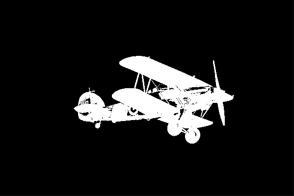

# 3. OpenCV Basic

```python
import cv2
import numpy as np
import sys
```

---


## 3.1. image type, dimension, data type 확인

#### 3.1.1. 비교

```python
img = cv2.imread('./Ch_2_Opencv_basic/fig/puppy.bmp', cv2.IMREAD_GRAYSCALE)

if img is None:
    print('read failed')
    sys.exit()
    
print('img type = ' , type(img))
print('img dimension =', img.shape)
print('data type = ', img.dtype)
'''
img type =  <class 'numpy.ndarray'>
img dimension = (480, 640) # 
data type =  uint8
'''
```

#### 3.1.2. 사진 크기에 따른 비교

```python
img = cv2.imread('./Ch_2_Opencv_basic/fig/puppy.bmp', cv2.IMREAD_COLOR)
img1 = cv2.imread('./Ch_2_Opencv_basic/fig/puppy_1280_853.jpg', cv2.IMREAD_COLOR)

if img is None or img1 is None:
    print('read failed')
    sys.exit()
    
print('img type = ' , type(img))
print('img1 type = ' , type(img1))

print('img dimension =', img.shape)
print('img1 dimension =', img1.shape)

print('data type = ', img.dtype)
print('data1 type = ', img1.dtype)
'''
img type =  <class 'numpy.ndarray'>
img1 type =  <class 'numpy.ndarray'>
img dimension = (480, 640, 3)
img1 dimension = (853, 1280, 3)
data type =  uint8
data1 type =  uint8
'''
```

#### 3.1.3. GRAYSCALE 비교

```python
img = cv2.imread('./Ch_2_Opencv_basic/fig/puppy.bmp', cv2.IMREAD_GRAYSCALE)
# img1 = cv2.imread('./Ch_2_Opencv_basic/fig/puppy_1280_853.jpg', cv2.IMREAD_COLOR)

if img is None or img1 is None:
    print('read failed')
    sys.exit()
    

print('img dimension =', img.shape)
# print('img1 dimension =', img1.shape)

# 파일의 크기를 알고 싶을 때
h, w = img.shape[:2]
print('img size = {} x {}'.format(w, h)) 

'''
img dimension = (480, 640)
img size = 640 x 480
'''
```

---


## 3.2. 픽셀값 참고하기

#### 3.2.1. center 값 찾기

```python
## 픽셀값 참고
img1 = cv2.imread('./Ch_2_Opencv_basic/fig/puppy.bmp', 1) # 컬러
img2 = cv2.imread('./Ch_2_Opencv_basic/fig/puppy.bmp', 0) # 흑백

h, w = img1.shape[:2]

img1_center = img1[h//2, w//2]
print('color center =' , img1_center)
'''
color center = [ 0 14 40] B , G , R 순서
'''
img2_center = img2[h//2, w//2]
print('gray center =' , img2_center)
'''
gray center = 20
'''


if img1 is None or img2 is None:
    print('read failed')
    sys.exit()
    
cv2.imshow('img1',img1)
cv2.imshow('img2',img2)

cv2.waitKey()

cv2.destroyAllWindows()
'''
color center = [ 0 14 40]
gray center = 20
'''
```

---


#### 3.2.2. 다른 예시

```python
## 픽셀값 참고
img1 = cv2.imread('./Ch_2_Opencv_basic/fig/puppy.bmp', 1) # 컬러
img2 = cv2.imread('./Ch_2_Opencv_basic/fig/puppy.bmp', 0) # 흑백

# h, w = img1.shape[:2]

만약 이렇게 주어진다면?
x = 120
y = 320


img1_center = img1[y, x]
print('color center =' , img1_center)
'''
color center = [ 0 14 40] B , G , R 순서
'''
img2_center = img2[y, x]
print('gray center =' , img2_center)
'''
gray center = 20
'''


if img1 is None or img2 is None:
    print('read failed')
    sys.exit()
    
cv2.imshow('img1',img1)
cv2.imshow('img2',img2)

cv2.waitKey()

cv2.destroyAllWindows()
```

---


## 3.3. 슬라이싱으로 특정 위치 잡기

```python
## 픽셀값 참고
img1 = cv2.imread('./Ch_2_Opencv_basic/fig/puppy.bmp', 1) # 컬러
img2 = cv2.imread('./Ch_2_Opencv_basic/fig/puppy.bmp', 0) # 흑백

# 세로 10~ 110, 가로 100~200 범위
img1[10:110, 100:200] = 0 # 검정 됨
img1[10:110, 100:200] = 255 # white됨 
img1[10:110, 100:200] = (0, 0, 255) # BGR # red됨

if img1 is None or img2 is None:
    print('read failed')
    sys.exit()
    
cv2.imshow('img1',img1)
cv2.imshow('img2',img2)

cv2.waitKey()

cv2.destroyAllWindows()
```

---


## 3.4. 특정 크기 사진 만들기

```python
import random

img1 = np.zeros((240, 320, 3), dtype = np.uint8) # 컬러
img2 = np.ones((240, 320), dtype = np.uint8) *255
img3 = np.full((240,320,3), 255, dtype = np.uint8)
img4 = np.random.randint(0, 255, size = (240, 320), dtype = np.uint8)

img1[10:60, 10:60] = (0, 0, 255) # 컬러
img2[10:60, 10:60] = 255 # 흑백


cv2.imshow('img1', img1)
cv2.imshow('img2', img2)
cv2.imshow('img3', img3)
cv2.imshow('img4', img4)
cv2.waitKey()

cv2.destroyAllWindows()
```

---


## 3.5. 영상 복사

```python
img = cv2.imread('./Ch_2_Opencv_basic/fig/cat.bmp')

if img is None:
    print('read failed')
    sys.exit()
    
img1 = img
    
cv2.imshow('image' , img)
cv2.imshow('image1' , img1)
while True:
    if cv2.waitKey(20) == 27:
        break
        
cv2.destroyAllWindows()
```

- 위 방법은 조심할 점이 있음

```python
img = cv2.imread('./Ch_2_Opencv_basic/fig/cat.bmp')

if img is None:
    print('read failed')
    sys.exit()
    
img1 = img
img2 = img.copy()

img[100:200, 200:300] = (0, 0, 255) 

# img1 은 img의 reference주소가 같기 때문에 img 만 수정해도 img1도 같이 수정됨
# 따라서 반대로 img1을 수정해도 img도 수정됨
# copy 함수를 쓰면 새로운 이미지를 다른 주소에 카피 하는 것    

cv2.imshow('image' , img)
cv2.imshow('image1' , img1)
cv2.imshow('image2' , img2)

while True:
    if cv2.waitKey(20) == 27:
        break
        
cv2.destroyAllWindows()
```
- image, image1, image2 순서


```python
# 확인해보기

img = np.ones((400, 400, 3), dtype = np.uint8)*255
img1 = img.copy() # 백업 만들기


# circle(img, center, radius, color[, thickness[, lineType[, shift]]]) -> img
cv2.circle(img, (100, 200), 100, (0,0,255), 3, cv2.LINE_AA) # cv2 는 가로 세로 순


cv2.imshow('image', img)

cv2.waitKey()
cv2.destroyAllWindows()
```


---


## 3.6. 인덱스 조정으로 코 뽑아보기

```python
img1 = cv2.imread('./Ch_2_Opencv_basic/fig/puppy.bmp')

print(img1.shape)
img2 = img1.copy()
nose = img2[200:350, 300:500]
cv2.imshow('image1', nose)
cv2.waitKey()
cv2.destroyAllWindows()
'''
(480, 640, 3)
'''
```


---


## 3.7. 루돌프 코 만들어보기

```python
import cv2
import numpy as np
import sys


img1 = cv2.imread('./Ch_2_Opencv_basic/fig/puppy.bmp')
img2 = img1[200:400, 300:500]
img3 = img1[200:400, 300:500].copy()

cv2.circle(img2, (110, 90), 50,(0, 0, 255), -1) # antialiasing


cv2.imshow('image1', img1)
cv2.imshow('image2', img2)
cv2.imshow('image3', img3)


cv2.waitKey()
cv2.destroyAllWindows()
```


---


## 3.8. 합성해보기 copyTo

```python

src = cv2.imread('./Ch_2_Opencv_basic/fig/airplane.bmp', cv2.IMREAD_COLOR)
mask = cv2.imread('./Ch_2_Opencv_basic/fig/mask_plane.bmp', cv2.IMREAD_GRAYSCALE)
dst = cv2.imread('./Ch_2_Opencv_basic/fig/field.bmp', cv2.IMREAD_COLOR)

if src is None or mask is None or dst is None:
    print('read failed')
    sys.exit()

# copyTo(src, mask, dst = None) -> dst 
cv2.copyTo(src, mask, dst) # mask영상에서 0이 아닌 부분이 해당되는 scr의 값을 dst에 넣는다
# mask를 한땀 한땀 만들기 매우 어렵기 때문에 alpha channel image가 있는 것


cv2.imshow('src', src)
cv2.imshow('mask', mask) # binary. mask. 
cv2.imshow('dst', dst)

cv2.waitKey()
cv2.destroyAllWindows()
```


#### 3.8.1. mask 만들어보기 

- 1차 시도

```python

src = cv2.imread('./Ch_2_Opencv_basic/fig/airplane.bmp', cv2.IMREAD_COLOR)
src_gray = cv2.cvtColor(src, cv2.COLOR_BGR2GRAY)

# threshold(src, thresh, maxval, type[, dst]) -> retval, dst
ret, mask = cv2.threshold(src_gray, 100, 255, cv2.THRESH_BINARY) 
# 배경이 흰색됨
# 따라서 inverse

cv2.imshow('src', src)
cv2.imshow('src_gray', src_gray)
cv2.imshow('mask', mask)


cv2.waitKey()
cv2.destroyAllWindows()
```


- 2차 시도

```python

src = cv2.imread('./Ch_2_Opencv_basic/fig/airplane.bmp', cv2.IMREAD_COLOR)
src_gray = cv2.cvtColor(src, cv2.COLOR_BGR2GRAY)

# threshold(src, thresh, maxval, type[, dst]) -> retval, dst
ret, mask = cv2.threshold(src_gray, 100, 255, cv2.THRESH_BINARY_INV) 
# 결과물이 안좋기 때문에 값을 조정


cv2.imshow('src', src)
cv2.imshow('src_gray', src_gray)
cv2.imshow('mask', mask)


cv2.waitKey()
cv2.destroyAllWindows()
```


- 3차 시도

```python

src = cv2.imread('./Ch_2_Opencv_basic/fig/airplane.bmp', cv2.IMREAD_COLOR)
src_gray = cv2.cvtColor(src, cv2.COLOR_BGR2GRAY)

# threshold(src, thresh, maxval, type[, dst]) -> retval, dst
ret, mask = cv2.threshold(src_gray, 160, 255, cv2.THRESH_BINARY_INV) 
# 그나마 낫다.. 그래도 최선은 아님


cv2.imshow('src', src)
cv2.imshow('src_gray', src_gray)
cv2.imshow('mask', mask)


cv2.waitKey()
cv2.destroyAllWindows()
```




---


## 3.9. 실습해보기

```python
import cv2
import numpy as np
import sys

img1 = cv2.imread('./Ch_2_Opencv_basic/fig/cow.png')
img2 = cv2.imread('./Ch_2_Opencv_basic/fig/green.png')
img1_gray = cv2.cvtColor(img1, cv2.COLOR_BGR2GRAY)

h, w = img1.shape[:2]
img2 = cv2.resize(img2, (w, h), interpolation = cv2.INTER_AREA)

ret, mask = cv2.threshold(cow_gray, 240, 255, cv2.THRESH_BINARY_INV)

cv2.copyTo(img1, mask, img2)

cv2.imshow('img1', img1)
cv2.imshow('img2', img2)
cv2.imshow('mask', mask)

cv2.waitKey()
cv2.destroyAllWindows()
```


---


## 3.10. 더 현실적으로 보이게 하기

```python
import cv2
import numpy as np
import sys


cow = cv2.imread('./Ch_2_Opencv_basic/fig/cow.png')
cow_gray = cv2.cvtColor(cow, cv2.COLOR_BGR2GRAY)
ret, mask = cv2.threshold(cow_gray, 240, 255, cv2.THRESH_BINARY_INV) 

green = cv2.imread('./Ch_2_Opencv_basic/fig/green.png')
green1 = green[400:1000, 800:1400]
print(green1.shape)
'''
(600, 600, 3)
'''

cv2.copyTo(cow, mask, green1)

cv2.imshow('mask', mask)
cv2.imshow('green', green)


cv2.waitKey()
cv2.destroyAllWindows()

cv2.imwrite('./Ch_2_Opencv_basic/fig/cow_2.png',green)

```


---


## 3.11. 인터넷에서 사진을 받아서 해보기

#### 3.11.1. 투명도를 추가해 보았다

```python
img1 = cv2.imread('./Ch_2_Opencv_basic/fig/images.jpg')
img2 = cv2.imread('./Ch_2_Opencv_basic/fig/images (1).jpg')

alpha = 0.5

h, w = img1.shape[:2]
img2 = cv2.resize(img2, (w, h), interpolation = cv2.INTER_AREA)

# img2_gray = cv2.cvtColor(img2, cv2.COLOR_BGR2GRAY)
# ret, mask = cv2.threshold(img2_gray, 190, 255, cv2.THRESH_BINARY_INV)

blended = img1 * alpha + img2 * (1-alpha)
blended = blended.astype(np.uint8)
cv2.imshow('img1 * alpha + img2 * (1-alpha)', blended)


# img11 = img1[]
# cv2.imshow('mask', mask)
# cv2.imshow('mask', mask)


cv2.waitKey()
cv2.destroyAllWindows()

cv2.imwrite('./Ch_2_Opencv_basic/fig/mine.png', blended )
```


