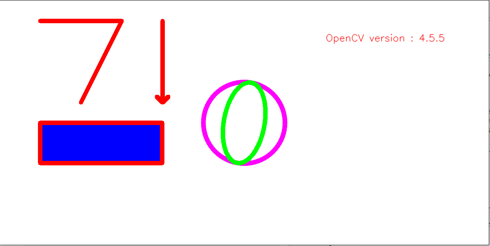

# 5. OpenCV Basic 2편

## 5.1. 사진

#### 5.1.1. alpha channel image

```python
import numpy as np
import cv2
import sys

src = cv2.imread('./Ch_2_Opencv_basic/fig/puppy.bmp', 1)
img_alpha = cv2.imread('./Ch_2_Opencv_basic/fig/imgbin_sunglasses_1.png', cv2.IMREAD_UNCHANGED) # 알파 파일은 꼭 이 옵션을 넣어야함


print(src.shape)
print(img_alpha.shape)
'''
(480, 640, 3)
(480, 960, 4)
'''
if src is None or img_alpha is None:
    print('read failed')
    sys.exit()


sunglass = img_alpha[:, :, 0:3] # 4개 차원이기 때문에 3까지 사진을 뽑고
mask = img_alpha[:,:,-1] # 마지막 차원인 mask를 뽑는다


cv2.imshow('src', src)
cv2.imshow('sunglass', sunglass)
cv2.imshow('mask', mask)

cv2.waitKey()
cv2.destroyAllWindows()
```

#### 5.1.2. 안경넣기

```python
import numpy as np
import cv2
import sys

src = cv2.imread('./Ch_2_Opencv_basic/fig/puppy.bmp', 1)
img_alpha = cv2.imread('./Ch_2_Opencv_basic/fig/imgbin_sunglasses_1.png', cv2.IMREAD_UNCHANGED)
img_alpha = cv2.resize(img_alpha, (300, 150))


if src is None or img_alpha is None:
    print('read failed')
    sys.exit()


sunglass = img_alpha[:, :, 0:3]
mask = img_alpha[:,:,-1]


h, w = mask.shape[:2]
crop = src[120:120+h, 220:220+w]

# 1편에서 한 송아지 합성처럼 하면 됨
cv2.copyTo(sunglass, mask, crop)
crop[mask > 0] = (255, 0, 255) # 안경 색 바꾸기


cv2.imshow('crop', crop)
cv2.imshow('src', src)
cv2.imshow('sunglass', sunglass)
cv2.imshow('mask', mask)

cv2.waitKey()
cv2.destroyAllWindows()
```


#### 5.1.3. 화면에 글씨 쓰기

```python
img = np.full((600, 1200, 3), 255, np.uint8)

# cv2.line(img, pt1, pt2, color, thickness = None, lineType = None, shift = None) -> img
# flags
    # img:그림을 그릴 영상
    # pt1, pt2: 직선의 시작점, 끝점
    # color: 직선의 칼라 (B,G,R)의 튜플
    # thinkness: 선두께, 기본은= 1
    # lineType: cv2.LINE_4, cv2.LINE_8, cv2.LINE_AA
    
cv2.line(img, (100, 50), (300, 50), (0, 0, 255), 10)
cv2.line(img, (300, 50), (200, 250), (0, 0, 255), 10)
cv2.arrowedLine(img, (400, 50), (400, 250), (0, 0, 255), 10)

# cv2.rectangle(img, pt1, pt2, color, thickness = None, lineType = None) -> img
   # pt1 :좌측 상단,  pt2: 우측하단
# cv2.rectangle(img, rect, color, thickness = None, lineType = None) -> img
    # rect: 사각형의 위치 정보 (x, y, w, h)

# cv2.rectangle(img, (100, 300), (400, 400), (255, 0, 0), 10)
cv2.rectangle(img, (100, 300), (400, 400), (255, 0, 0), -1) #안쪽 채울 때
cv2.rectangle(img, (100, 300, 300, 100), (0, 0, 255), 10)


# cv2.circle(img, center, radius, color, thickness = None, lineType = None) -> img
    # center: 원의 중심좌표 (x, y)
    # radius : 원의 반지름
    
cv2.circle(img, (600, 300), 100, (255,0,255), 10, cv2.LINE_AA) # 각 생기기 방지   

# cv2.ellipse(img, center, axes, angle, startAngle, endAngle, color[, thickness[, lineType[, shift]]]) -> img
    # center: 원의 중심좌표 (x, y)
    # axis: 축의 반지름(x, y)
    # angle: 타원의 기울기 (예, 10, 오른쪽으로 10도 기울어짐)
    # startAngle: 타원을 그리는 시작 각도 (3시 방향이 0도)
    # endAngle: 타원을 그리는 종료 각도
    
cv2.ellipse(img, (600, 300), (50, 100),  10, 0, 360, (0, 255,0), 10)


# putText(img, text, org, fontFace, fontScale, color[, thickness[, lineType[, bottomLeftOrigin]]]) -> img

text = 'OpenCV version : ' + cv2.__version__
cv2.putText(img, text, (800, 100), cv2.FONT_HERSHEY_SIMPLEX,
           0.8, (0, 0, 255), 1, cv2.LINE_AA)


print(text)
    
cv2.imshow('canvas', img)

cv2.waitKey()
cv2.destroyAllWindows()
```



#### 5.1.4. 인삼 써보기

```python
import numpy as np
import cv2
import sys

img = np.full((600, 1200, 3), 255, np.uint8)

cv2.circle(img, (200, 200), 100, (0, 255, 255), 10, cv2.LINE_AA)
cv2.line(img, (400, 50),(400, 350), (0, 255,255), 10)
cv2.line(img, (200, 400),(200, 450), (0, 255,255), 10)
cv2.line(img, (200, 450),(400, 450), (0, 255,255), 10)

cv2.line(img, (450, 300),(550, 100), (0, 255,255), 10, cv2.LINE_AA)
cv2.line(img, (550, 100),(650, 300), (0, 255,255), 10, cv2.LINE_AA)
cv2.line(img, (700, 50),(700, 350), (0, 255,255), 10)
cv2.line(img, (700, 200),(750, 200), (0, 255,255), 10)
cv2.rectangle(img, (450, 400), (700, 500), (0, 255,255), 10, cv2.LINE_AA)

cv2.imshow('canvas', img)

cv2.waitKey()
cv2.destroyAllWindows()
```


---


## 5.2. 비디오 캡쳐

- 사진 편집과 다른점은 즉시 반영되어야 하기 때문에 처리 속도가 중요함

#### 5.2.1.웹캠 화면 띄울 때

```python

cap = cv2.VideoCapture(0)

if not cap.isOpened():
    print('Videocap open failed')
    sys.exit()
    

while True:
    ret, frame = cap.read() # ret== retuen frame == 영상
    
    if not ret:
        print('video read failed')
        break
    
    edge = cv2.Canny(frame, 50, 150)
    
    cv2.imshow('img', frame)
    cv2.imshow('edge', edge)
    if cv2.waitKey(20) ==27:
        break
        
        
        
cap.release()
cv2.destroyAllWindows()
```

#### 5.2.2. 동영상 플레이 할 때

```python
cap = cv2.VideoCapture('./Ch_2_Opencv_basic/fig/raining.mp4')

if not cap.isOpened():
    print('Videocap open failed')
    sys.exit()
    

while True:
    ret, frame = cap.read() # ret== retuen frame == 영상
    
    if not ret:
        print('video read failed')
        break
    
    edge = cv2.Canny(frame, 30, 150)
    
    cv2.imshow('img', frame)
    cv2.imshow('edge', edge)
    if cv2.waitKey(20) ==27:
        break
        
        
        
cap.release()
cv2.destroyAllWindows()
```


#### 5.2.3. 저장하기

```python
import numpy as np
import cv2
import sys
cap = cv2.VideoCapture(0)

if not cap.isOpened():
    print('Videocap open failed')
    sys.exit()
    
w = int(cap.get(cv2.CAP_PROP_FRAME_WIDTH))
h = int(cap.get(cv2.CAP_PROP_FRAME_HEIGHT))
fps= int(cap.get(cv2.CAP_PROP_FPS)*0.7) # 속도 조절
fourcc = cv2.VideoWriter_fourcc(*'DIVX')
# print(w, h, fps, sep= '|' )
'''
640.0|480.0|30.0
'''

out = cv2.VideoWriter('./Ch_2_Opencv_basic/fig/output_class.avi', fourcc, fps, (w,h))


while True:
    ret, frame = cap.read() # ret== retuen frame == 영상
    
    if not ret:
        print('video read failed')
        break
    
    edge = cv2.Canny(frame, 30, 150)
    
    cv2.imshow('img', frame)
    cv2.imshow('edge', edge)
    
    out.write(frame)
    if cv2.waitKey(20) ==27:
        break
        
        
        
cap.release()
out.release()
cv2.destroyAllWindows()
```

#### 5.2.4. edge 저장하기

- 1차시도 그냥 하니까 안된다

```python
import numpy as np
import cv2
import sys
cap = cv2.VideoCapture(0)

if not cap.isOpened():
    print('Videocap open failed')
    sys.exit()
    
w = int(cap.get(cv2.CAP_PROP_FRAME_WIDTH))
h = int(cap.get(cv2.CAP_PROP_FRAME_HEIGHT))
fps= int(cap.get(cv2.CAP_PROP_FPS)*0.7) # 속도 조절
fourcc = cv2.VideoWriter_fourcc(*'DIVX')
# print(w, h, fps, sep= '|' )
'''
640.0|480.0|30.0
'''

out = cv2.VideoWriter('./Ch_2_Opencv_basic/fig/output_edge_class.avi', fourcc, fps, (w,h))


while True:
    ret, frame = cap.read() # ret== return frame == 영상
    
    if not ret:
        print('video read failed')
        break
    
    edge = cv2.Canny(frame, 30, 150)
    
    
    cv2.imshow('img', frame)
    cv2.imshow('edge', edge)
    
    out.write(edge) # 그냥하면 안됨 ㅠ edge는 gray고 frame은 color이라 
    if cv2.waitKey(20) ==27:
        break
        
        
        
cap.release()
out.release()
cv2.destroyAllWindows()
```

- 2차시도 gray를 BGR로 변환해서 해보자

```python
import numpy as np
import cv2
import sys
cap = cv2.VideoCapture(0)

if not cap.isOpened():
    print('Videocap open failed')
    sys.exit()
    
w = int(cap.get(cv2.CAP_PROP_FRAME_WIDTH))
h = int(cap.get(cv2.CAP_PROP_FRAME_HEIGHT))
fps= int(cap.get(cv2.CAP_PROP_FPS)*0.7) # 속도 조절
fourcc = cv2.VideoWriter_fourcc(*'DIVX')
# print(w, h, fps, sep= '|' )
'''
640.0|480.0|30.0
'''

out = cv2.VideoWriter('./Ch_2_Opencv_basic/fig/output_edge_class.avi', fourcc, fps, (w,h))


while True:
    ret, frame = cap.read() # ret== return frame == 영상
    
    if not ret:
        print('video read failed')
        break
    ## 동영상 편집 부분
    #############################################################################    
    edge = cv2.Canny(frame, 30, 150)
    edge_color = cv2.cvtColor(edge, cv2.COLOR_GRAY2BGR) # gray를 BGR로 
    #############################################################################    
    cv2.imshow('img', frame)
    cv2.imshow('edge', edge_color)
    
    out.write(edge_color) 
    if cv2.waitKey(20) ==27:
        break
        
        
        
cap.release()
out.release()
cv2.destroyAllWindows()
```

#### 5.2.5. edge 반전해보기

- 혼자 해본 방법이라 적절한지 모르겠으나 잘 동작한다

```python
import numpy as np
import cv2
import sys
cap = cv2.VideoCapture(0)

if not cap.isOpened():
    print('Videocap open failed')
    sys.exit()
    
w = int(cap.get(cv2.CAP_PROP_FRAME_WIDTH))
h = int(cap.get(cv2.CAP_PROP_FRAME_HEIGHT))
fps= int(cap.get(cv2.CAP_PROP_FPS)*0.7) # 속도 조절
fourcc = cv2.VideoWriter_fourcc(*'DIVX')
# print(w, h, fps, sep= '|' )
'''
640.0|480.0|30.0
'''

out = cv2.VideoWriter('./Ch_2_Opencv_basic/fig/output_inv_edge_class.avi', fourcc, fps, (w,h))


while True:
    ret, frame = cap.read() # ret== return frame == 영상
    
    if not ret:
        print('video read failed')
        break
    ## 동영상 편집 부분
    #############################################################################    
    edge = cv2.Canny(frame, 30, 150)
    ret, edge_inv = cv2.threshold(edge,0, 255, cv2.THRESH_BINARY_INV)
    edge_color = cv2.cvtColor(edge_inv, cv2.COLOR_GRAY2BGR)
    # gray를 BGR로 
    #############################################################################    
    cv2.imshow('img', frame)
    cv2.imshow('edge', edge_color)
    
    out.write(edge_color) 
    if cv2.waitKey(20) ==27:
        break
        
        
        
cap.release()
out.release()
cv2.destroyAllWindows()
```

- 쉽고 좋은 방법

```python
import numpy as np
import cv2
import sys
cap = cv2.VideoCapture(0)

if not cap.isOpened():
    print('Videocap open failed')
    sys.exit()
    
w = int(cap.get(cv2.CAP_PROP_FRAME_WIDTH))
h = int(cap.get(cv2.CAP_PROP_FRAME_HEIGHT))
fps= int(cap.get(cv2.CAP_PROP_FPS)*0.7) # 속도 조절
fourcc = cv2.VideoWriter_fourcc(*'DIVX')
# print(w, h, fps, sep= '|' )
'''
640.0|480.0|30.0
'''

out = cv2.VideoWriter('./Ch_2_Opencv_basic/fig/output_inv_edge_class.avi', fourcc, fps, (w,h))


while True:
    ret, frame = cap.read() # ret== return frame == 영상
    
    if not ret:
        print('video read failed')
        break
   

    ## 동영상 편집 부분
    #############################################################################    
    edge = cv2.Canny(frame, 30, 150)
    edge = 255 - edge
    edge_color = cv2.cvtColor(edge, cv2.COLOR_GRAY2BGR)
    # gray를 BGR로 
    #############################################################################    
  

    cv2.imshow('img', frame)
    cv2.imshow('edge', edge_color)
    
    out.write(edge_color) 
    if cv2.waitKey(20) ==27:
        break
        
        
        
cap.release()
out.release()
cv2.destroyAllWindows()
```

- 더 쉽고 간략한 방법으로 작동한다. 