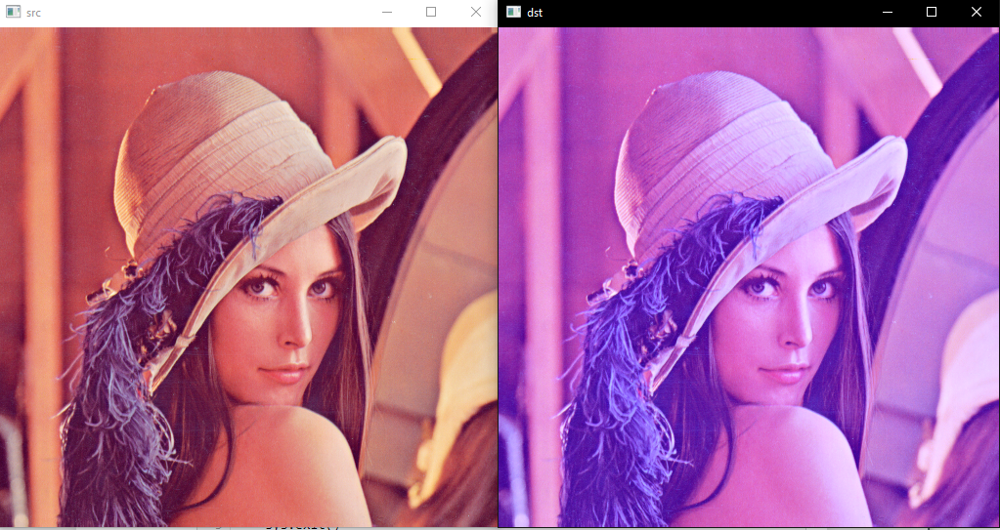
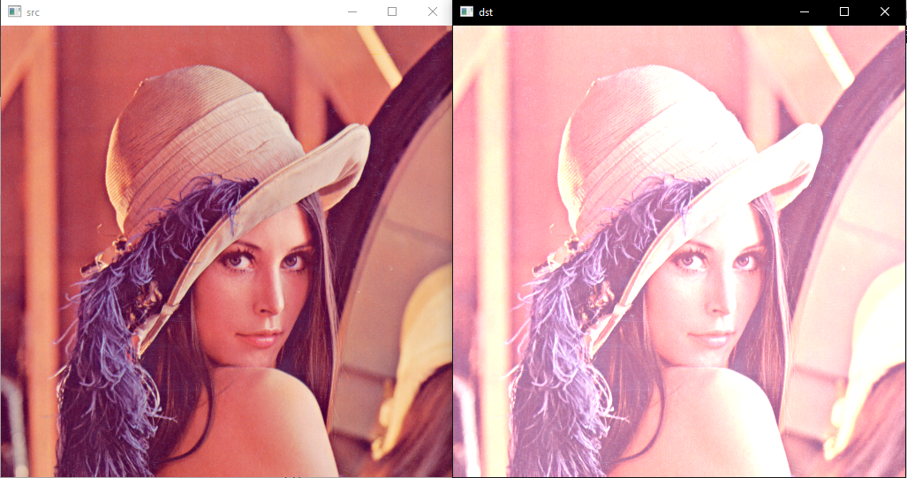
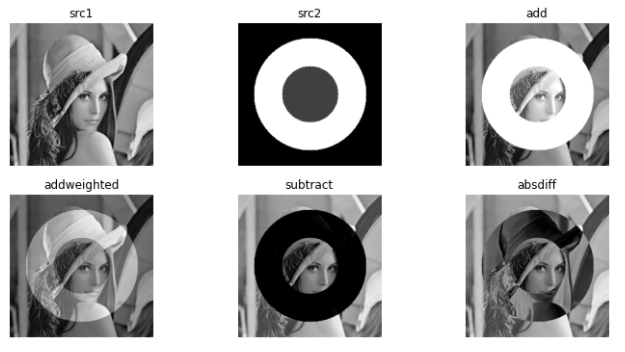
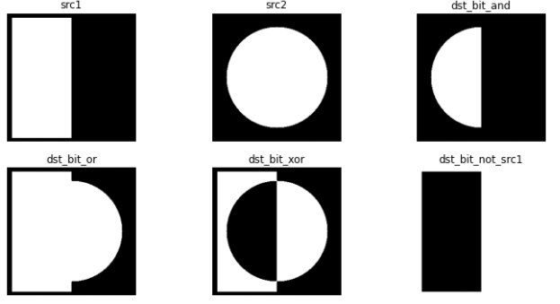
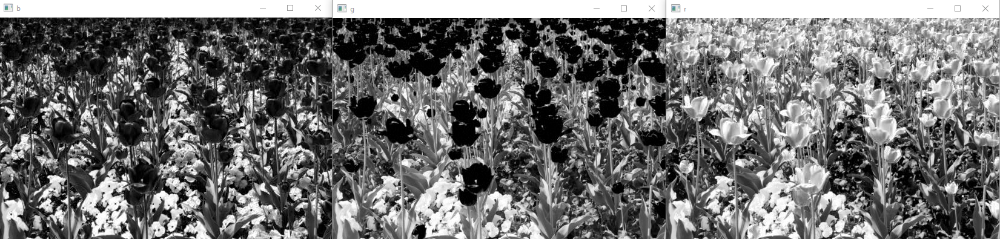
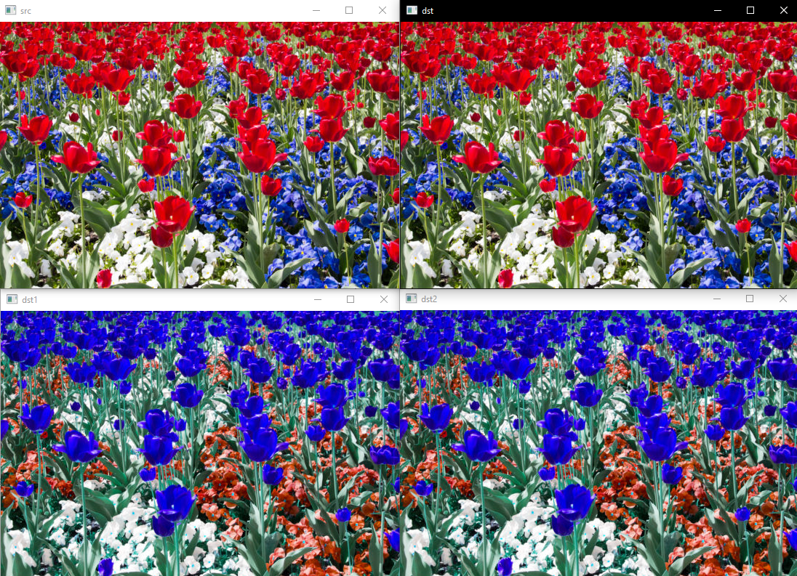

# 7. OpenCV Point Processing
## 7.1. histogram sliding 

```python
import numpy as np
import sys
import cv2
```


#### 7.1.1. 흑백 GrayScale

```python
src = cv2.imread('./fig/lenna.bmp', cv2.IMREAD_GRAYSCALE)

if src is None:
    print('image read failed')
    sys.exit()
# histogram sliding    0보다 작으면 0으로 255보다 크면 255로
# cliping 은 float 연산만 가능하기 때문에 float 값을 입력하고 다시 uint8로 변환해줘야 함    
dst = np.clip(src + 100., 0, 255).astype(np.uint8) 
    
cv2.imshow('src',src)
cv2.imshow('dst',dst)
cv2.waitKey()
cv2.destroyAllWindows()
```

- 더 쉬운 방법

```python
src = cv2.imread('./fig/lenna.bmp', cv2.IMREAD_GRAYSCALE)

if src is None:
    print('image read failed')
    sys.exit()

# 원큐에 가능 clipping 까지 해줌
dst = cv2.add(src, 100)    
    
cv2.imshow('src',src)
cv2.imshow('dst',dst)
cv2.waitKey()
cv2.destroyAllWindows()
```


#### 7.1.2. 컬러 Color

```python
src = cv2.imread('./fig/lenna.bmp', cv2.IMREAD_COLOR)

if src is None:
    print('image read failed')
    sys.exit()

# 원큐에 가능 clipping 까지 해줌
# 하지만, 이렇게 하면 앞에만 더해짐 B 만.  
dst = cv2.add(src, 100)    
    
cv2.imshow('src',src)
cv2.imshow('dst',dst)
cv2.waitKey()
cv2.destroyAllWindows()

```




- 따라서 아래와 같은 방법으로 해야한다

```python
src = cv2.imread('./fig/lenna.bmp', cv2.IMREAD_COLOR)

if src is None:
    print('image read failed')
    sys.exit()

# 원큐에 가능 clipping 까지 해줌
dst = cv2.add(src, (100, 100, 100, 0))    # 이케 해줘야함 
# 사실 이렇게 가능하지만 color space를 바꿔서 변환해줘야함
    
cv2.imshow('src',src)
cv2.imshow('dst',dst)
cv2.waitKey()
cv2.destroyAllWindows()

```




#### 7.1.3. 여러가지 연산

```python
import numpy as np
import sys
import cv2
import matplotlib.pyplot as plt
src1 = cv2. imread('./fig/lenna256.bmp', cv2.IMREAD_GRAYSCALE)

# h, w = src1.shape[:2] 이렇게 하면 사실 좋음
src2 = np.zeros_like(src1, dtype = np.uint8)
cv2.circle(src2, (128,128), 100, 200, -1)
cv2.circle(src2, (128,128), 50, 50, -1)

dst1 = cv2.add(src1, src2)
dst2 = cv2.addWeighted(src1, 0.5, src2, 0.5, 0.0)
dst3 = cv2.subtract(src1, src2) # 순서 중요
dst4 = cv2.absdiff(src1, src2)

cv2.imshow('src1', src1)
cv2.imshow('src2', src2)

cv2.imshow('dst1', dst1)
cv2.imshow('dst2', dst2)
cv2.imshow('dst3', dst3)
cv2.imshow('dst4', dst4)

cv2.waitKey()
cv2.destroyAllWindows()

```


#### 7.1.4. matplotlib로 해보기

```python
import numpy as np
import sys
import cv2
import matplotlib.pyplot as plt
src1 = cv2. imread('./fig/lenna256.bmp', cv2.IMREAD_GRAYSCALE)

# h, w = src1.shape[:2] 이렇게 하면 사실 좋음
src2 = np.zeros_like(src1, dtype = np.uint8)
cv2.circle(src2, (128,128), 100, 200, -1)
cv2.circle(src2, (128,128), 50, 50, -1)

dst1 = cv2.add(src1, src2)
# dst2 = cv2.addWeighted(src1, 0.5, src2, 0.5, 0.0)
dst2 = cv2.addWeighted(src1, 0.7, src2, 0.3, 0.0)
dst3 = cv2.subtract(src1, src2) # 순서 중요
dst4 = cv2.absdiff(src1, src2)

plt.figure(figsize = (12, 6))
 # 2행 3열에 1번째
plt.subplot(231), plt.imshow(src1, cmap = 'gray'), plt.axis('off'),plt.title('src1')
plt.subplot(232), plt.imshow(src2, cmap = 'gray'), plt.axis('off'),plt.title('src2')
plt.subplot(233), plt.imshow(dst1, cmap = 'gray'), plt.axis('off'),plt.title('add')
plt.subplot(234), plt.imshow(dst2, cmap = 'gray'), plt.axis('off'),plt.title('addweighted')
plt.subplot(235), plt.imshow(dst3, cmap = 'gray'), plt.axis('off'),plt.title('subtract')
plt.subplot(236), plt.imshow(dst4, cmap = 'gray'), plt.axis('off'),plt.title('absdiff')
plt.show()

```




#### 7.1.5. bitwise

```python
src1 = np.zeros((256, 256), np.uint8)
cv2.rectangle(src1, (10, 10), (127, 248), 255, -1)

src2 = np.zeros((256, 256), np.uint8)
cv2.circle(src2, (128, 128), 100, 255, -1)


cv2.imshow('src1', src1)
cv2.imshow('src2', src2)

cv2.waitKey()
cv2.destroyAllWindows()
```

```python
src1 = np.zeros((256, 256), np.uint8)
cv2.rectangle(src1, (10, 10), (127, 248), 255, -1)

src2 = np.zeros((256, 256), np.uint8)
cv2.circle(src2, (128, 128), 100, 255, -1)

dst_bit_and = cv2.bitwise_and(src1, src2)
dst_bit_or = cv2.bitwise_or(src1, src2)
dst_bit_xor = cv2.bitwise_xor(src1, src2) # 둘중 한군데만 있을 때
dst_bit_not = cv2.bitwise_not(src1) # 아닌 부분


plt.figure(figsize = (12, 6))
plt.subplot(231), plt.axis('off'), plt.imshow(src1, 'gray'), plt.title('src1')
plt.subplot(232), plt.axis('off'), plt.imshow(src2, 'gray'), plt.title('src2')
plt.subplot(233), plt.axis('off'), plt.imshow(dst_bit_and, 'gray'), plt.title('dst_bit_and')
plt.subplot(234), plt.axis('off'), plt.imshow(dst_bit_or, 'gray'), plt.title('dst_bit_or')
plt.subplot(235), plt.axis('off'), plt.imshow(dst_bit_xor, 'gray'), plt.title('dst_bit_xor')
plt.subplot(236), plt.axis('off'), plt.imshow(dst_bit_not, 'gray'), plt.title('dst_bit_not_src1')
plt.show()


cv2.waitKey()
cv2.destroyAllWindows()
```




#### 7.1.6. 컬러영상 연산하기

```python
src = cv2.imread('./fig/flowers.jpg')
print(src.shape)
cv2.imshow('src', src)

b, g, r = cv2.split(src)
print(type(b))
'''
<class 'numpy.ndarray'>
'''
# 즉 각각 grayscale로 나옴

cv2.imshow('b', b)
cv2.imshow('g', g)
cv2.imshow('r', r)

cv2.waitKey()
cv2.destroyAllWindows()
```

- b, g ,r 순 ( 모든 b, g , r 값이 높아야 흰색이 나오기 때문에 흰 부분도 값이 높게 나온다)


#### 7.1.7. 컬러영상 합치기

```python
src = cv2.imread('./fig/flowers.jpg')
print(src.shape)
cv2.imshow('src', src)

b, g, r = cv2.split(src)
print(type(b))
'''
<class 'numpy.ndarray'>
'''
# 즉 각각 grayscale로 나옴

dst = cv2.merge((b, g, r))
# cvtColor 메뉴얼로 하는 방식임 
dst1 = cv2.merge((r, g, b))
dst2 = cv2.cvtColor(dst, cv2.COLOR_BGR2RGB)


cv2.imshow('src', src)
cv2.imshow('dst', dst)
cv2.imshow('dst1', dst1)
cv2.imshow('dst2', dst2)
cv2.waitKey()
cv2.destroyAllWindows()
```


