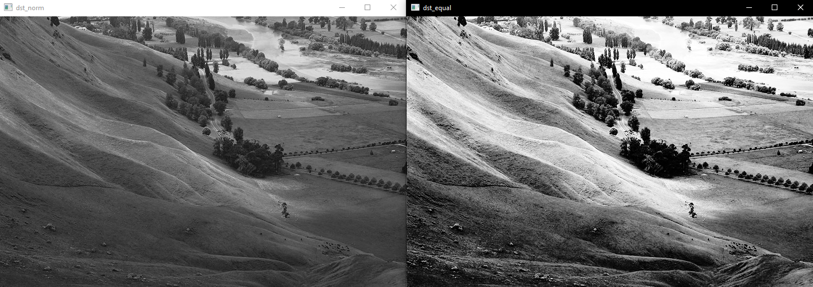
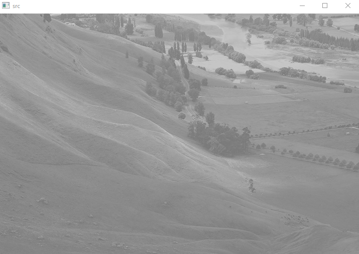
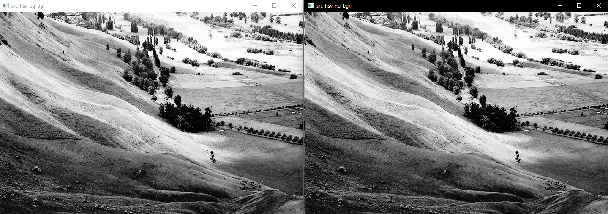

# 8. Histogram Modification

```python
import sys
import numpy as np
import cv2
```

## 8.1. 흑백사진 Histogram Modification

```python
src = cv2.imread('./fig/Hawkes.jpg', 0)

# cv2.normalize(src, dst=None, alpha=None, beta=None, norm_type=None, dtype=None, mask=None) -> dst
# src: 입력영상
# dst: 결과영상
# alpha: 정규화 최소값 (예, 0)
# beta: 정규화 최댓값 (예, 155)
# norm_type: cv2.NORM_MINMAX
# dtype =  -1, src와 같은 type


dst_norm = cv2.normalize(src, None, 0, 255, cv2.NORM_MINMAX, -1)
dst_equal = cv2.equalizeHist(src)


cv2.imshow('src', src)
cv2.imshow('dst_norm', dst_norm)
cv2.imshow('dst_equal', dst_equal)


cv2.waitKey()
cv2.destroyAllWindows()
```


- normalization, equalization 순서




## 8.2. 컬러사진 Histogram modification

```python
src = cv2.imread('./fig/Hawkes.jpg', 1)

src_hsv = cv2.cvtColor(src, cv2.COLOR_BGR2HSV)

h, s, v= cv2.split(src_hsv)

v_norm = cv2.normalize(v, None, 0, 255, cv2.NORM_MINMAX, -1)
v_hsv_no = cv2.merge((h,s,v_norm)) 

v_hsv_no_bgr = cv2.cvtColor(v_hsv_no, cv2.COLOR_HSV2BGR)

####
v_equal = cv2.equalizeHist(v)
src_hsv_eq = cv2.merge((h,s,v_equal)) 

src_hsv_eq_bgr = cv2.cvtColor(src_hsv_eq, cv2.COLOR_HSV2BGR)


cv2.imshow('src', src)
cv2.imshow('src_hsv_eq_bgr', src_hsv_eq_bgr)
cv2.imshow('src_hsv_no_bgr', src_hsv_eq_bgr)
cv2.waitKey()
cv2.destroyAllWindows()
```



- equalization, normalization 순서

